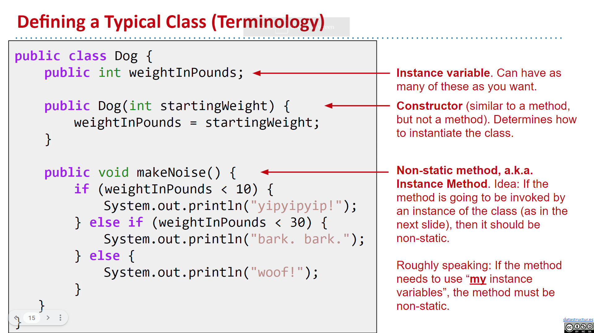
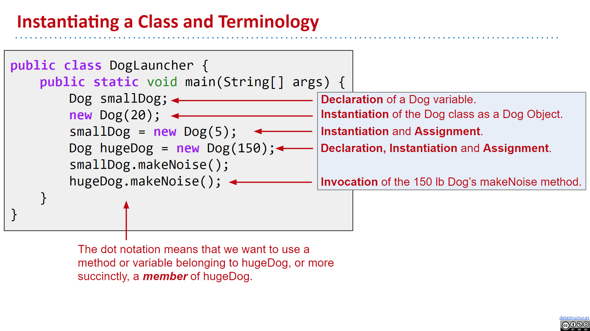
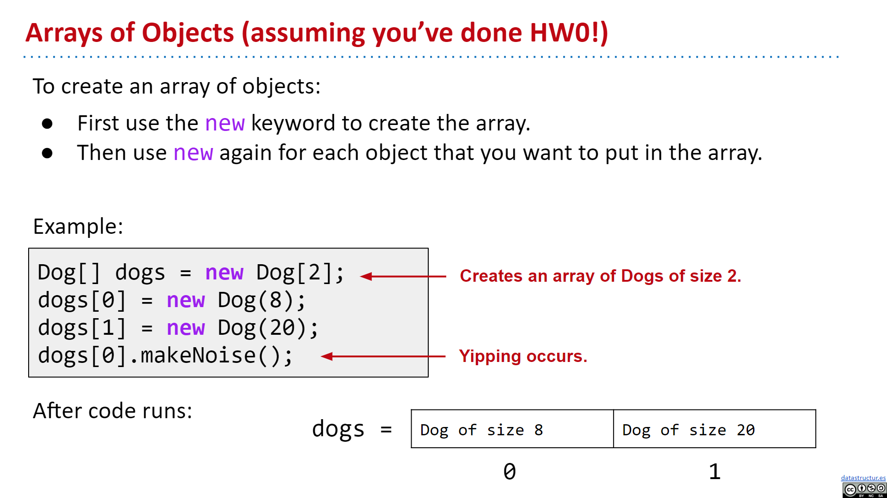
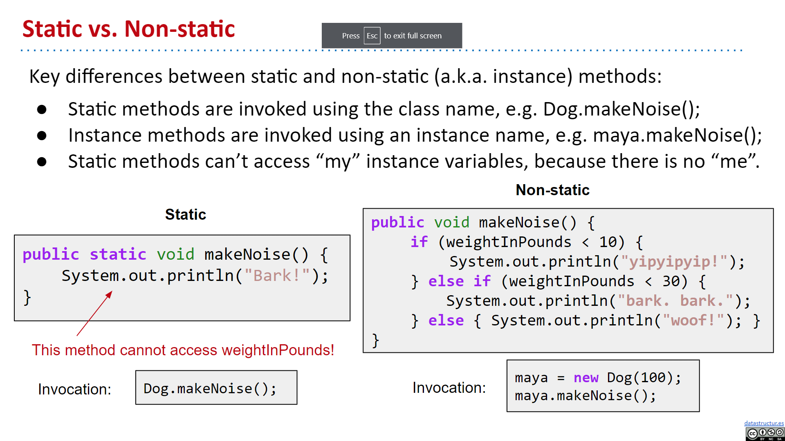
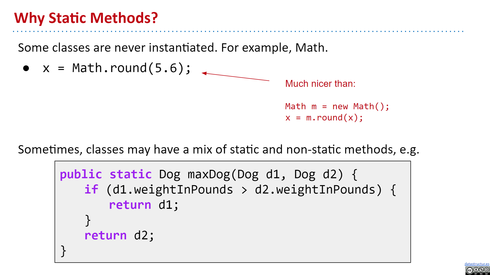
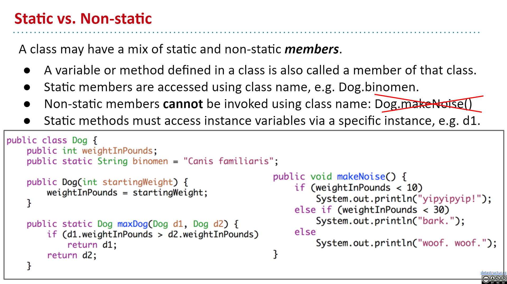

# Week 1

## Hello World

1. All code in Java must be inside of a class.
2. We delimit the beginning and end of segments of code using `{}`.
3. All statements in Java must end with `;`.
4. For code to run we need `public static void main(String[] args)`

### Code

```java
public class HelloWorld {
  public static void main(String[] args) {
    System.out.println("hello world");
  }
}
```

Note the following:

1. The program consists of a class declaration, which is declared using the keywords `public class`. In Java, all code lives inside of classes.
2. The code that is run is inside of a **method** called `main`, which is declared as `public static void main(String[] args)`.

---

## Running a Java Program

1. The most common way to execute a Java program is to run it through a sequence of two programs. The first is the **Java compiler**, or `javac` (`c` stands for "compile"). The second is the **Java interpreter**, or `java`.

2. For example, to run `HelloWorld.java`, we'd type the command `javac HelloWorld.java` into the terminal, followed by the command `java HelloWorld`. The result would look something like this:

   ```
   $ javac HelloWorld.java
   $ java HelloWorld
   Hello World!
   ```

   You may notice that we include the '.java' when compiling, but we don't include the '.class' when interpreting. This is just the way it is

3. Basically, it works like this:

   ```
                Compiler                  Interpreter
   Hello.java --> javac --> Hello.class --> java --> code execution
   ```

4. Why make a `.class` file at all?

   - `.class` file has been type checked. Distributed code is safer.
   - `.class` files are "simpler" for machine to execute. Distributed code is safer.
   - Minor benifit: Protects our source code from being viewed by others (since we normally only give out the `.class` files).

---

## Static Typing

The program below will print out the integers from 0 through 9.

```java
public class HelloNumbers {
    public static void main(String[] args) {
        int x = 0;
        while (x < 10) {
            System.out.print(x + " ");
            x = x + 1;
        }
    }
}
```

1. Our print statement is just `System.out.print` instead of `System.out.println` ("ln" stands for "line"). This means we should not include a newline (a return).
2. Our print statement adds a number to a space. This makes sure the numbers don't run into each other. Try removing the space to see what happens.
3. When we run it, our prompt ends up on the same line as the numbers

When we run this program, we see:

```
$ javac HelloNumbers.java
$ java HelloNumbers
$ 0 1 2 3 4 5 6 7 8 9
```

1. Java variables must be declared before they're used.
2. Java variables have a specific type.
3. Java variable types can never change.
4. Types are verified before the code executes by the compiler.
5. Expressions also have a type.

The compiler rejects a program with type errors out of hand before it even runs. This is a big deal, because it means that there's no chance that somebody running this program out in the world will ever run into a type error!

In addition to providing additional error checking, static types also let the programmer know exactly what sort of object he or she is working with.

To summarize, static typing has the following advantages:

- The compiler ensures that all types are compatible, making it easier for the programmer to debug their code.
- Since the code is guaranteed to be free of type errors, users of your compiled programs will never run into type errors. For example, Android apps are written in Java, and are typically distributed only as .class files, i.e. in a compiled format. As a result, such applications should never crash due to a type error since they have already been checked by the compiler.
- Every variable, parameter, and function has a declared type, making it easier for a programmer to understand and reason about code.
- Code can run more efficiently, e.g. no need to do runtime type checks.

### Extra thought

Consider these two Java statements:

```java
String h = 5 + "horse";
```

```java
int h = 5 + "horse";
```

The first one of these will succeed; the second will give a compiler error. Since Java is strongly typed, if you tell it h is a string, it can **concatenate the elements and give you a string**. But when h is an int, it can NOT concatenate a number and a string and give you a number.

In this case, `System.out.println(5 + "horse");`, Java interprets the arguments as a string concatentation, and prints out "5horse" as your result. Or, more usefully, `System.out.println(5 + " ");` will print a space after your "5".

---

## Declaring Functions

1. Functions must be declared as part of a class in Java.
   A function that's part of a class is called a **method**.
   So in Java, all functions are methods.

2. To define a function in Java, we use `public static` (We'll see alternate ways of defining functions later).

3. Just like in C, all parameters and return value of a function must have a declared type.

4. Actually, just like JavaScript, Java has its Java Doc format too. So we can document the functions

5. We call `public static int larger(int x, int y)` the method's **signature**.

### Code Example

```java
/** Demonstrates declaration of a method in Java */
public class LargerDemo {
  /**
   * Returns the Larger of x and y.
   *
   * @param x an integer
   * @param y another integer to compare with x
   * @return the larger of x and y
   */
  public static int larger(int x, int y) {
    if (x > y) {
      return x;
    }
    return y;
  }

  public static void main(String[] args) {
    System.out.println(larger(-5, 15));
  }
}
```

---

## Code Style

1. Check out [CS61b style guide](https://sp19.datastructur.es/materials/guides/style-guide.html)

2. All of our methods and almost all of our classes should be described in a comment using the so-called **Javadoc format**.

---

## Some type differences between C and Java

1. There's no `long double` type in Java (though `long` type does exist, which is an 8 byte integer).

2. We can do `double x = 1;` in Java, since Java will automatically convert `1`, which is an expression with `int` type, to type `double`. See: [stackoverflow](https://stackoverflow.com/questions/9211874/assigning-an-integer-literal-to-a-double-variable-in-java)

3. In Java, we sometimes still need type casting, and we perform type casting just like in C:

   ```java
   public class YourClassNameHere {
      public static void main(String[] args) {
        int a = 1;
        int b = 2;
        int c = a / b;
        double d = a / b;
        double e = (double) a / b;
        System.out.println(a / b);
        System.out.println((double) a / b);
        System.out.println(c);
        System.out.println(d);
        System.out.println(e);
      }
   }
   ```

   ```
   0
   0.5
   0
   0.0
   0.5
   ```

---

## Note

1. [println() va. print("\n") for new line](https://www.quora.com/What-is-better-print-n-or-println-Java)

   Basically, `System.out.println()` is better because it's system independent, it'll use whichever character defined as the new line character for different systems, where `System.out.print("\n")` assumes the new line character is `\n`.

---

## Arrays in Java

1. In Java, an array is an object consisting of a numbered list of variables, each of which is a primitive type or a reference to another object.

   Like any object, an array is only useful if we can reference it, usually through some reference variable like "c" above. We declare c thusly:

   ```java
   char[] c; // Reference to an array (of any length) of characters.
   ```

   We can **construct** an array of four characters as follows.

   ```java
   c = new char[4];
   ```

   Now that we have an array object, we may fill in its values by indexing c.

   ```java
   c[0] = 'b';
   c[1] = 'l';
   c[2] = 'u';
   c[3] = 'e';
   ```

   The characters in a four-element array are indexed from 0 to 3. If we try to address any index outside this range, we will trigger a run-time error:

   ```java
    // error
    c[4] = 's'; // Program stops with ArrayIndexOutOfBoundsException
   ```

   A **run-time error** is an error that doesn't show up when you compile the code, but does show up later when you run the program and the Java Virtual Machine tries to access the out-of-range index.

   When c references an array, you can find out its length by looking at the field `c.length`. You can never assign a value to the "length" field, though. Java will give you a compile-time error if you try.

2. We can declare an array in Java in the following 2 ways:

   ```java
   int[] numbers = new int[3];
   numbers[0] = 4;
   numbers[1] = 7;
   numbers[2] = 10;
   System.out.println(numbers[1]);
   ```

   ```java
   int[] numbers = new int[] {4, 7, 10};
   System.out.println(numbers[1]);
   ```

3. In Java, we can actually initialize an array in the following 2 ways:

   ```java
   int[] arr = {1, 2, 3};
   ```

   This is called an **array initializer**. However, the compiler actually implicitly convert it to the seconde way:

   ```java
   int arr = new int[] {1, 2, 3};
   ```

   See: [stackoverflow](https://stackoverflow.com/questions/67782405/array-declaration-and-initialization-in-java)

4. We can print an array in a formatted string form using:

   ```java
   int[] a = {4, 8, -3, 13, 9, 4};
   System.out.println(java.util.Arrays.toString(a));
   // Should print 4, 8, -3, 13, 9, 4
   ```

---

## The Enhanced for-loop

1. Java also supports iteration through an array using an “enhanced for loop”. The basic idea is that there are many circumstances where we don’t actually care about the index at all. In this case, we avoid creating an index variable using a special syntax involving a colon.

   For example, in the code below, we do the exact thing as in ContinueDemo above. However, in this case, we do not create an index `i`. Instead, the String `s` takes on the identity of each String in `a` exactly once, starting from `a[0]`, all the way up to `a[a.length - 1]`.

   ```java
   public class EnhancedForContinueDemo {
    public static void main(String[] args) {
      String[] b = {"cat", "dog", "laser horse", "ketchup", "horse", "horbse"};

      for (String s : b) {
         if (s.contains("horse")) {
            continue;
         }
         System.out.println(s);
      }
    }
   }
   ```

---

## Git

1. [CS61b using-git sp18](https://sp18.datastructur.es/materials/guides/using-git.html)
   [CS61b using-git fa22](https://fa22.datastructur.es/materials/guides/git/)
   Read: A~C

2. [Git Documentation](https://git-scm.com/doc)

3. Git is a distributed version control system as opposed to a centralized version control system. This means that every developer’s computer stores the entire history (including all old versions) of the entire project!

   We call the entire history of an entire project a "repository". The fact that the repository is stored locally leads to our ability to use Git locally on our own computers, even without an internet connection.

---

## Defining and Instantiating Classes

1. Every method (i.e. function) is associated with some class.

   To run a class, we must define a `main` method.

   ```java
   // Dog.java
   public class Dog {
      public static void makeNoise() {
         System.out.println("Bark!");
      }
   }
   ```

   ```java
   // DogLauncher.java
   public class DogLauncher {
      public static void main(String[] args) {
         Dog.makeNoise();
      }
   }
   ```

2. Consider if we'd like to create objects of dogs but with different type of noises, we could naively create a separate classes for each dogs. However, a better way is to create a single `Dog` class, and then create **instances** (or objects) of this `Dog`.

   The class provides a blueprint that all Dog objects will follow. Also, classes can contain not just methods, but also data (or properties or instance variables).

   ```java
   // Dog.java
   public class Dog {
      public int weightInKg;

      // Constructor for Dog.
      public Dog(int w) {
         weightInKg = w;
      }

      public void makeNoise() {
         if (weightInKg < 10) {
            System.out.println("yip!");
         } else if (weightInKg < 30) {
            System.out. println("baark!");
         } else {
            System.out.println("wooooooof!");
         }
      }
   }
   ```

   ```java
   // DogLaucher.java
   public class DogLauncher {
      public static void main(String[] args) {
         Dog d = new Dog(25);
         d.makeNoise();
      }
   }
   ```

   ```
   $ javac DogLauncher.java
   $ java DogLauncher
   baark!
   ```

   Note that we do NOT have to compile `Dog.java` manually, `javac` will automatically find out that we have a `Dog` dependency inside of `DogLauncher` and compile `Dog` file for us.

3. Some key observations and terminology:

   - An Object in Java is an **instance** of any class.
   - The Dog class has its own variables, also known as **instance variables** or non-static variables. These must be declared inside the class, unlike languages like Python or Matlab, where new variables can be added at runtime.
   - The method that we created in the Dog class did not have the static keyword. We call such methods **instance methods** or non-static methods.
   - To call the makeNoise method, we had to first **instantiate** a Dog using the `new` keyword, and then make a specific Dog bark. In other words, we called `d.makeNoise()` instead of `Dog.makeNoise()`.
   - Once an object has been instantiated, it can be assigned to a declared variable of the appropriate type, e.g. `d = new Dog();`
   - Variables and methods of a class are also called **members** of a class.
   - Members of a class are accessed using dot notation.

---

## Terminology

1. 

   A constructor tells you how to construct a instance (or instantiate a class), usually used for setting properties for the object.

2. 

   Note that the `new Dog(20)` instantiation instantiates an object, but that object is not getting assigned or used, so it'll simply be deleted by the **garbage collector**.

3. 

   Note that we not only need to use `new` to allocate memory for the `Dog[2]` array, we also use `new` to allocate memory for each `Dog` object in the array.

---

## Static vs. Instance Members

1. 

   Note that "static methods" can NOT acces "instance variables", since when "static methods" are called, they're called by the class, NOT an instance of the class, and hence has NO access to the "instance variables".

   Java allows us to define two types of methods:

   - Class methods, a.k.a. static methods.
   - Instance methods, a.k.a. non-static methods.

2. 

   Static methods do NOT need access to "instance variables", since they're mostly methods that's used by classes that's never instantiated. And "static methods" are like a general method which is related to its class, but we simply want to use that method without needing to instantiate the class and then use the object to call the method.

3. We also have the `this` keyword in methods in Java.

4. **Static variables** of a class is actually not only accessible by the `Dog` class itself, but also accessible by its instantiations (though this is a BAD style, we should always access static variables or methods by the class name only).

5. 

```java
// Dog.java
public class Dog {
  public int weightInKg;
  public static String binomen = "Canis familiaris";

  // Constructor for Dog.
  public Dog(int w) {
    weightInKg = w;
  }

  public void makeNoise() {
    if (weightInKg < 10) {
      System.out.println("yip!");
    } else if (weightInKg < 30) {
      System.out. println("baark!");
    } else {
      System.out.println("wooooooof!");
    }
  }

  public static Dog maxDog(Dog d1, Dog d2) {
    if (d1.weightInKg > d2.weightInKg) {
      return d1;
    }
    return d2;
  }

  public Dog maxDog(Dog d2) {
    if (this.weightInKg > d2.weightInKg) {
      return this;
    }
    return d2;
  }
}
```

```java
public class DogLauncher {
  public static void main(String[] args) {
    Dog d = new Dog(25);
    Dog d2 = new Dog(100);

    // Here, we don't want the instantiated dogs to do the judgement
    // Instead, we want the "god" version of Dogs to decide.
    Dog bigger = Dog.maxDog(d, d2);
    bigger.makeNoise();

    // non-static version
    Dog bigger2 = d.maxDog(d2);
    bigger2.makeNoise();

    // static variables
    System.out.println(d.binomen); // BAD style, DON'T do this
    System.out.println(d2.binomen); // BAD style, DON'T do this
    System.out.println(Dog.binomen); // GOOD
  }
}
```

6. Sidenote: Arrays in Java never have empty elements, they're always set to some default value if not setted manually.

   - For array of primitives: set to `0`
   - For array of objects: set to `null`

7. Domonstrating what happens when we try to read some field from `null`:

   ```java
   public class Exercise {
      public static void main(String[] args) {
         Dog smallDog = new Dog(5);
         Dog mediumDog = new Dog(25);
         Dog hugeDog = new Dog(150);

         Dog[] dogs = new Dog[4];
         dogs[0] = smallDog;
         dogs[1] = hugeDog;
         dogs[2] = new Dog(130);

         for (int i = 0; i < dogs.length; i++) {
            Dog.maxDog(dogs[i], mediumDog).makeNoise();
         }
      }

      public static class Dog {
         public int size;

         public Dog(int s) {
            size = s;
         }

         public void makeNoise() {
            if (size < 10) {
            System.out.println("yip");
            } else if (size < 30) {
            System.out.println("bark bark");
            } else {
            System.out.println("woof woof woof");
            }
         }

         public static Dog maxDog(Dog d1, Dog d2) {
            if (d1.size > d2.size) {
            return d1;
            }
            return d2;
         }
      }
   }
   ```

---

## public static void main(String[] args)

1. ```java
   public class ArgsDemo {
      public static void main(String[] args) {
         System.out.println(args[0]);
         /**
         * Suppose we ran the program using "java ArgsDemo arg1"
         * then "arg1" is printed.
         */
      }
   }
   ```

2. Converting `String` to `int`: [stackoverflow](https://stackoverflow.com/questions/5585779/how-do-i-convert-a-string-to-an-int-in-java)

   Basically using `Integer.parseInt(str)`. And optionally catch an exception with `try-catch`:

   ```java
   int foo;
   try {
      foo = Integer.parseInt(myString);
   }
   catch (NumberFormatException e) {
      foo = 0;
   }
   ```

3. Another example:

   ```java
   // ArgsSum.java
   public class ArgsSum {
   public static void main(String[] args) {
         int N = args.length;
         int i = 0;
         int sum = 0;
         while (i < N) {
            sum = sum + Integer.parseInt(args[i]);
            i++;
         }
         System.out.println(sum);
      }
   }
   ```

---

## Using Libraries

1. In CS61b, all needed libraries will be provided. These inludes:

   - Built-in Java libraries (e.g. Math, String, Integer, List, Map)
   - Priceton standard library (e.g. StdDraw, StdAudio, StdIn): [Priceton std library](https://introcs.cs.princeton.edu/java/stdlib/)

2. For Java built-in libraries, we can use the official documentation, e.g. [java Integer doc](https://docs.oracle.com/javase/7/docs/api/java/lang/Integer.html)

---

## Lab1 Setting up Git and Github for CS61b

1. After setting up, note that we can use ` git log --author="bretonyang"` to filter logs by me only.

---
