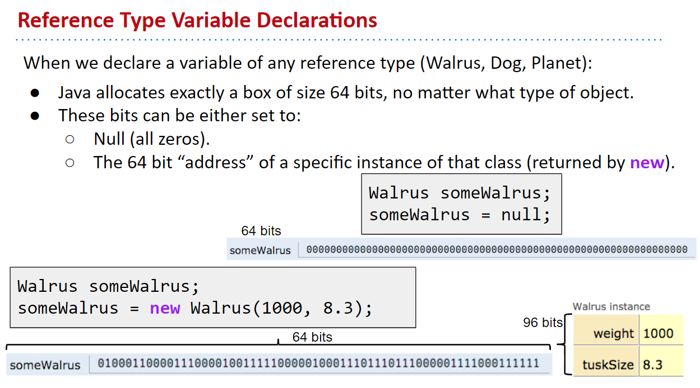
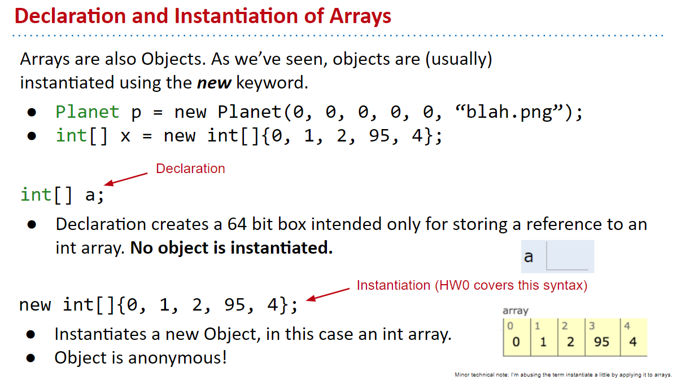
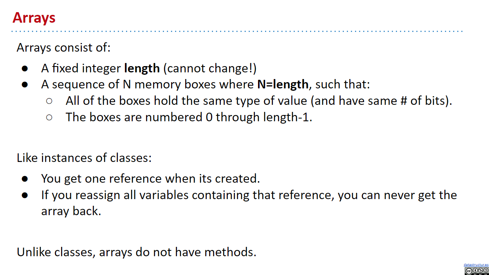
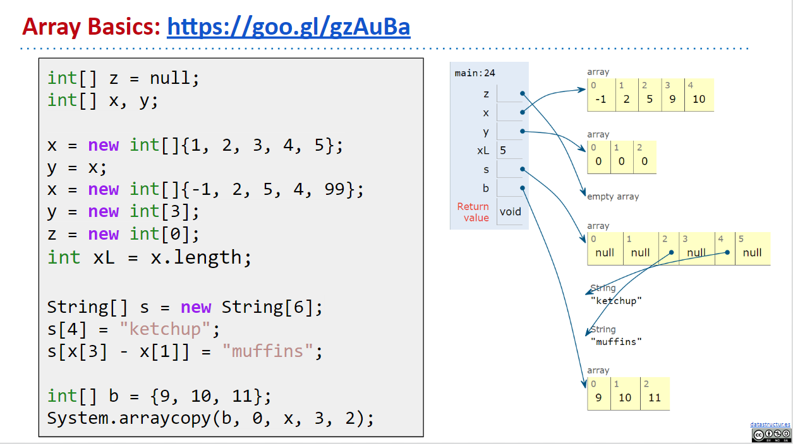
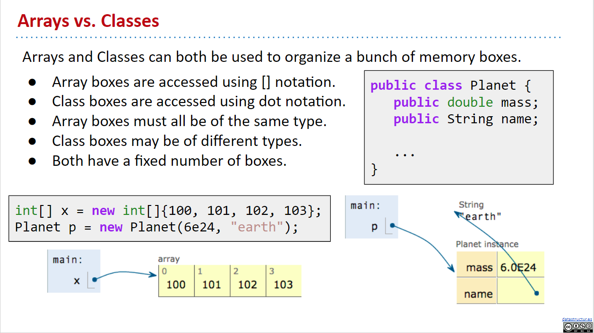
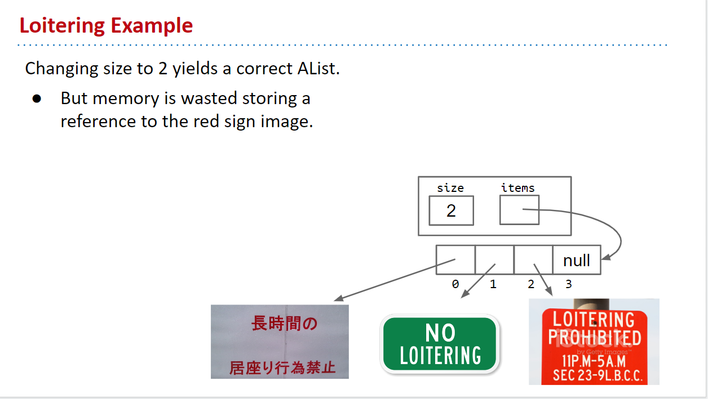
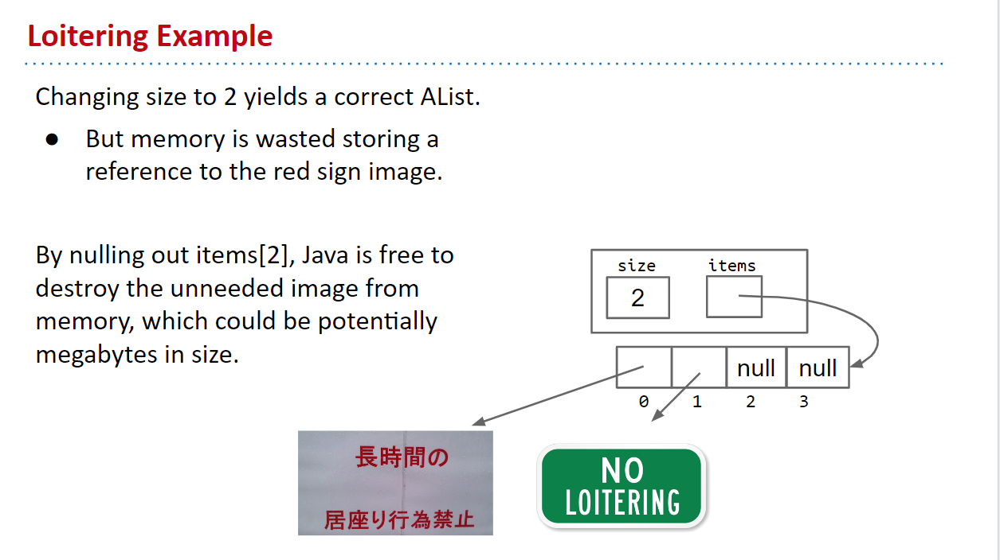

# CS61b Week 2

## 2-1 Reference, Recursion, and IntLists

1. Consider the following 2 examples:

   ```java
   Walrus a = new Walrus(1000, 8.3);
   Walrus b;
   b = a;
   b.weight = 5;
   System.out.println(a.weight); // 5
   System.out.println(b.weight); // 5
   ```

   ```java
   int x = 5;
   int y;
   y = x;
   x = 2;
   System.out.println(x); // 2
   System.out.println(y); // 5
   ```

### Primitive types

1. In Java, there are 8 primitive types: `byte`, `short`, `int`, `long`, `float`, `double`, `boolean`, `char` (although short and float is rarely used).

2. When we declare a variable of a certain type in Java:

   - computer sets aside exactly enough bits for that type.
   - Java creates an internal table that maps each variable name to a location.
   - Java does NOT write anything into the reserved boxes. (For safety, Java will not allow access to an uninitialized variable)

   In this class, we will use the "simplified box notation" to represent how primitive types are stored, e.g. for `int x = -1431195969`:

   

3. Assignment like `y = x` will copy all the bits from x into y. (this is true for all types)

### Reference types

1. 
   
   

2. 
   

3. 
   
   
   

### Parameter Passing

1. When we pass parameters, the computer also simply **copies** the bits to the new scope.

2. 

3. 
   

### Introducing IntLists

1. 

2. Lecture Code:

```java
public class IntList {
  public int first;
  public IntList rest;

  public IntList(int f, IntList r) {
    first = f;
    rest = r;
  }

  /** Return the size of the list using recursion */
  public int size() {
    if (rest == null) {
      return 1;
    }
    return 1 + rest.size();
  }

  /** Return the size of the List using iteration */
  public int iterativeSize() {
    IntList p = this;
    int totalSize = 0;
    while (p != null) {
      totalSize++;
      p = p.rest;
    }
    return totalSize;
  }

  /** Returns the ith item of this list using recursion */
  public int get(int i) {
    if (i == 0) {
      return first;
    }

    return rest.get(i - 1);
  }

  /**
   * Convert IntList to String format
   * NOTE: This is NOT included in sp18 lecture. Instead,
   * it's from the sp16 version.
   */
  public String toString() {
    if (rest == null) {
      return Integer.toString(first);
    }
    return Integer.toString(first) + " " + rest.toString();
  }

  /**
   * Returns an new IntList identical to L, but with
   * each element incremented by x. L is not allowed
   * to change.
   */
  public static IntList incrList(IntList L, int x) {
    // Using recursion, but iteration also works.
    // Also, other base cases are possible
    if (L == null) {
      return null;
    }
    return new IntList(L.first + x, incrList(L.rest, x));

    /*
     * Josh Hug prof's solution:
     * You can do the two lines on one line, but he've opted
     * for two lines for maximum pedagogical clarity.
     */
    // IntList incrementedList = new IntList(L.first + x, null);
    // incrementedList.rest = incrList(L.rest, x);
    // return incrementedList;
  }

  /**
   * Returns an IntList identical to L, but with
   * each element incremented by x. Not allowed to use
   * the 'new' keyword.
   */
  public static IntList dincrList(IntList L, int x) {
    /*
     * Using recursion, but iteration also works.
     * Also, other base cases are possible.
     */
    if (L == null) {
      return null;
    }

    L.first += x;
    dincrList(L.rest, x); // Don't care about return value here

    return L;
  }

  public static void main(String[] args) {
    IntList L = new IntList(15, null);
    L = new IntList(10, L);
    L = new IntList(5, L);

    System.out.println(L.size());
    System.out.println(L.iterativeSize());
    System.out.println(L.get(0));

    IntList L2 = incrList(L, 3);
    IntList L3 = dincrList(L, 3);

    System.out.println("Testing for memory locations ...");
    /*
     * toString() method returns the String representation of
     * the object. If you print any object, Java compiler
     * internally invokes the toString() method on the object.
     *
     * If we didn't write our own toString() here, then Java will
     * print the address of these objects.
     */
    System.out.println(L);
    System.out.println(L2);
    System.out.println(L3);

    System.out.println("Testing for incrList() ...");
    System.out.println(L2.size());
    System.out.println(L2.get(0));
    System.out.println(L2.get(1));
    System.out.println(L2.get(2));
    System.out.println(L2.toString());

    System.out.println("Testing for dincrList() ...");
    System.out.println(L3.size());
    System.out.println(L3.get(0));
    System.out.println(L3.get(1));
    System.out.println(L3.get(2));
    System.out.println(L3.toString());
  }
}
```

3. Solution of exercise or other version of IntList implementation can be found at: [lectureCode-sp16/lec3/exercises/solution/IntList.java](https://github.com/Berkeley-CS61B/lectureCode-sp16/blob/master/lec3/exercises/solution/IntList.java)

### Lab 2

1. Using Intellij as our IDE, don't forget to import our library in `CS61b-sp18\library-sp18\javalib` folder to our projects. And to set a SDK.

#### IntList.of() method

This method is implemented by Josh Hug for IntListTest.java. It makes it easier for us to create an IntList where we can simply write:

```java
IntList myList = IntList.of(0, 1, 2, 3);
// Creates the IntList 0 -> 1 -> 2 -> 3 -> null
```

The method uses the concept of **variable arguments** in Java.

```java
/**
* Returns a new IntList containing the ints in ARGS. You are not
* expected to read or understand this method.
*/
public static IntList of(Integer... args) {
   IntList result, p;

   if (args.length > 0) {
      result = new IntList(args[0], null);
   } else {
      return null;
   }

   int k;
   for (k = 1, p = result; k < args.length; k += 1, p = p.rest) {
      p.rest = new IntList(args[k], null);
   }
   return result;
}
```

#### Iterative Implementation of dcatenate() and catenate()

```java
/**
* Returns a list consisting of the elements of A followed by the
* elements of B.  May modify items of A. Don't use 'new'.
*/
public static IntList dcatenate(IntList A, IntList B) {
   //TODO:  fill in method
   // Using iteration
   if (A == null) {
      return B;
   }

   IntList tmp = A;
   while (tmp.rest != null) {
      tmp = tmp.rest;
   }
   tmp.rest = B;

   return A;
}

/**
* Returns a list consisting of the elements of A followed by the
* elements of B.  May NOT modify items of A.  Use 'new'.
*/
public static IntList catenate(IntList A, IntList B) {
   //TODO:  fill in method
   // Using iteration
   if (A == null) {
      if (B == null) {
            return null;
      }
      return catenate(B, null);
   }

   IntList ptr = new IntList(A.first, null);
   IntList res = ptr;
   while (A.rest != null) {
      ptr.rest = new IntList(A.rest.first, null);
      ptr = ptr.rest;
      A = A.rest;
   }
   ptr.first = A.first;

   if (B == null) {
      return res;
   }

   ptr.rest = new IntList(B.first, null);
   ptr = ptr.rest;

   while (B.rest != null) {
      ptr.rest = new IntList(B.rest.first, null);
      ptr = ptr.rest;
      B = B.rest;
   }
   ptr.first = B.first;

   return res;
}
```

#### Recursive Implementation of dcatenate() and catenate()

```java
/**
* Returns a list consisting of the elements of A followed by the
* elements of B.  May modify items of A. Don't use 'new'.
*/
public static IntList dcatenate(IntList A, IntList B) {
   //TODO: fill in method
   // Using Recursion
   if (A == null) {
      return B;
   }

   A.rest = dcatenate(A.rest, B);
   return A;
}

/**
* Returns a list consisting of the elements of A followed by the
* elements of B.  May NOT modify items of A.  Use 'new'.
*/
public static IntList catenate(IntList A, IntList B) {
   //TODO: fill in method
   // Using Recursion
   if (A == null) {
      if (B != null) {
            return catenate(B, null);
      } else {
            return null;
      }
   }

   return new IntList(A.first, catenate(A.rest, B));
}
```

### Unit Testing with JUnit

1. Inside of IntListTest.java, we used `assertEquals()` to check for value equality of two IntLists, notice that we've overwritten the `.equals()` method in IntList.java, which is a method that's used by `assertEquals()` to compare two Objects. We do this since the normal `.equals()` method only compares the first layer value of the objects, but for IntLists we need to compare every value in the list (Josh Hug also overwrite a lot of other methods which we'll learn why and how in the future).

2. Do not use the `new` keyword in our tests. We can create lists using the handy `IntList.of()` method.

3. Make sure to include test cases involving lists of various sizes on both sides of the operation. That includes the empty of, which can be instantiated, for example, with `IntList empty = IntList.of()`.

#### IntListTest.java

```java
import static org.junit.Assert.*;

import org.junit.Test;

public class IntListTest {

    /**
     * Example test that verifies correctness of the IntList.of static
     * method. The main point of this is to convince you that
     * assertEquals knows how to handle IntLists just fine.
     */

    @Test
    public void testList() {
        IntList one = new IntList(1, null);
        IntList twoOne = new IntList(2, one);
        IntList threeTwoOne = new IntList(3, twoOne);

        IntList x = IntList.of(3, 2, 1);
        assertEquals(threeTwoOne, x);
    }

    @Test
    public void testdSquareList() {
        IntList L = IntList.of(1, 2, 3);
        IntList.dSquareList(L);
        assertEquals(IntList.of(1, 4, 9), L);
    }

    /**
     * Do not use the new keyword in your tests. You can create
     * lists using the handy IntList.of method.
     * <p>
     * Make sure to include test cases involving lists of various sizes
     * on both sides of the operation. That includes the empty of, which
     * can be instantiated, for example, with
     * IntList empty = IntList.of().
     * <p>
     * Keep in mind that dcatenate(A, B) is NOT required to leave A untouched.
     * Anything can happen to A.
     */

    @Test
    public void testSquareListRecursive() {
        IntList L = IntList.of(1, 2, 3);
        IntList res = IntList.squareListRecursive(L);
        assertEquals(IntList.of(1, 2, 3), L);
        assertEquals(IntList.of(1, 4, 9), res);
    }

    @Test
    public void testDcatenate() {
        IntList A = IntList.of(1, 2, 3);
        IntList B = IntList.of(4, 5, 6);
        IntList exp = IntList.of(1, 2, 3, 4, 5, 6);
        assertEquals(exp, IntList.dcatenate(A, B));
        assertEquals(IntList.of(1, 2, 3, 4, 5, 6), A);
    }

    @Test
    public void testCatenate() {
        IntList A = IntList.of(1, 2, 3);
        IntList B = IntList.of(4, 5, 6);
        IntList exp = IntList.of(1, 2, 3, 4, 5, 6);
        assertEquals(exp, IntList.catenate(A, B));
        assertEquals(IntList.of(1, 2, 3), A);
    }

}
```

---

## 2-2 SLLists, Nested Classes, Sentinel Nodes

### Introducint the SLList

1. 
   
   

2. The programmer who's using a SLList need NOT think about references and addresses and memories and all that naked complecated stuff. Notice how with SLList, when we create a list, instead of having to manually specify `null` as the address of the next node, we can now simply write the value of that node and need not think about the address: `new SLList(10)`, instead of `new IntList(10, null)`.

3. 
   
   

4. Essentially, the `SLList` class acts as a middleman between the list user and the naked recursive data structure. As suggested above in the `IntList` version, there is a potentially undesireable possibility for the `IntList` user to have variables that point to the middle of the `IntList`.

5. Exercise 2.2.1:

   ```java
   public class IntList {
      public int first;
      public IntList rest;

      public IntList(int f, IntNode r) {
         first = f;
         rest = r;
      }

      public void addFirst(int x) {
         rest = new IntList(first, rest);
         first = x;
      }
   }
   ```

#### Code

```java
// IntNode.java
public class IntNode {
  public int item;
  public IntNode next;

  public IntNode(int i, IntNode n) {
    item = i;
    next = n;
  }
}
```

```java
// SLList.java
/** An SLList is a list of integers, which hides the terrible
  * of the nakedness within. */
public class SLList {
  private IntNode first;

  public SLList(int x) {
    first = new IntNode(x, null);
  }

  /** Adds x to the front of the list */
  public void addFirst(int x) {
    first = new IntNode(x, first);
  }

  /** Returns the first item in the list */
  public int getFirst() {
    return first.item;
  }

  public static void main(String[] args) {
    /* Creates a list of integers, 5, 10, 15 */
    SLList L = new SLList(15);
    L.addFirst(10);
    L.addFirst(5);
    System.out.println(L.getFirst());
  }
}
```

### Public vs. Private

1. The `private` keyword makes the variable only usable **inside** the class (Note that the `main()` method of the `SLList` class counts as part of the class).

2. > Side note: when declaring some method or field as `public`, we have the mindset that we're not going to remove that method or field in the future version of this class. Since stating method as `public` means others will use this method directly in their code, and if we remove this method in the future, then the old codebase that rely on that method will no longer work.

### Nested Classes

1. Side note: [static classes](https://stackoverflow.com/questions/7486012/static-classes-in-java)

2. CONVENTION: Put the nested class definition at the top, and instance variables, constructors, and instance methods below it.

   And if nobody else outside the class need to use that nested class, e.g. `IntNode` inside of `SLList`, then make it `private`.

3. access modifiers are: `public`, `private`, etc.

4. 
   
   
   
   
   
   
   
   

#### Code

```java
// SLList.java
/** An SLList is a list of integers, which hides the terrible
  * of the nakedness within. */
public class SLList {

  private static class IntNode {
    public int item;
    public IntNode next;
    public IntNode(int i, IntNode n) {
      item = i;
      next = n;
    }
  }

  private IntNode first;

  public SLList(int x) {
    first = new IntNode(x, null);
  }

  /** Adds x to the front of the list */
  public void addFirst(int x) {
    first = new IntNode(x, first);
  }

  public static void main(String[] args) {
    /* Creates a list of integers, 5, 10, 15 */
    SLList L = new SLList(15);
    L.addFirst(10);
    L.addFirst(5);
    L.addLast(20);
    System.out.println(L.getFirst());
  }

}
```

### addLast() and size()

1. 

2. Consider:

   ```java
   SLList L = new SLList(15);
   L.addFirst(10);
   L.addFirst(5);
   L.addLast(20);
   ```

   

3. Iterative way:

   ```java
   /** Returns the size of the SLList */
   public int size() {
     IntNode ptr = first;
     int n = 0;
     while (ptr != null) {
       ptr = ptr.next;
       n++;
     }
     return n;
   }
   ```

4. Notice how when we try to implement the "recursive" way of `size()` and `addLast()`, it's hard to come up with a base case and to do recursive calls. This is because **SLList data structure itself is NOT recursive**, it does NOT have SLList pointers.

   The solution to this is to use a `private static` helper method (Make it `static` since it does NOT need any instance variables like `first` and any instance methods, declaring it as static is also more memory effiecient since it'll not be a private method of ALL instances).

   > NOTE: this is a very common pattern when working with **recursive data structure** that we'll have a `public` method that's used by the instances which calls a `private static` method that does the "recursive" things behind the scenes ( interacting with the underlying naked recursive data structure).

5. [when to use private static methods](https://softwareengineering.stackexchange.com/questions/234412/why-have-private-static-methods)

   Basically we use `private static` when we have a method that does NOT depend on non-static members (using `static` can make the method only be stored within the class and not stored inside each instance we instantiate) and we don't want outside code to access it.

6. Idea: we can think of **static members** as having "class-level" scope (a lower scope) and **non-static members** as having "instance-level" scope (a higher scope). Therefore, the class-level (lower level) scopes does NOT have access to instance-level (higher level) scopes, so static members can NOT access non-static members (they can only access `static` members), but non-static members can access static members. And actually static members lives in a class level, so they're not instantiated for every instance we create.

   > Also, note that every `static` members are stored in a class-level, so all instances instantiated with the same class, all have the same static member (stored in the class), and we can't access that static member via instances, however, if we used the static members in our methods, and we call that method on a instance, then that method will look into the class to find the static members.

   Basically, all instances share the same `static` members, so if we ever change the static member using some method, all values of that static member in the instances are changed.

   > NOTE: we can actually call `static` methods via instances in Java, but it's considered bad style. Many professors actually think it's a mistake by the designer of Java.

7. [Oracle Java Docs: non-static and static nested classes](https://docs.oracle.com/javase/tutorial/java/javaOO/nested.html)

#### Code

```java
/** An SLList is a list of integers, which hides the terrible
  * of the nakedness within. */
public class SLList {

  private static class IntNode {
    public int item;
    public IntNode next;
    public IntNode(int i, IntNode n) {
      item = i;
      next = n;
    }
  }

  private IntNode first;

  public SLList(int x) {
    first = new IntNode(x, null);
  }

  /** Adds x to the front of the list */
  public void addFirst(int x) {
    first = new IntNode(x, first);
  }

  /** Returns the first item in the list */
  public int getFirst() {
    return first.item;
  }

  /** Adds x to the end of the list */
  public void addLast(int x) {
    IntNode ptr = first;

    // Move ptr until it reaches the end of the list
    while (ptr.next != null) {
      ptr = ptr.next;
    }

    ptr.next = new IntNode(x, null);
  }

  /** Returns the size of the list that start at IntNode ptr */
  private static int size(IntNode ptr) {
    if (ptr.next == null) {
      return 1;
    }

    return 1 + size(ptr.next);
  }

  /** Returns the size of the SLList */
  public int size() {
    return size(first);
  }

  public static void main(String[] args) {
    /* Creates a list of integers, 5, 10, 15 */
    SLList L = new SLList(15);
    L.addFirst(10);
    L.addFirst(5);
    L.addLast(20);
    System.out.println(L.getFirst());
    System.out.println(L.size());
  }

}
```

### Caching

1. 

   Answer: (c) 2000 seconds

2. 

3. 
   

   Notice how nice it is to have a "middle class" between the user and naked recursive data structure. Allowing us to store meta data about the underlying naked recursive data structure, e.g. size, maximum, minimum, etc.

   On the other hand, if we're simply using a naked recursive data structure like IntList, then we don't have a middle place to store all these information, we can only store them inside each node in the list. However if we want to update some data, then we'll have to manually change all stored value of that data in the list.

   This practice of saving important data to speed up retrieval is sometimes known as **caching**.

4. 

   Note how easy it is to represent an empty list with SLList than IntList.

   However, the `addLast()` method will run into an error (`nullPointerException`) when we try to add item to an empty list.

5. 

   A dirty way to fix it (it works perfectly fine, but cluters up our code too much for such a simple method like `addLast()`):

   ```java
   /** Adds x to the end of the list */
   public void addLast(int x) {
      size++;

      if (first == null) {
         first = new IntNode(x, null);
         return;
      }

      IntNode ptr = first;

      // Move ptr until it reaches the end of the list
      while (ptr.next != null) {
         ptr = ptr.next;
      }

      ptr.next = new IntNode(x, null);
   }
   ```

   

6. A BETTER way: **Sentinel Nodes**

### Sentinel Nodes

1. 
   
   

   Basically a **sentinel** serves as a "guard node" of our list that's ALWAYS there for all SLLists and have its `sentinel.next` points to the actual list.

2. 

   Since a `SLList` without a sentinel has no special cases, we can simply delete the special case from our `addLast()` method, yielding:

   

#### Code

```java
/** An SLList is a list of integers, which hides the terrible
  * of the nakedness within. */
public class SLList {

  private static class IntNode {
    public int item;
    public IntNode next;
    public IntNode(int i, IntNode n) {
      item = i;
      next = n;
    }
  }

  /* The first item (if it exists) is at sentinel.next */
  private IntNode sentinel;
  private int size;

  /** Creates an empty SLList */
  public SLList() {
    sentinel = new IntNode(69, null); // number doesn't matter here
    size = 0;
  }

  public SLList(int x) {
    sentinel = new IntNode(69, null);
    sentinel.next = new IntNode(x, null);
    size = 1;
  }

  /** Adds x to the front of the list */
  public void addFirst(int x) {
    size++;
    sentinel.next = new IntNode(x, sentinel.next);
  }

  /** Returns the first item in the list */
  public int getFirst() {
    return sentinel.next.item;
  }

  /** Adds x to the end of the list */
  public void addLast(int x) {
    size++;

    IntNode ptr = sentinel; // Starting at sentinel.

    // Move ptr until it reaches the end of the list.
    while (ptr.next != null) {
      ptr = ptr.next;
    }

    ptr.next = new IntNode(x, null);
  }

  /** Returns the size of the SLList (fast way) */
  public int size() {
    return size;
  }

  public static void main(String[] args) {
    /* Creates a list of integers, 5, 10, 15 */
    SLList L = new SLList(15);
    L.addFirst(10);
    L.addFirst(5);
    L.addLast(20);
    System.out.println(L.getFirst());
    System.out.println(L.size());
  }

}
```

### Invariants

1. 

2. **Invariant**: a conditon that's guaranteed to be true throughout code execution.

3. 

### Guide Exercises B Level

```java
/** An SLList is a list of integers, which hides the terrible
  * of the nakedness within. */
public class SLList {

  private static class IntNode {
    public int item;
    public IntNode next;
    public IntNode(int i, IntNode n) {
      item = i;
      next = n;
    }
  }

  /* The first item (if it exists) is at sentinel.next */
  private IntNode sentinel;
  private int size;

  /** Creates an empty SLList */
  public SLList() {
    sentinel = new IntNode(69, null); // number doesn't matter here
    size = 0;
  }

  public SLList(int x) {
    // NOTE: we can also use this();
    sentinel = new IntNode(69, null);
    sentinel.next = new IntNode(x, null);
    size = 1;
  }

  /** Creates a list out of an array of integers */
  public SLList(int[] arr) {
    sentinel = new IntNode(69, null);
    size = arr.length;

    IntNode ptr = sentinel;
    for (int n : arr) {
      ptr.next = new IntNode(n, null);
      ptr = ptr.next;
    }
  }

  /** Adds x to the front of the list */
  public void addFirst(int x) {
    size++;
    sentinel.next = new IntNode(x, sentinel.next);
  }

  /** Delete the first node in our list */
  public void deleteFirst() {
    size--;
    sentinel.next = sentinel.next.next;
  }

  /** Returns the first item in the list */
  public int getFirst() {
    return sentinel.next.item;
  }

  /** Adds x to the end of the list */
  public void addLast(int x) {
    size++;

    IntNode ptr = sentinel; // Starting at sentinel.

    // Move ptr until it reaches the end of the list.
    while (ptr.next != null) {
      ptr = ptr.next;
    }

    ptr.next = new IntNode(x, null);
  }

  /** Returns the size of the SLList (fast way) */
  public int size() {
    return size;
  }


  /** Just a helper function to help us visualize tests */
  public void printList() {
    IntNode ptr = sentinel;
    while (ptr.next != null) {
      ptr = ptr.next;
      System.out.print(" " + ptr.item);
    }
    System.out.println();
  }

  public static void main(String[] args) {
    /* Creates a list of integers, 5, 10, 15 */
    SLList L = new SLList(15);
    L.printList();

    L.addFirst(10);
    L.printList();

    L.addFirst(5);
    L.printList();

    L.addLast(20);
    L.printList();

    L.deleteFirst();
    L.printList();

    System.out.println(L.size());

    SLList L2 = new SLList(new int[] {3, 1, 2, -5, 14});
    L2.printList();

    L2.addFirst(69);
    L2.printList();

    L2.deleteFirst();
    L2.printList();
  }

}
```

### Guide Exercises A Level

```java

```

---

## 2-3 DLLists

### Problem with SLLists and Its addLast() Method

1. 
   
   
   
   
   
   

### Doubly Linked Lists (or DLLists)

1. 
   

   There is a subtle issue with this design where the `last` pointer sometimes points at the sentinel node (consider when we're dealing with an empty list), and sometimes at a real node. Just like the non-sentinel version of the `SLList`.

2. 
   
   
   

### Generic Lists

1. 
   
   

2. Since **generics only work with reference types**, we cannot put primitives like `int` or `double` inside of angle brackets, e.g. `<int>`. Instead, we use the reference version of the primitive type, which in the case of `int` case is `Integer`

3. Minor detail: You may also declare the type inside of angle brackets when instantiating, though this is not necessary, so long as you are also declaring a variable on the same line. In other words, the following line of code is perfectly valid, even though the `Integer` on the right hand side is redundant.

   ```java
   DLList<Integer> d1 = new DLList<Integer>(5);
   ```

---

## 2-4 Arrays

### Arrays

1. 
   
   
   
   
   

### 2D Arrays

1. 
   
   

   Answer: C

### Arrays vs. Classes

1. 
   
   
   
   

2. Compared to other languages, java arrays:
   - Have no special syntax for "slicing" (such as in Python).
   - Cannot be shrunk or expanded (such as in Ruby).
   - Do not have member methods (such as in Javascript).
   - Must contain values only of the same type (unlike Python & JavaScript).

---

## 2-5 ALists, Resizing, vs. SLLists

### A Last Look at Linked Lists

1. Recall with DLLists, we can add, get, and remove first/last items in a super fast way. Then, why even bother to use ALists (Array Lists)?

2. 
   
   
   

### Naive Array Lists

1. 
   
   

2. 
   

   Answer: (a) size

3. 

#### Code

```java
/** Array based list. */

//         0 1  2 3 4 5 6
// items: [6 9 -1 2 0 0 0 ...]
// size: 4

/* Invaraints:
1. position of next item to be inserted is always size.
2. size is always the number of items in the AList.
3. The last item in the list is always at position size - 1.
*/

public class AList {

  private int[] items;
  private int size;

  /** Creates an empty list. */
  public AList() {
    items = new int[100];
    size = 0;
  }

  /** Inserts X into the back of the list. */
  public void addLast(int x) {
    items[size] = x;
    size++;
  }

  /** Returns the item from the back of the list. */
  public int getLast() {
    return items[size - 1];
  }

  /** Gets the ith item in the list (0 is the front). */
  public int get(int i) {
    return items[i];
  }

  /** Returns the number of items in the list. */
  public int size() {
    return size;
  }

  /** Deletes item from back of the list and
  * returns deleted item. */
  public int removeLast() {
    int returnItem = getLast();
    size--;
    return returnItem;
  }

}
```

### Resizing Arrays

1. 
   
   
   
   
   
   
   

2. 
   

   Answer: (c) 203
   Bonus: 203 (when we're copying from 101 to 102 array)

   

3. 

   Answer: 101 + 102 + 103 + ... + 1000 = (1101 \* 900) / 2 = 495450
   --> (b) 500,000

   Bonus: 1999

4. 
   
   

   Answer: instead of resizing to only size + 1 everytime, we can resize a lot more boxes at a time for future usage. For that, we can either resize by adding a RFACTOR, or even better, we can **multiply** by an RFACTOR.

   

   But how do we know that multiplying by some RFACTOR is the fastest and most efficient approach? We'll answer this in a few weeks.

5. 
   

#### Code

The solution here haven't completely solved the resizing time/space efficiency problem yet, will be discussed more in future lectures.

```java
/** Array based list. */

//         0 1  2 3 4 5 6
// items: [6 9 -1 2 0 0 0 ...]
// size: 4

/* Invaraints:
1. position of next item to be inserted is always size.
2. size is always the number of items in the AList.
3. The last item in the list is always at position size - 1.
*/

public class AList {

  private int[] items;
  private int size;

  /** Creates an empty list. */
  public AList() {
    items = new int[100];
    size = 0;
  }

  /** Resizes the underlying array to the target capacity */
  private void resize(int capacity) {
    int[] newItems = new int[capacity];
    System.arraycopy(items, 0, newItems, 0, size);
    items = newItems;
  }

  /** Inserts X into the back of the list. */
  public void addLast(int x) {
    if (size == items.length) {
      resize(size * 2);
    }

    items[size] = x;
    size++;
  }

  /** Returns the item from the back of the list. */
  public int getLast() {
    return items[size - 1];
  }

  /** Gets the ith item in the list (0 is the front). */
  public int get(int i) {
    return items[i];
  }

  /** Returns the number of items in the list. */
  public int size() {
    return size;
  }

  /** Deletes item from back of the list and
  * returns deleted item. */
  public int removeLast() {
    int returnItem = getLast();
    size--;
    return returnItem;
  }

}
```

### Generic ALists

1. > NOTE: There's a very weird design behavior of Java, where **generic arrays are NOT allowed**.

   If we really need an array of generic, we'll need to first instantiate an array of `Object` type, then we'll need to manually **cast** the `Object` type to our generic type. e.g:

   ```java
   Item[] newItems = (Item[]) new Object[100];
   ```

   , where `Item` is our generic (google for generic type name conventions).

   

2. Notice that for int-based AList, each item in our array is of a primitive type `int`, which is just stored their in the array, so when we delete an item, we can just leave its value unchanged and simply decrease `size` variable.

3. However, for generic AList, each item in our array is of a **reference type** which means the value stored in our array is an 8-byte pointer to another place in the memory storing the actual object of some generic type.

   That means we can NOT just leave the value in the array (which is a pointer) unchanged, since they'll still reference to that object somewhere in memory, which does NOT get garbage-collected if we still have a reference to it. This behavior of "keeping references to unneeded objects" is called **loitering**.

4. 
   
   
   
   

#### Code

```java
/** Array based list. */

//         0 1  2 3 4 5 6
// items: [6 9 -1 2 0 0 0 ...]
// size: 4

/* Invaraints:
1. position of next item to be inserted is always size.
2. size is always the number of items in the AList.
3. The last item in the list is always at position size - 1.
*/

public class AList<Item> {

  private Item[] items;
  private int size;

  /** Creates an empty list. */
  public AList() {
    items = (Item[]) new Object[100];
    size = 0;
  }

  /** Resizes the underlying array to the target capacity */
  private void resize(int capacity) {
    Item[] newItems = (Item[]) new Object[capacity];
    System.arraycopy(items, 0, newItems, 0, size);
    items = newItems;
  }

  /** Inserts X into the back of the list. */
  public void addLast(Item x) {
    if (size == items.length) {
      resize(size * 2);
    }

    items[size] = x;
    size++;
  }

  /** Returns the item from the back of the list. */
  public Item getLast() {
    return items[size - 1];
  }

  /** Gets the ith item in the list (0 is the front). */
  public Item get(int i) {
    return items[i];
  }

  /** Returns the number of items in the list. */
  public int size() {
    return size;
  }

  /** Deletes item from back of the list and
  * returns deleted item. */
  public Item removeLast() {
    Item returnItem = getLast();
    items[size - 1] = null; // to avoid loitering
    size--;
    return returnItem;
  }

}
```

---

## Project 1A

1. [why does null reference print as null?](https://stackoverflow.com/questions/7374363/why-does-null-reference-print-as-null)

   However, the following does NOT work:

   ```java
   System.out.println(null);
   // throws error
   ```

   This is because simply `null` is just a reference for nothing.

   But if we cast it to a reference of some type, e.g. `char[]` or `int[]`, then it'll really be some pointer exists in the memory with value null. Thus, the following code will print `"null"`;

   ```java
   System.out.println((int[]) null);
   // prints: null
   ```

2. [Is arr.length O(1) in Java?](https://stackoverflow.com/questions/21614298/what-is-the-runtime-of-array-length)

   [How is arr.length implemented in Java?](https://stackoverflow.com/questions/5950155/how-is-length-implemented-in-java-arrays)
