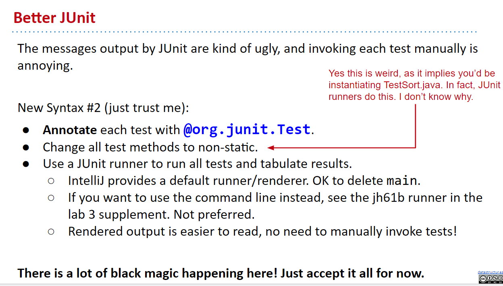

# Week 3

Don't forget the 2 things to set up after opening a new Intellij project:

1. Set **SDK** to path `C:\Program Files\Java\jdk-19`, which is where we installed jdk at.
2. Include the `javalib` library provided by cs61b to our project.

## 3-1 Testing

### A new way (intro)

1. Refer to the github book: [cs61b book ch.3-1](https://joshhug.gitbooks.io/hug61b/content/chap3/chap31.html)

### Ad Hoc Testing is Not Fun

1. For comparing objects, the `==` sign does NOT work, since the real value of the objects are just addresses, so when we write `obj1 == obj2`, we're literally comparing the addresses they hold as their value.

2. To compare equality for arrays, we can use:

   ```java
   java.util.Arrays.equals(Object[] a1, Object[] a2)
   ```

   It returns `true` if the two specified arrays of objects are equal to one another. The two arrays are considered equal if both arrays contain the same number of elements, and all corresponding pairs of elements in the two arrays are equal.

   Two objects `e1` and `e2` are considered equal `if (e1 == null ? e2 == null : e1.equals(e2))`. The two arrays are equal if they contain the same elements in the same order.Two array references are considered equal if both are `null`.

3. The `Object.equals()` method for `Object`: [oracle documentation](https://docs.oracle.com/javase/7/docs/api/java/lang/Object.html)

   Indicates whether some other object is "equal to" this one. The method uses the `hashCode()` method to determine whether 2 objects are equal by checking both objects have the same hash code returned by the `hashCode()` method.

   The `equals` method implements an equivalence relation on **non-null object references**.

   The `equals` method for class Object implements the most discriminating possible equivalence relation on objects; that is, for any non-null reference values `x` and `y`, this method returns `true` if and only if `x` and `y` **refer to the same object (hold the same address)** (`x == y` has the value `true`).

   Note that it is generally necessary to **override** the `hashCode()` method whenever this method is overridden, so as to maintain the general contract for the hashCode method, which states that **equal objects must have equal hash codes**.

4. The `String.equals()` method for `String`: The `String` class overrides the `equals()` method that is inherited from the `Object` class and implemented logic to compare the two `String` objects character by character. This is why the `equals()` method for `String` do NOT simply compare reference equality like the usual `equals()` method for `Object`, and instead compare actual strings.

5. > The `Array` class did NOT overrides the `equals()` method inherited from `Object` class!!! So when using `arr1.equals(arr2)` we're literally comparing their references.

   Instead we'll use the `java.util.Arrays.equals(arr1, arr2)` method, which will actually compare the content of the elements in the arrays.

   However, this method actually also uses `equals()` method to compare elements too, which will work fine for primitive types and `String` type (note that `String` works because the class overrides the `equals()` method). But it does NOT work for array with elements of reference types (Objects), because `Arrays.equals()` uses `Object.equals()` to compare the elements, and for references, it simply compares their reference value. That's why it also does NOT work for 2-d arrays.

#### Code

Notice how verbose and tedious this test code is.

```java
/**
 * Tests the Sort class.
 */
public class TestSort {

    public static void testSort() {
        String[] input = {"i", "have", "an", "egg"};
        String[] expected = {"an", "egg", "have", "i"};

        Sort.sort(input);

        for (int i = 0; i < input.length; i++) {
            if (!input[i].equals(expected[i])) {
                System.out.println("Mismatch in position " + i +
                        ", expected: " + expected[i] +
                        ", but got: " + input[i]);
            }
        }
    }

    public static void main(String[] args) {
        testSort();
    }
}
```

### JUnit Test

1. Note that the `org.junit.Assert.assertEquals(expected, input)` method for `Array` is deprecated (but still used for other `Object` or `String` comparison).

2. Now for comparing equality of arrays, we use `org.junit.Assert.assertArrayEquals(expected, input)` method.

#### Code

Notice how clean this code is now compared to ad hoc test:

```java
/**
 * Tests the Sort class.
 */
public class TestSort {


    public static void testSort() {
        String[] input = {"i", "have", "an", "egg"};
        String[] expected = {"an", "egg", "have", "i"};
        Sort.sort(input);
        org.junit.Assert.assertArrayEquals(expected, input);
    }

    public static void main(String[] args) {
        testSort();
    }
}
```

### Selection Sort

1. 

2. Note that when testing for `private` methods in anotehr testing file, we can't access that method for testing. There's a few solutions to this problem, but the most ugly yet fastest way is to change `private` to `public` (this is just for course purpose, never do this in real world).

   Some other ways to test private methods: [stackoverflow](https://stackoverflow.com/questions/34571/how-do-i-test-a-class-that-has-private-methods-fields-or-inner-classes)

3. To compare lexicographically 2 strings, we use the `str.compareTo(str2)` method. If `str` is lexicographically less than `str2` a negative numbre is returned, ot `0` if equal, or a positive number if `str` is greater than `str2`.

   ```java
   "a".compareTo("b"); // returns a negative number, e.g. -1
   "a".compareTo("a"); // returns 0
   "b".compareTo("a"); // returns a positive number, e.g. 1
   ```

4. Some steps to follow for debugging when our code fails oru unit test:

   1. According to the fail message by unit tests, came up with where might be wrong and set a breakpoint.
   2. Start debugging, make a hypothesis about what's going to happen after we step over a certain breakpoint(normally they're function calls).

5. Notice how by breaking our selection sort algorithm into smaller functions `swap()`, `findSmallestIndex()`, we're able to unit test each small piece of code whether they're working or not, and hence greatly reduces the thinking that our brain needs into one small function. This also helps us debug our code more easily.

6. 
   

#### Code

```java
/**
 * Tests the Sort class.
 */
public class TestSort {

    /**
     * Test the Sort.sort() method
     */
    public static void testSort() {
        String[] actual = {"i", "have", "an", "egg"};
        String[] expected = {"an", "egg", "have", "i"};
        Sort.sort(actual);
        org.junit.Assert.assertArrayEquals(expected, actual);

        String[] actual2 = {"apple", "bed", "cat", "deck"};
        String[] expected2 = {"apple", "bed", "cat", "deck"};
        Sort.sort(actual2);
        org.junit.Assert.assertArrayEquals(expected2, actual2);

        String[] actual3 = {"deck", "cat", "bed", "apple"};
        String[] expected3 = {"apple", "bed", "cat", "deck"};
        Sort.sort(actual3);
        org.junit.Assert.assertArrayEquals(expected3, actual3);
    }

    /**
     * Test the Sort.findSmallest() method.
     */
    public static void testFindSmallestIndex() {
        String[] input= {"i", "have", "an", "egg"};
        int expected = 2;
        int actual = Sort.findSmallestIndex(input, 0);
        org.junit.Assert.assertEquals(expected, actual);

        String[] input2 = {"i", "am", "feeling", "sleepy", "now"};
        int expected2 = 2;
        int actual2 = Sort.findSmallestIndex(input, 2);
        org.junit.Assert.assertEquals(expected2, actual2);
    }

    /**
     * Test the Sort.swap() method.
     */
    public static void testSwap() {
        String[] actual = {"i", "have", "an", "egg"};
        int a = 0;
        int b = 2;
        String[] expected = {"an", "have", "i", "egg"};
        Sort.swap(actual, a, b);
        org.junit.Assert.assertArrayEquals(expected, actual);
    }

    public static void main(String[] args) {
        testSort();
        // testFindSmallestIndex();
        // testSwap();
    }
}
```

```java
public class Sort {

    /**
     * Sorts strings destructively.
     */
    public static void sort(String[] x) {
        sort(x, 0);
    }

    /**
     * Sorts x starting at position start.
     */
    private static void sort(String[] x, int start) {
        if (start == x.length - 1) {
            return;
        }

        int smallestIndex = findSmallestIndex(x, start);
        swap(x, start, smallestIndex);
        sort(x, start + 1);
    }

    /**
     * Returns the index of the smallest String in x, starting at start.
     */
    public static int findSmallestIndex(String[] x, int start) {
        int smallestIndex = start;
        for (int i = start + 1; i < x.length; i++) {
            if (x[i].compareTo(x[smallestIndex]) < 0) {
                smallestIndex = i;
            }
        }
        return smallestIndex;
    }

    /**
     * Swap item at position a with item at position b.
     */
    public static void swap(String[] x, int a, int b) {
        String tmp = x[a];
        x[a] = x[b];
        x[b] = tmp;
    }
}
```

### Better JUnit

1. By adding the an annotation `@org.junit.Test` at the line just above the test method signature, JUnit will gather all our methods with that annotation and run a runner on those tests, gather the result, and finally format a prettier output for us.

   It also has the following advantages:

   - No need to manually invoke test methods (with `main`).
   - All tests are run, not just the ones we specify.
   - If one test fails, the others still run.
   - A count of how many tests were run and how many passed.
   - Nicer fail message.

2. We can then use `import static org.junit.Assert.*` where `*` means all. With the help of static import, we can access the static members of a class directly without class name or any object. For Example: we always use `sqrt()` method of `Math` class by using `Math` class i.e. `Math.sqrt()`, but by using static import we can access `sqrt()` method directly.

3. We can also `import org.junit.Test` and change our annotation from `@org.junit.Test` to simply `@Test`.

4. 
   
   

#### Code

```java
import org.junit.Test;
import static org.junit.Assert.*;

/**
 * Tests the Sort class.
 */
public class TestSort {

    /**
     * Test the Sort.sort() method
     */
    @Test
    public void testSort() {
        String[] actual = {"i", "have", "an", "egg"};
        String[] expected = {"an", "egg", "have", "i"};
        Sort.sort(actual);
        assertArrayEquals(expected, actual);

        String[] actual2 = {"apple", "bed", "cat", "deck"};
        String[] expected2 = {"apple", "bed", "cat", "deck"};
        Sort.sort(actual2);
        assertArrayEquals(expected2, actual2);

        String[] actual3 = {"deck", "cat", "bed", "apple"};
        String[] expected3 = {"apple", "bed", "cat", "deck"};
        Sort.sort(actual3);
        assertArrayEquals(expected3, actual3);
    }

    /**
     * Test the Sort.findSmallest() method.
     */
    @Test
    public void testFindSmallestIndex() {
        String[] input= {"i", "have", "an", "egg"};
        int expected = 2;
        int actual = Sort.findSmallestIndex(input, 0);
        assertEquals(expected, actual);

        String[] input2 = {"i", "am", "feeling", "sleepy", "now"};
        int expected2 = 2;
        int actual2 = Sort.findSmallestIndex(input, 2);
        assertEquals(expected2, actual2);
    }

    /**
     * Test the Sort.swap() method.
     */
    @Test
    public void testSwap() {
        String[] actual = {"i", "have", "an", "egg"};
        int a = 0;
        int b = 2;
        String[] expected = {"an", "have", "i", "egg"};
        Sort.swap(actual, a, b);
        assertArrayEquals(expected, actual);
    }

}
```

### Testing Philosophy

1. 
   
   
   
   

2. > As a summary, you should definitely write tests but only when they might be useful! Taking inspiration from TDD, writing your tests before writing code can also be very helpful in some cases.

### More on JUnit (Extra)

1. 
   

2. If you want to have your tests timeout after a certain amount of time (to prevent infinite loops), you can declare your test like this (The given parameter specifies the maximum time in milliseconds):

   ```java
   @Test(timeout = 1000)
   ```

3.
