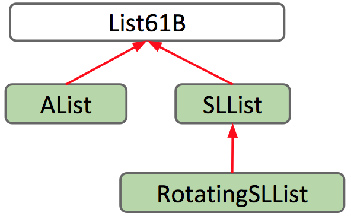

# Week 4

## 4-1 Intro and Interfaces

### The Desire for Generality

1. 
   
   
   
   
   

2. It's nice that Java is smart enough to know how to deal with two of the same methods for different types, but **overloading** has several downsides:

   - It's super repetitive and ugly, because you now have two virtually identical blocks of code.
   - It's more code to maintain, meaning if you want to make a small change to the longest method such as correcting a bug, you need to change it in the method for each type of list.
   - If we want to make more list types, we would have to copy the method for every new list class.

### Hypernyms, Hyponyms, and Interface Inheritance

1. 
   
   
   
   

2. We will formalize this relationship in Java: if a SLList is a hyponym of List61B, then the SLList class is a **subclass** of the List61B class and the List61B class is a **superclass** of the SLList class.

   

3. The new List61B is what Java calls an **interface**. It is essentially a contract that specifies what a list must be able to do, but it doesn't provide any implementation for those behaviors.

4. `implements` is essentially a promise. AList is saying "I promise I will have and define all the attributes and behaviors specified in the List61B interface"

### Overriding vs. Overloading

1. 
   
   
   

2. **Overriding**: Only happens with inheritance, if a subclass has a method with the exact same signature as in the superclass, we say that the subclass **overrides** the method.

   **Overloading**: Simply happens when methods have the same name but different signatures.

3. It's a good practice to use the `@Override` annotation for overridden methods.

   It is good to note that even if you don’t include this tag, you are still overriding the method. So technically, you don't _have_ to include it. However, including the tag acts as a safeguard for you as the programmer by alerting the compiler that you intend to override this method. The compiler will tell you if something goes wrong in the process.

   Say you want to override the `addLast` method. What if you make a typo and accidentally write `addLsat`? If you don't include the `@Override` tag, then you might not catch the mistake, which could make debugging a more difficult and painful process. Whereas if you include `@Override`, the compiler will stop and prompt you to fix your mistakes before your program even runs.

4. The `@Override` annotation does the these checks: Indicates that a method declaration is intended to override a method declaration in a supertype. If a method is annotated with this annotation type compilers are required to generate an error message unless at least one of the following conditions hold:
   - The method does override or implement a method declared in a supertype.
   - The method has a signature that is override-equivalent to that of any public method declared in `Object`.

#### Code

```java
public interface List61B<Item> {

    /** Inserts X into the back of the list. */
    public void addLast(Item x);

    /** Returns the item from the back of the list. */
    public Item getLast();

    /** Gets the ith item in the list (0 is the front). */
    public Item get(int i);

    /** Returns the number of items in the list. */
    public int size();

    /** Deletes item from back of the list and
     * returns deleted item. */
    public Item removeLast();

    /** Inserts item into given position.
     * Code from discussion #3 */
    public void insert(Item x, int position);

    /** Inserts an item at the front. */
    public void addFirst(Item x);

    /** Gets an item from the front. */
    public Item getFirst();

}
```

```java
/** Array based list.
 *  @author Josh Hug
 */

/* The next item ALWAYS goes in the size position */

public class AList<Item> implements List61B<Item>{
    /* the stored integers */
    private Item[] items;
    private int size;

    private static int RFACTOR = 2;

    /** Creates an empty list. */
    public AList() {
        size = 0;
        items = (Item[]) new Object[100];
    }

    /** Resize our backing array so that it is
     * of the given capacity. */
    private void resize(int capacity) {
        Item[] a = (Item[]) new Object[capacity];
        System.arraycopy(items, 0, a, 0, size);
        items = a;
    }

    /** Inserts X into the back of the list. */
    @Override
    public void addLast(Item x) {
        if (size == items.length) {
            resize(size * RFACTOR);
        }

        items[size] = x;
        size = size + 1;
    }

    /** Returns the item from the back of the list. */
    @Override
    public Item getLast() {
        int lastActualItemIndex = size - 1;
        return items[lastActualItemIndex];
    }

    /** Gets the ith item in the list (0 is the front). */
    @Override
    public Item get(int i) {
        return items[i];
    }

    /** Returns the number of items in the list. */
    @Override
    public int size() {
        return size;
    }

    /** Deletes item from back of the list and
     * returns deleted item. */
    @Override
    public Item removeLast() {
        Item itemToReturn = getLast();
        /* setting to zero not strictly necessary, but
         * it's a good habit (we'll see why soon) */
        items[size - 1] = null;
        size = size - 1;
        return itemToReturn;
    }

    /** Inserts item into given position.
     * Code from discussion #3 */
    @Override
    public void insert(Item x, int position) {
        Item[] newItems = (Item[]) new Object[items.length + 1];

        System.arraycopy(items, 0, newItems, 0, position);
        newItems[position] = x;

        System.arraycopy(items, position, newItems, position + 1, items.length - position);
        items = newItems;
    }

    /** Inserts an item at the front. */
    @Override
    public void addFirst(Item x) {
        insert(x, 0);
    }

    /** Gets an item from the front. */
    @Override
    public Item getFirst() {
        return get(0);
    }

}
```

```java
/* Represent a list of stuff, where all the "list" work is delegated
 * to a naked recursive data structure. */

public class SLList<Blorp> implements List61B<Blorp>{
    public class Node {
        public Blorp item;     /* Equivalent of first */
        public Node next; /* Equivalent of rest */

        public Node(Blorp i, Node h) {
            item = i;
            next = h;
        }
    }

    private Node sentinel;
    private int size;

    /** Creates an empty list. */
    public SLList() {
        size = 0;
        sentinel = new Node(null, null);
    }

    public SLList(Blorp x) {
        size = 1;
        sentinel = new Node(null, null);
        sentinel.next = new Node(x, null);
    }

    /** Adds an item of the front. */
    @Override
    public void addFirst(Blorp x) {
        Node oldFrontNode = sentinel.next;
        Node newNode = new Node(x, oldFrontNode);
        sentinel.next = newNode;
        size += 1;
    }

    /** Gets the front item of the list. */
    @Override
    public Blorp getFirst() {
        return sentinel.next.item;
    }

    /** Puts an item at the back of the list. */
    @Override
    public void addLast(Blorp x) {
        size += 1;

        Node p = sentinel;

        /* Move p until it reaches the end. */
        while (p.next != null) {
            p = p.next;
        }

        p.next = new Node(x, null);
    }

    /** Returns the back node of our list. */
    private Node getLastNode() {
        Node p = sentinel;

        /* Move p until it reaches the end. */
        while (p.next != null) {
            p = p.next;
        }
        return p;
    }

    /** Returns last item */
    @Override
    public Blorp getLast() {
        Node back = getLastNode();
        return back.item;
    }

    /** Deletes and returns last item. */
    @Override
    public Blorp removeLast() {
        Node back = getLastNode();
        if (back == sentinel) {
            return null;
        }

        Node p = sentinel;

        while (p.next != back) {
            p = p.next;
        }
        p.next = null;
        return back.item;
    }

    @Override
    public int size() {
        return size;
    }

    /** Gets the positionth item of the list. */
    @Override
    public Blorp get(int position) {
        if (position == 0) {
            return getFirst();
        }
        Node currentNode = sentinel.next.next;
        while (position > 1 && currentNode.next != null) {
            position -= 1;
            currentNode = currentNode.next;
        }

        return currentNode.item;
    }

    /** Inserts item into given position.
     * Code from discussion #3 */
    @Override
    public void insert(Blorp item, int position) {
        if (sentinel.next == null || position == 0) {
            addFirst(item);
            return;
        }

        Node currentNode = sentinel.next.next;
        while (position > 1 && currentNode.next != null) {
            position -= 1;
            currentNode = currentNode.next;
        }

        Node newNode = new Node(item, currentNode.next);
        currentNode.next = newNode;
    }


    /** TODO: Add a print method that overrides List61B's inefficient print method. */
    public void print() {
        for (Node p = sentinel.next; p != null; p = p.next) {
            System.out.print(p.item + " ");
        }
    }
}
```

```java
public class WordUtils {
    /** Returns the length of the longest word. */
    public static String longest(List61B<String> list) {
        int maxIdx = 0;
        for (int i = 0; i < list.size(); i += 1) {
            String longestString = list.get(maxIdx);
            String thisString = list.get(i);
            if (thisString.length() > longestString.length()) {
                maxIdx = i;
            }
        }
        return list.get(maxIdx);
    }

    public static void main(String[] args) {
        SLList<String> someList = new SLList<>();
        someList.addLast("elk");
        someList.addLast("are");
        someList.addLast("watching");
        System.out.println(longest(someList));
        //someList.print();
    }
}
```

### Interface Inheritance

1. 
   
   
   
   
   

2. > NOTE: A memory box can only hold 8byte address for the appropriate type. e.g. `String x` can never hold the 8byte address of a `Dog`. However, super/subclasses have something to do:

3. It's important to note that a variable of a superclass can have memory boxes holding its subclass's pointers. So, it's ok to do

   ```java
   List61B<String> myList = new SLList<String>();
   ```

   Also, when we then call `myList.addFirst("elk");`, this also runs fine, because although the `List61B` interface does NOT have the implementation of `addFirst()`, but the SLList that `myList` is pointing to "overrides" that method.

### Implementation Inheritance: Default Methods

1. 
   
   
   
   
   
   

2. In an `interface`, the methods can NOT have a body. So, if we need to achieve **implementation inheritance** (where methods implemented in the superclass is inherited by its subclass), then we'll need to use the keyword `default` in the signature of the method. e.g.:

   ```java
   default public void print() {
      // DO SOMETHING
   }
   ```

3. Note that although we don't have any instance variables to manipulate inside List61B class, but we do have the signature of the methods of its subclass, which allow us to use those methods in the `print()` method.

4. Turns out the `print()` method implemented in `List61B` is not efficient for SLList, since its `get()` method needs to traverse through the whole list until the ith item.

   So, it's efficient for AList, but inefficient for SLList.

### Static and Dynamic Type, Dynamic Method Selection

1. 
   
   
   
   
   

2. The term **Method Selection** is actually non-standard, but there's no official term for it, so we'll simply call it method selection.

3. Summary: In Java, variables have a "static type" which is the type given in declaration, and a "dynamic type" which is the type given in initialization during runtime. And the "dynamic type" can be changed many times during runtime.

### More Dynamic Method Selection, Overloading vs. Overriding

1. If the dynamic type Y has a method that **overrides** a method from its compile-time type X ("overriding" means to have the **exact same signature**, even including the parameter type, name, and the return type, but NOT including the modifiers like `public`, `default`), then Y's implementation of that method is used instead.

2. NOTE: **Override** only happens when the signatures are exactly the same.

   e.g. when superclass has `default void flatter(Animal a)` and the subclass has `void flatter(Dog a)`. The difference in the signatures is the parameter type. And since they're actually different signatures, they won't be overridden. Instead, these two methods are **overloaded** and NOT overridden.

3. Based on the above, we came up with how the **Method Selection** works:

   

4. So, in the above example:

   

   First, at compile time, the compiler sees `a.flatter(d)` and searches for a method in `Animal` tha can handle this. If 2 or more methods can handle this, then the most **specific** method is picked. The compiler then "records" the signature `void flatter(Animal a)`.

   Second, when the program runs, the code `a.flatter(d)` have to use the method with the exact same signature `void flatter(Animal a)` recorded by the compiler at compile-time. If some method in `Dog` has the exact same signature, then the program will actually use the one defined in `Dog`. This behavior is called overriding.

5. SUMMARY:

   - **Compile-time**: setup the "static type", and record the signature of the most specific method to this type. (**"overload"** could happen here)

   - **Run-time**: setup the "dynamic type" (might be the same as static type or a subclass type). If its dynamic type is indeed a subclass type and the method is **"override"** in the subclass, then JVM will run that overriding method instead (note that in order to override, methods must have exactly the same signatures). If no override takes place, then simply the original recorded method is run.

6. The fact that "dynamic typing" is checked and "override" mehtods are called only in runtime is intuitive, since at compile we haven't even pass the object yet, then how can JVM know what type the argument is? So, only at runtime when we know the type of the argument can JVM checks for overridden methods.

7. > But note that the **signature** is already decided at compile time, so if the signature is not the same as the overridden method, then JVM will NOT call the override method.

8. "Static type": The type of the object pointer variable. So, the variable pointing to the object will always be of this type, meaning that its pointer points to object of this static type.

   "Dynamic type": The type of the instantiated object that the pointer is currently pointing to.

9. Say there are two methods in the same class

   ```java
   public static void peek(List61B<String> list) {
        System.out.println(list.getLast());
    }
    public static void peek(SLList<String> list) {
        System.out.println(list.getFirst());
    }
   ```

   and you run this code

   ```java
   SLList<String> SP = new SLList<String>();
   List61B<String> LP = SP;
   SP.addLast("elk");

   peek(SP); // calls the 2nd method
   peek(LP); // calls the 1st method
   ```

   The first call to peek() will use the second peek method that takes in an SLList. The second call to peek() will use the first peek method which takes in a List61B. This is because the only distinction between two overloaded methods is the types of the parameters.

   When Java checks to see which method to call, it checks the **static type** and calls the method with the parameter of the same type.

### Interface Inheritance vs. Implementation Inheritance

1. How do we differentiate between "interface inheritance" and "implementation inheritance"? Well, you can use this simple distinction:

   - Interface inheritance (what): Simply tells what the subclasses should be able to do.
     - EX) all lists should be able to print themselves, how they do it is up to them.
   - Implementation inheritance (how): Tells the subclasses how they should behave.
     - EX) Lists should print themselves exactly this way: by getting each element in order and then printing them.

2. When you are creating these hierarchies, remember that the relationship between a subclass and a superclass should be an **_"is-a"_** relationship. AKA Cat should only implement Animal Cat is an Animal. You should not be defining them using a "has-a" relationship. Cat has-a Claw, but Cat definitely should not be implementing Claw.

3. Finally, Implementation inheritance may sound nice and all but there are some drawbacks:
   - It's possible that you overrode a method but forgot you did.
   - It may be hard to resolve conflicts in case two interfaces give conflicting default methods.
   - It encourages overly complex code
   - WORST OF ALL: Breaks encapsulation!!!

---

## 4-2 Extends, Casting, Higher Order Functions

### Extends

Now you've seen how we can use the `implements` keyword to define a hierarchical relationship with interfaces. What if we wanted to define a "hierarchical relationship between classes"?

Suppose we want to build a `RotatingSLList` that has the same functionality as the `SLList` like `addFirst`, `size`, etc., but with an additional `rotateRight` operation to bring the last item to the front of the list.

One way you could do this would be to copy and paste all the methods from `SLList` and write `rotateRight` on top of it all - but then we wouldn't be taking advantage of the power of inheritance! Remember that **inheritance allows subclasses to reuse code from an already defined class**. So let's define our `RotatingSLList` class to inherit from SLList.

We can set up this inheritance relationship in the class header, using the extends keyword like so:

```java
public class RotateSLList<Item> extends SLList<Item>
```

In the same way that `AList` shares an "is-a" relationship with `List61B`, `RotatingSLList` shares an "is-a" relationship `SLList`. The `extends` keyword lets us keep the original functionality of SLList, while enabling us to make modifications and add additional functionality.



**Exercise 4.2.1.** Define the rotateRight method, which takes in an existing list, and rotates every element one spot to the right, moving the last item to the front of the list.

For example, calling `rotateRight` on [5, 9, 15, 22] should return [22, 5, 9, 15].

```java
public void rotateRight() {
    Item x = removeLast();
    addFirst(x);
}
```

You might have noticed that we were able to use methods defined outside of `RotatingSLList`, because we used the extends keyword to inherit them from SLList. That gives rise to the question: What exactly do we inherit?

By using the `extends` keyword, subclasses inherit all **members of the parent class**. "Members" includes:

- All instance and static variables
- All methods
- All nested classes

> Note that "constructors" are not inherited, and `private` members cannot be directly accessed by subclasses.

### VengefulSLList

Notice that when someone calls `removeLast` on an SLList, it throws that value away - never to be seen again. But what if those removed values left and started a massive rebellion against us? In this case, we need to remember what those removed values were so we can hunt them down and terminate them later.

We create a new class, `VengefulSLList`, that remembers all items that have been banished by removeLast.

Like before, we specify in VengefulSLList's class header that it should inherit from SLList.

Now, let's give VengefulSLList a method to print out all of the items that have been removed by a call to the removeLast method, `printLostItems()`. We can do this by adding an instance variable that can keep track of all the deleted items. If we use an SLList to keep track of our items, then we can simply make a call to the print() method to print out all the items.

VengefulSLList's `removeLast` should do exactly the same thing that SLList's does, except with one additional operation - adding the removed item to the `deletedItems` list. In an effort to reuse code, we can override the `removeLast` method to modify it to fit our needs, and call the `removeLast` method defined in the parent class, SLList, using the `super` keyword.

```java
public class VengefulSLList<Item> extends SLList<Item> {
    SLList<Item> deletedItems;

    public VengefulSLList() {
        deletedItems = new SLList<Item>();
    }

    @Override
    public Item removeLast() {
        Item x = super.removeLast();
        deletedItems.addLast(x);
        return x;
    }

    /** Prints deleted items. */
    public void printLostItems() {
        deletedItems.print();
    }
}
```

Notice how we use `super.removeLast()` to call the superclass' method.

### Constructors Are Not Inherited

As we mentioned earlier, subclasses inherit all members of the parent class, which includes instance and static variables, methods, and nested classes, but does NOT include constructors.

While constructors are not inherited, **Java requires that all constructors must start with a call to one of its superclass's constructors**.

To gain some intuition on why that it is, recall that the `extends` keywords defines an "is-a" relationship between a subclass and a parent class. If a VengefulSLList "is-a" SLList, then it follows that every VengefulSLList must be set up like an SLList.

Here's a more in-depth explanation. Let's say we have two classes:

```java
public class Human {...}
```

```java
public class TA extends Human {...}
```

It is logical for TA to extend Human, because all TA's are Human. Thus, we want TA's to inherit the attributes and behaviors of Humans.

If we run the code below:

```java
TA yang = new TA();
```

Then first, a Human must be created. Then, that Human can be given the qualities of a TA. It doesn't make sense for a TA to be constructed without first creating a Human first.

Thus, we can either explicitly make a call to the superclass's constructor, using the `super` keyword:

```java
public VengefulSLList() {
    super();
    deletedItems = new SLList<Item>();
}
```

Or, **if we choose not to, Java will automatically make a call to the superclass's no-argument constructor**.

In this case, adding `super()` has no difference from the constructor we wrote before. It just makes explicit what was done implicitly by Java before. However, if we were to define another constructor in VengefulSLList, Java's implicit call may not be what we intend to call.

Suppose we had a one-argument constructor that took in an item. If we had relied on an implicit call to the superclass's no-argument constructor, super(), the item passed in as an argument wouldn't be placed anywhere!

So, we must **make an explicit call to the correct constructor by passing in the item as a parameter to super**.

```java
public VengefulSLList(Item x) {
    super(x);
    deletedItems = new SLList<Item>();
}
```

### The Object Class

**Every class in Java is a descendant of the `Object` class, or extends the `Object` class**. Even classes that do not have an explicit `extends` in their class still implicitly extend the `Object` class.

For example,

- VengefulSLList `extends` SLList explicitly in its class declaration
- SLList `extends` Object implicitly

This means that since SLList inherits all members of Object, VengefulSLList inherits all members of SLList and Object, transitively. So, what is to be inherited from Object?

As seen in the documentation for the `Object` class, the Object class provides operations that every Object should be able to do - like `.equals(Object obj)`, `.hashCode()`, and `toString()`.

> Note: Interfaces do NOT extend the Object class.


### Encapsulation

Encapsulation is one of the fundamental principles of object oriented programming, and is one of the approaches that we take as programmers to resist our biggest enemy: _complexity_. Managing complexity is one of the major challenges we must face when writing large programs.

Some of the tools we can use to fight complexity include **hierarchical abstraction** (abstraction barriers!) and a concept known as **"Design for change"**. This revolves around the idea that _programs should be built into modular, interchangeable pieces that can be swapped around without breaking the system_. Additionally, **hiding information** that others don't need is another fundamental approach when managing a large system.

- Hierarchical abstraction.
  - Create **layers of abstraction**, with **clear abstraction barriers**.
- "Design for change".
  - Organize program around objects.
  - Let objects decide how things are done.
  - Hide information others don't need.

The root of encapsulation lies in this notion of hiding information from the outside. One way to look at it is to see how encapsulation is analogous to a Human cell. The internals of a cell may be extremely complex, consisting of chromosomes, mitochondria, ribosomes etc., but yet it is fully **encapsulated into a single module - abstracting away the complexity inside**.


In computer science terms, **a module can be defined as a set of methods that work together as a whole to perform a task or set of related tasks**. This could be something like a class that represents a list. Now, **if the implementation details of a module are kept internally hidden and the only way to interact with it is through a documented interface, then that module is said to be encapsulated**.

Take the `ArrayDeque` class, for example. The outside world is able to utilize and interact with an `ArrayDeque` through its defined methods, like `addLast` and `removeLast`. However, they need not understand the complex details of how the data structure was implemented in order to be able to use it effectively.

> Managing complexity is the most important thing for building large projects.

### Abstraction Barriers

Ideally, a user should not be able to observe the internal workings of, say, a data structure they are using.

Fortunately, Java makes it easy to enforce abstraction barriers. Using the `private` keyword in Java, it becomes virtually impossible to look inside an object - ensuring that the underlying complexity isn't exposed to the outside world.

And in fact, Java is one of the few languages that actually makes `private` and `protected` forced by the compiler, other languages like Python merely uses a convention.


The above problems are bad examples of using encapsulation, since they're thinking at a low-level abstraction.


### My Questions

Q: How does the JVM search for a method for a class with superclasses? Does it start from the very root or from the class itself?
Ans: For an instance method, it always starts searching in the runtime class of the object calling the method. When Java sees that the method has been overridden in the runtime class, it executes that implementation. Otherwise, it walks up the class hierarchy to find an inherited implementation.

### How Inheritance Breaks Encapsulation

Suppose we had the following two methods in a Dog class. We could have implemented `bark` and `barkMany` like so:

```java
public void bark() {
    System.out.println("bark");
}

public void barkMany(int N) {
    for (int i = 0; i < N; i += 1) {
        bark();
    }
}
```

Or, alternatively, we could have implemented it like so:

```java
public void bark() {
    barkMany(1);
}

public void barkMany(int N) {
    for (int i = 0; i < N; i += 1) {
        System.out.println("bark");
    }
}
```

From a user's perspective, the functionality of either of these implementations is exactly the same. However, observe the effect if we were to define a a subclass of `Dog` called `VerboseDog`, and override its `barkMany` method as such:

```java
@Override
public void barkMany(int N) {
    System.out.println("As a dog, I say: ");
    for (int i = 0; i < N; i += 1) {
        bark();
    }
}
```

**Exercise 4.2.3.** Given a VerboseDog `vd`, what would `vd.barkMany(3)` output, given the first implementation above? The second implementation?

- a: As a dog, I say: bark bark bark
- b: bark bark bark
- c: Something else

As you have seen, using the first implementation, the output is A, while using the second implementation, the program gets caught in an infinite loop. The call to `bark()` will call `barkMany(1)`, which makes a call to `bark()`, repeating the process infinitely many times.

#### Note

The methods are actually stored only in the class defining those methods. When instances calls the method, JVM just lookup into its class for that definition.

The instance methods of an object are stored in its class object (only one copy should exist), they are not "copied" with each new instance, instead, under the hood each instance holds a reference to the method implementation residing in the class object.

See: [stackoverflow: how-are-instance-methods-stored](https://stackoverflow.com/questions/8376953/how-are-instance-methods-stored)

#### Walkthrough of exercise


1. When we call `vd.barkMany(3)`, the dynamic type of `vd` is `VerboseDog`, so JVM will search for the method in `VerboseDog` class and it does find it there.

2. Calling the `barkMany` method, it calls `bark()`, which is equivalently `this.bark()`, where `this` is of dynamic type `VerboseDog`.

3. Calling `this.bark()`, JVM searches for the method in its dynamic type class, `VerboseDog`, but didn't fint it. So, it looks up to its superclasses and finds an implementation in `Dog` and calls it (still calling by `this.bark()`, its just the definition of `bark()` is found at `Dog` class, but the object being called on is still the same)

4. `bark()` then calls `this.barkMany(1)`, where `this` is still just of dynamic type `VerboseDog`.

5. And we get caught in an infinite loop...

### Type Checking and Casting

Before we go into types and casting, let's review dynamic method selection. Recall that dynamic method lookup is the process of determining the method that is executed at runtime based on the dynamic type of the object. Specifically, if a method in SLList is overridden by the VengefulSLList class, then the method that is called at runtime is determined by the run-time type, or dynamic type, of that variable.

**Exercise 4.2.4.** For each line of code below, decide the following:

- Does that line cause a compilation error?
- Which method uses dynamic selection?


Let's go through this program line by line.

```java
VengefulSLList<Integer> vsl = new VengefulSLList<Integer>(9);
SLList<Integer> sl = vsl;
```

These two lines above compile just fine. Since VengefulSLList "is-an" SLList, it's valid to put an instance of the VengefulSLList class inside an SLList "container".

```java
sl.addLast(50);
sl.removeLast();
```

These lines above also compile. The call to addLast is unambiguous, as VengefulSLList did not override or implement it, so the method executed is in SLList. The removeLast method is overridden by VengefulSLList, however, so we take a look at the dynamic type of sl. Its dynamic type is VengefulSLList, and so dynamic method selection chooses the overridden method in the VengefulSLList class.

```java
sl.printLostItems(); // compile-time error
```

This line above results in a compile-time error. Remember that the **compiler determines whether or not something is valid based on the static type of the object**. Since sl is of static type SLList, and _printLostItems is not defined in the SLList class_, the code will not be allowed to run, even though sl's runtime type is VengefulSLList.

```java
VengefulSLList<Integer> vsl2 = sl; // compile-time error
```

This line above also results in a compile-time error, for a similar reason. In general, the compiler only allows method calls and assignments based on compile-time types. _Since the compiler only sees that the static type of sl is SLList, it will not allow a VengefulSLList "container" to hold it_.

#### Expressions

Like variables as seen above, **expressions using the new keyword also have compile-time types**.

```java
SLList<Integer> sl = new VengefulSLList<Integer>();
```

Above, the compile-time type of the right-hand side of the expression is VengefulSLList. The compiler checks to make sure that VengefulSLList "is-a" SLList, and allows this assignment,

```java
VengefulSLList<Integer> vsl = new SLList<Integer>();
```

Above, the compile-time type of the right-hand side of the expression is SLList. **The compiler checks if SLList "is-a" VengefulSLList, which it is not in all cases, and thus a compilation error results**.

Further, method calls have compile-time types equal to their declared type. Suppose we have this method:

```java
public static Dog maxDog(Dog d1, Dog d2) { ... }
```

Since the **return type of maxDog is Dog, any call to maxDog will have compile-time type Dog**.

```java
Poodle frank = new Poodle("Frank", 5);
Poodle frankJr = new Poodle("Frank Jr.", 15);
```

```java
Dog largerDog = maxDog(frank, frankJr);
Poodle largerPoodle = maxDog(frank, frankJr); //does not compile! RHS has compile-time type Dog
```

Assigning a Dog object to a Poodle variable, like in the SLList case, results in a compilation error. A Poodle "is-a" Dog, but a more general Dog object may not always be a Poodle, even if it clearly is to you and me (we know that frank and frankJr are both Poodles!).

Is there any way around this, when we know for certain that assignment would work?

#### Casting

Java has a special syntax where you can tell the compiler that a specific expression has a specific compile-time type. This is called "casting". **With casting, we can tell the compiler to view an expression as a different compile-time type**.

Looking back at the code that failed above, since we know that `frank` and `frankJr` are both Poodles, we can cast:

```java
Poodle largerPoodle = (Poodle) maxDog(frank, frankJr);
// compiles! RHS has compile-time type Poodle after casting
```

> Caution: Casting is a powerful but dangerous tool. Essentially, casting is telling the compiler not to do its type-checking duties - telling it to trust you and act the way you want it to.

Here's a possible issue that could arise:

```java
Poodle frank = new Poodle("Frank", 5);
Malamute frankSr = new Malamute("Frank Sr.", 100);

Poodle largerPoodle = (Poodle) maxDog(frank, frankSr); // runtime exception!
```

In this case, we compare a Poodle and a Malamute. Without casting, the compiler would normally not allow the call to maxDog to compile, as the right hand side compile-time type would be Dog, not Poodle. However, casting allows this code to pass, and **when maxDog returns the Malamute at runtime, and we try casting a Malamute as a Poodle, we run into a runtime exception** - a `ClassCastException`.

### Higher Order Functions

Taking a little bit of a detour, we are going to introduce higher order functions. **A higher order function is a function that treats other functions as data**. For example, take this Python program `do_twice` that takes in another function as input, and applies it to the input x twice.

```py
def tenX(x):
    return 10*x

def do_twice(f, x):
    return f(f(x))
```

A call to `print(do_twice(tenX, 2))` would apply `tenX` to `2`, and apply `tenX` again to its result, `20`, resulting in `200`. How would we do something like this in Java?

**In old school Java (Java 7 and earlier), memory boxes (variables) could not contain pointers to functions.** What that means is that **we could not write a function that has a "Function" type, as there was simply no type for functions**.

To get around this we can take advantage of interface inheritance. Let's **write an interface that defines any function that takes in an integer and returns an integer - an `IntUnaryFunction`**.

```java
public interface IntUnaryFunction {
    int apply(int x);
}
```

Now we can write a class which `implements` `IntUnaryFunction` to represent a concrete function. Let's make a function that takes in an integer and returns 10 times that integer.

```java
public class TenX implements IntUnaryFunction {
    /* Returns ten times the argument. */
    public int apply(int x) {
        return 10 * x;
    }
}
```

At this point, we've written in Java the Python equivalent of the tenX function. Let's write do_twice now.

```java
public static int do_twice(IntUnaryFunction f, int x) {
    return f.apply(f.apply(x));
}
```

A call to print(do_twice(tenX, 2)) in Java would look like this:

```java
System.out.println(do_twice(new TenX(), 2));
```

Why do we want an interface `IntUnaryFunction`?

Because we might have other methods like `FiveX()`, `TwentyX()`, etc., and when we want to call `do_twice()` with those methods, we can simply refer to them all as of `IntUnaryFunction` class.


### Inheritance Cheatsheet

`VengefulSLList extends SLList` means VengefulSLList "is-an" SLList, and inherits all of SLList's members:

- Variables, methods, and nested classes
- Not constructors Subclass constructors must invoke superclass constructor first. The `super` keyword can be used to invoke overridden superclass methods and constructors.

Invocation of overridden methods follows two simple rules:

- Compiler plays it safe and only allows us to do things according to the static type.
- For overridden methods (not overloaded methods), the actual method invoked is based on the dynamic type of the invoking expression
- Can use casting to overrule compiler type checking.


