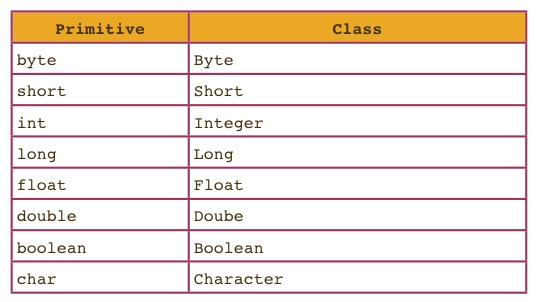
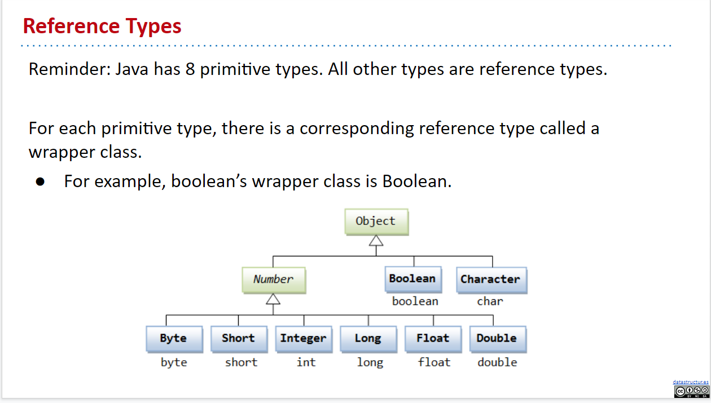
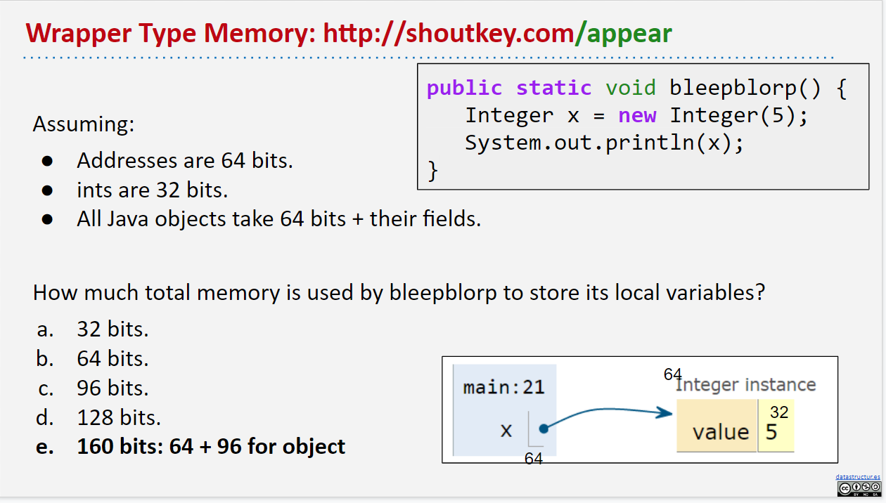
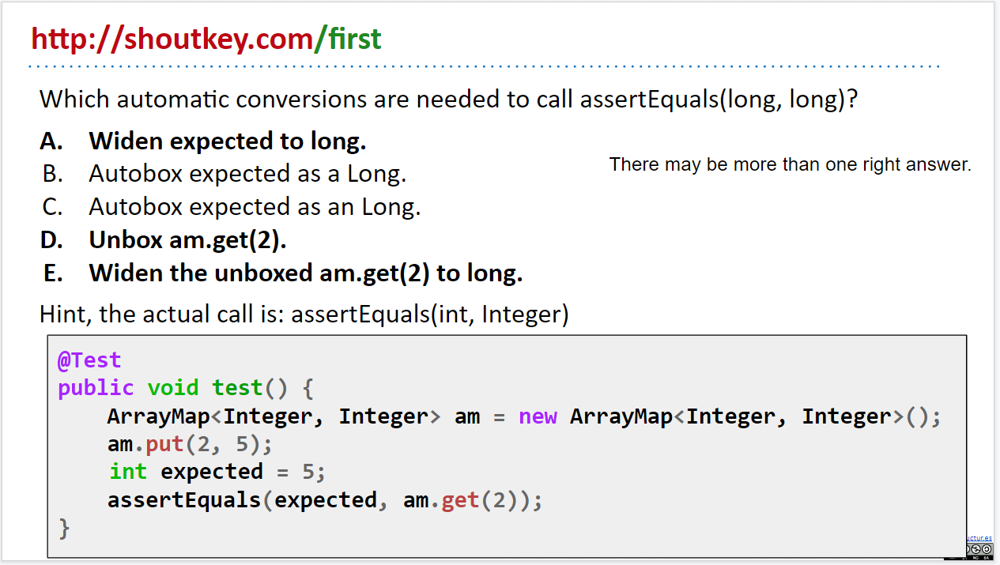
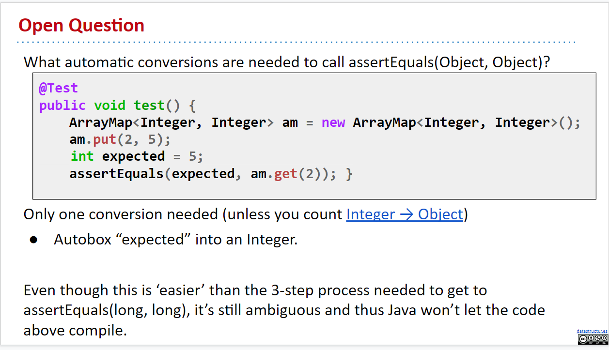
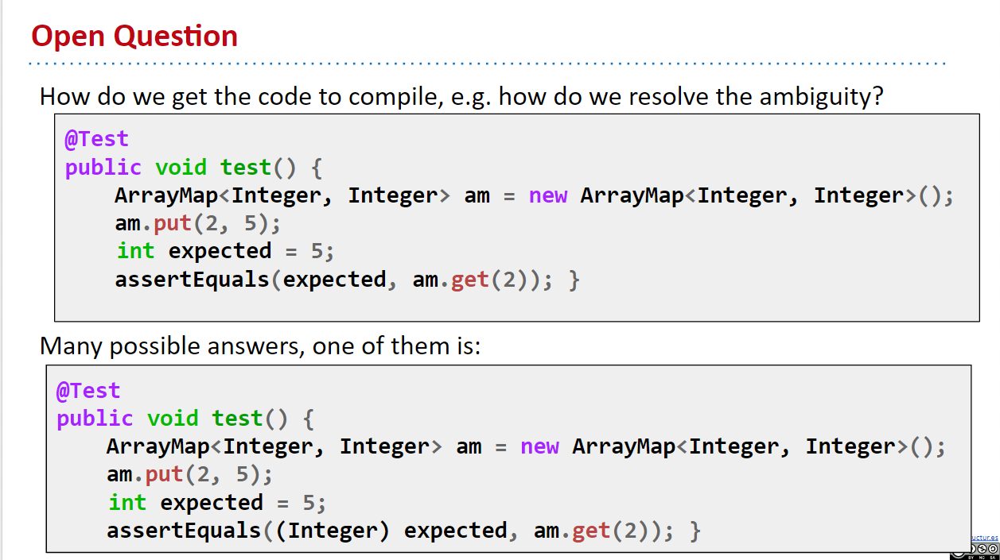
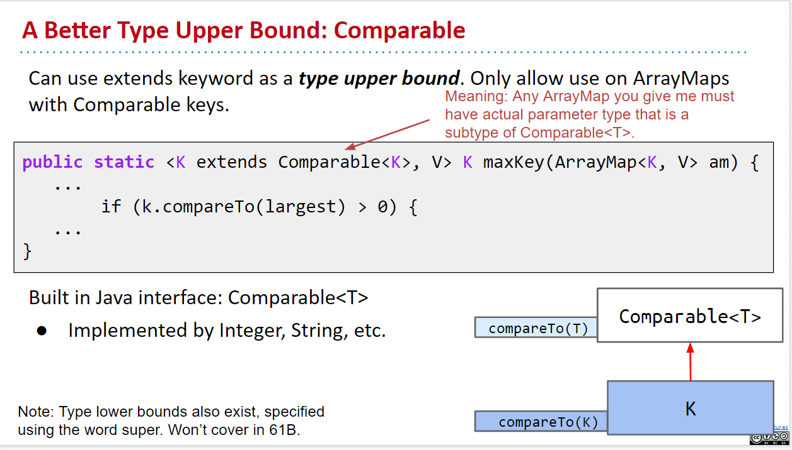
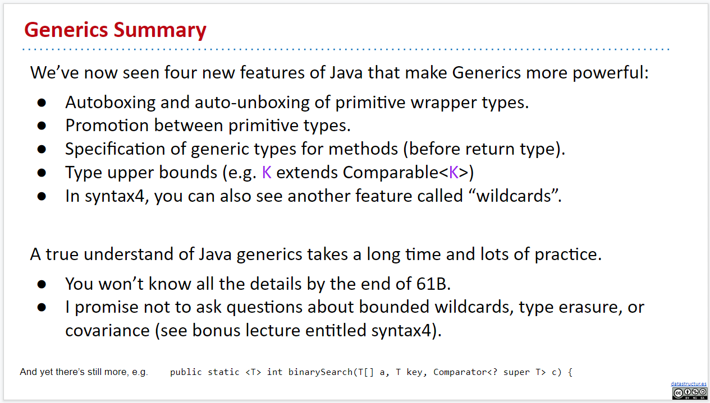

# Week 5

## 5-1 Autoboxing

In the previous parts of this book, we've talked about various data structures and the way that Java supports their implementation. In this chapter, we'll discuss a variety of supplementary topics that are used in industrial strength implementations of Java programs.

This is not meant to be a comprehensive guide to Java, but rather a highlight of features that are likely to be useful to you while working on this course.

### Autoboxing and Unboxing

As we saw in the previous chapter, we can define classes which have generic type variables using the `<>` syntax, e.g. `LinkedListDeque<Item>` and `ArrayDeque<Item>`. When we want to instantiate an object whose class uses generics, we have to substitute the generic with a concrete class, i.e. specify what type of items are going to go into that class.

Recall that Java has 8 primitive types -- all other types are reference types. One particular feature of Java is that we _can NOT provide a primitive type as an actual type argument for generics_, e.g. `ArrayDeque<int>` is a syntax error. Instead, we use `ArrayDeque<Integer>`.

For each primitive type, we use the corresponding reference type as shown in the table below. These reference types are called **"wrapper classes"**.



Naively, we'd assume that this would result in having to manually convert between primitive and reference types when using a generic data structure. For example, we might imagine having to do the following:

```java
public class BasicArrayList {
    public static void main (String[] args) {
      ArrayList<Integer> L = new ArrayList<>();
      L.add(new Integer(5)); // convert 5 to an Integer object
      L.add(new Integer(6)); // convert 6 to an Integer object

      /* Use the Integer.valueOf method to convert to int */
      int first = L.get(0).valueOf(); // convert Integer to int
    }
}
```

Writing code like above can be a bit annoying. Luckily, **Java can implicitly convert between primitive and wrapper types**, so the code below works just fine

```java
public class BasicArrayList {
    public static void main (String[] args) {
      ArrayList<Integer> L = new ArrayList<>();
      L.add(5);
      L.add(6);
      int first = L.get(0);
    }
}
```

The reason this works is that **Java will automatically "box" and "unbox" values between a primitive type and its corresponding reference type**. That is, if Java expects a wrapper type, like Integer, and you provide a primitive type, like int, it will "autobox" the integer. For example, if we have the function:

```java
public static void blah(Integer x) {
    System.out.println(x);
}
```

And we call it using:

```java
int x = 20;
blah(x);
```

Then Java implicitly creates a new `Integer` with value 20, resulting in a call to equivalent to calling `blah(new Integer(20))`. This process is known as autoboxing.

Likewise, if Java a function expected a primitive:

```java
public static void blahPrimitive(int x) {
    System.out.println(x);
}
```

but you give it a corresponding wrapper type:

```java
Integer x = new Integer(20);
blahPrimitive(x);
```

It will automatically unbox the integer, equivalent to calling the Integer class's valueOf method i.e. `blahPrimitive(x.valueOf())`.




Roughly speaking, all Java Objects uses 64 bits to store some extra informations about themselves, and some more bits to store its field variables.

### Caveats

There are a few things to keep in mind when it comes to autoboxing and unboxing:

- **Arrays are NEVER autoboxes or auto-unboxed**, e.g. if you have an array of integers `int[] x`, and try to put its address into a variable of type `Integer[]`, the compiler will NOT allow your program to compile.
- Autoboxing and unboxing also has a measurable performance impact. That is, **code that relies on autoboxing and unboxing will be slower** than code w/o such automatic conversions.
- **Wrapper types use much more memory than primitive types**. On most modern comptuers, not only must your code hold a 64 bit reference to the object, but every object also requires 64 bits of overhead used to store things like the dynamic type of the object.
  - More on memory usage, see [this link](http://blog.kiyanpro.com/2016/10/07/system_design/memory-usage-estimation-in-java/)

### Widening

Similar to the autoboxing/unboxing process, **Java will also automatically widen a primitive if needed**. Specifically, if a program expects a primitive of type T2 and is given a variable of type T1, and type T2 can take on a wider range of values than T1, the the variable will be implicitly cast to type T2.

For example, `double` in Java are wider than `int`. If we have the function shown below:

```java
public static void blahDouble(double x) {
    System.out.println("double: " + x);
}
```

We can call it with an int argument:

```java
int x = 20;
blahDouble(x);
```

The effect is the same as if we'd done `blahDouble((double) x)`. Thanks Java :)

If you want **to go from a wider type to a narrower type, you must explicitly do type cast**. For example, if you have the method below:

```java
public static void blahInt(int x) {
    System.out.println("int: " + x);
}
```

Then we'd need to explicitly cast if we want to call this method with a `double` value:

```java
double x =  20;
blahInt((int) x);
```

For more details on widening, including a full description of what types are wider than others, see the [official Java documentation](https://docs.oracle.com/javase/specs/jls/se8/html/jls-5.html).

---

## 5-2 Immutability

Definition: An immutable data type is a data type whose instances cannot change in any observable way after instantiation.

For example, `String` objects in Java are immutable. No matter what, if you have an instance of `String`, you can call any method on that `String`, but it will remain completely unchanged. This means that when `String` objects are concatenated, neither of the original `String`s are modified -- instead, a totally new `String` object is returned.

Mutable datatypes include objects like `ArrayDeque` and `Planet`. We can add or remove items from an `ArrayDeque`, which are observable changes. Similarly, the velocity and position of a `Planet` may change over time.

Any data type with non-private variables is mutable, unless those variables are declared `final` (this is not the only condition for mutability -- there are many other ways of defining a data type so that it is mutable). This is because an outside method can change the value of non-private variables, leading to observable change.

The `final` keyword is a keyword for variables that prevents the variable from being changed after its first assignment. For example, consider the `Date` class below:

```java
public class Date {
    public final int month;
    public final int day;
    public final int year;
    private boolean contrived = true;

    public Date (int m, int d, int y) {
        month = m; day = d; year = y;
    }
}
```

This class is **immutable**. After instantiating a Date, there is no way to change the value of any of its properties.

- Advantages of immutable data types:
  - Prevents bugs and makes debugging easier because properties cannot change ever
  - You can count on objects to have a certain behavior/trait
- Disadvantages:
  - Needs to create a new object in order to change a property
- Caveats:

  - Declaring a reference as `final` does NOT make the object that reference is pointing to immutable!!! For example, consider the following code snippet:

    ```java
    public final ArrayDeque<String>() deque = new ArrayDeque<String>();
    ```

    The `deque` variable is `final` and can never be reassigned, but the array deque object its pointing to can change! `ArrayDeque`s are always mutable!

  - Using the Reflection API, it is possible to make changes even to private variables! Our notion of immutability assumes that we're not using any of the special capabilities of this library.

---

## 5-3 Generics

### Creating Another Generic Class

Now that we've created generic lists, such as `DLList`s and `AList`s, lets move on to a different data type: maps. **Maps** let you **associate keys with values**, for example, the statement "Josh's score on the exam is 0" could be stored in a Map that associates students to their exam scores. A map is the Java equivalent of a Python dictionary or a JavaScript Map.

We're going to be creating the `ArrayMap` class, which implements the `Map61B` interface, a restricted version of Java's built-in `Map` interface. `ArrayMap` will have the following methods:

```
 put(key, value): Associate key with value.
 containsKey(key): Checks if map contains the key.
 get(key): Returns value, assuming key exists.
 keys(): Returns a list of all keys.
 size(): Returns number of keys.
```

For this exercise, we will ignore resizing. One thing to note about the `Map61B` interface (and the Java `Map` interface in general) is that **each key can only have one value at a time**. If Josh is mapped to 0, and then we say "Oh wait, there was a mistake! Josh actually got 100 on the exam," we erase the value 0 that Josh maps to and replace it with 100.

The implementation:

```java
package Map61B;

import java.util.List;
import java.util.ArrayList;

/***
 * An array-based implementation of Map61B.
 ***/
public class ArrayMap<K, V> implements Map61B<K, V> {

    private K[] keys;
    private V[] values;
    int size;

    public ArrayMap() {
        keys = (K[]) new Object[100];
        values = (V[]) new Object[100];
        size = 0;
    }

    /**
    * Returns the index of the key, if it exists. Otherwise returns -1.
    **/
    private int keyIndex(K key) {
        for (int i = 0; i < size; i++) {
            if (keys[i].equals(key)) {
            return i;
        }
        return -1;
    }

    public boolean containsKey(K key) {
        int index = keyIndex(key);
        return index > -1;
    }

    public void put(K key, V value) {
        int index = keyIndex(key);
        if (index == -1) {
            keys[size] = key;
            values[size] = value;
            size += 1;
        } else {
            values[index] = value;
        }
    }

    public V get(K key) {
        int index = keyIndex(key);
        return values[index];
    }

    public int size() {
        return size;
    }

    public List<K> keys() {
        List<K> keyList = new ArrayList<>();
        for (int i = 0; i < keys.length; i++) {
            // There's a bug here!!!
            keyList.add(keys[i]);
        }
        return keyList;
    }
}
```

> Note: the decision to name the generics K and V is arbitrary (but meant to be intuitive). It's quite common to see generics in Java represented as a single uppercase letter, in this course and elsewhere.

There were a few interesting things here; looking at the top of the code, we stated `package Map61B;`. We will go over this a bit later, but for now just know that it means we are putting our `ArrayMap` class within a folder called Map61B. Additionally, we import `List` and `ArrayList` from `java.utils`.

**Exercise 5.2.1**: In our current implementation of `ArrayMap`, there is a bug. Can you figure out what it is?

**Answer**: In the `keys` method, the for loop should be iterating until `i == size`, not `keys.length`. This is because the `keys` array have 100 elements and hence `keys.length` is `100`; however, some of them might just be `null`s, since we don't have that many keys yet. So, we only want to iterate to `size - 1`.

### ArrayMap and Autoboxing Puzzle

If we write a test as shown below:

```java
@Test
public void test() {
    ArrayMap<Integer, Integer> am = new ArrayMap<Integer, Integer>();
    am.put(2, 5);
    int expected = 5;
    assertEquals(expected, am.get(2));
}
```

You will find that we get a compile-time error!

```
$ javac ArrayMapTest.java
ArrayMapTest.java:11: error: reference to assertEquals is ambiguous
    assertEquals(expected, am.get(2));
    ^
    both method assertEquals(long, long) in Assert and method assertEquals(Object, Object) in Assert match
```

We get this error because JUnit's `assertEquals` method is **overloaded**, eg. `assertEquals(long expected, long actual)`, `assertEquals(Object expected, Object actual)`, etc (note that junit does NOT have a `assertEquals(int expected, int actual)` method). Thus, Java is unsure which method to call for `assertEquals(expected, am.get(2))`, which requires one argument to be autoboxed/unboxed.

- **Excercise 5.2.2** What would we need to do in order to call `assertEquals(long, long)`?
  A.) Widen `expected` to a `long`
  B.) Autobox `expected` to a `Long`
  C.) Unbox `am.get(2)`
  D.) Widen the unboxed `am.get(2)` to `long`

  **Answer**: We'll need all of A, C, and D to work.

  

- **Excercise 5.2.3** How would we make it work with `assertEquals(Object, Object)`?
  **Answer**: Autobox `expected` to an `Integer` because Integers are Objects.

  

- **Excercise 5.2.4** How do we make the code compile without having any runtime conversions? (Note: The answers in Exercise 5.2.2 and 5.2.3 both use runtime conversion)
  **Answer**: Cast `expected` to `Integer`. (Try to think about why not cast it to `Long`)

  

### Generic Methods

The goal for the next section is to create a class `MapHelper` which will have two methods:

- `get(Map61B, key)`: Returns the value corresponding to the given key in the map if it exists, otherwise null.
  - This is useful because `ArrayMap` currently has a bug where the get method throws an `ArrayIndexOutOfBoundsException` if we try to get a key that doesn't exist in the `ArrayMap`.
- `maxKey(Map61B)`: Returns the maximum of all keys in the given ArrayMap. Works only if keys can be compared.

Let's implement these methods inside the `MapHelper` class:

```java
package map61b;

public class MapHelper {
  // CODE HERE
}
```

#### Implementing get(Map61B, key)

`get` is a static method that takes in a Map61B instance and a key and returns the value that corresponds to the key if it exists, otherwise returns null.

**Excercise 5.2.5** Try writing this method yourself!

As you see, we could write a very limited method by declare the parameters as String and Integer like so:

```java
/**
  * Returns the value corresponding to the given key in the map
  * if it exists, otherwise null.
  */
public static Integer get(Map61B<String, Integer> map, String key) {
    if (map.containsKey(key)) {
        return map.get(key);
    }
    return null;
}
```

We are restricting this method to only take in `Map61B<String, Integer>`, which is not what we want! We want it to take any kind of `Map61B`, no matter what the actual types for the generics are. However, the following method header produces a compilation error:

```java
public static V get(Map61B<K, V> map, K key) {
  // ...
}
```

With generics defined in class headers, Java waits for the user to instantiate an object of the class in order to know what actual types each generic will be.

However, here we'd like a **generic specific to this method**. Moreover, we do not care what actual types `K` and `V` take on in our `Map61B` argument -- the important part is that whatever `V` is, an object of type `V` is returned.

Thus we see the need for **generic methods**. To declare a method as generic, the **formal type parameters must be specified before the return type**:

```java
public static <K, V> V get(Map61B<K, V> map, K key) {
  // ...
}
```

The complete syntax for invoking this method would be:

```java
ArrayMap<String, Integer> m = new ArrayMap<>();
String key = MapHelper.<String, Integer>get(m, "house");
```

The type has been explicitly provided.

Generally, you don't need any explicit declaration of what type you are inserting. Java can infer that isMap is an ArrayMap from Integers to Strings.

```java
ArrayMap<String, Integer> m = new ArrayMap<>();
String key = MapHelper.get(m, "house");
```

More on generic methods: [oracel docs](https://docs.oracle.com/javase/tutorial/java/generics/methods.html) and [Type Inference](https://docs.oracle.com/javase/tutorial/java/generics/genTypeInference.html)

### Implementing maxKey(Map61B)

**Exercise 5.2.6** Try writing this method yourself!

> Note: The enhanced for-loop `for (int item : items)` can be used on arrays and `Collection` objects (e.g. `List<T>`).

Here's something that looks OK, but isn't quite correct:

```java
public static <K, V> K maxKey(Map61B<K, V> map) {
    List<K> keylist = map.keys();
    K largest = keylist.get(0);
    for (K k: keylist) {
        if (k > largest) {
            largest = k;
        }
    }
    return largest;
}
```

**Exercise 5.2.7** Can you spot what's wrong with this method?

**Answer**: The `>` operator can't be used to compare `K` objects. This only works on primitives and `map` may not hold primitives

We will rewrite this method using the `compareTo` method:

```java
public static <K, V> K maxKey(Map61B<K, V> map) {
    List<K> keylist = map.keys();
    K largest = keylist.get(0);
    for (K k: keylist) {
        if (k.compareTo(largest) > 0) {
            largest = k;
        }
    }
    return largest;
}
```

**Exercise 5.2.8** This is still wrong, why?

**Answer** Not all Objects have a `compareTo` method. Thus this code won't compile!

To solve this problem, we need to somehow let the compiler know that **`K` is-a `Comparable`**, so that the compiler will know that `k` will always have a `compareTo` method.

To achive this, we'll use the following syntax for generic methods in the header of the function:

```java
public static <K extends Comparable<K>, V> K maxKey(Map61B<K, V> map) {
    List<K> keyList = map.keys();
    K largest = keyList.get(0);
    for (K k : keyList) {
        if (k.compareTo(largest) > 0) {
            largest = k;
        }
    }
    return largest;
}
```

The `K extends Comparable<K>` means keys must implement the `Comparable` interface and can be compared to other `K`'s. **We need to include the `<K>` after `Comparable` because `Comparable` itself is a generic interface!** Therefore, we must specify what kind of comparable we want. **In this case, we want to compare K's with K's**.

### Type upper bounds

You might be wondering, **why does it "extend" comparable and not "implement"?** `Comparable` is an interface after all.

Well, it turns out, `extends` in this context has a different meaning than in the polymorphism context.

When we say that the `Dog` class `extends` the `Animal` class, we are saying that Dogs can do anything that animals can do and more! We are giving Dog the abilities of an animal.

When we say that `K` `extends` `Comparable<K>`, we are simply stating a fact. We aren't giving K the abilities of a Comparable, we are just saying that **K must be Comparable**. This different use of `extends` is called **type upper bounding**. (This is just the word that designers of Java decides to use, which is very confusing, since it has NOTHING to do with the `extends` keyword used when defining a class)

Confusing? That's okay, it is confusing. Just remember, in the context of inheritance, the `extends` keyword is active in giving the subclass the abilities of the superclass. On the other hand, in the context of generics, `extends` simply states a fact: You must be a subclass of whatever you're extending. When used with generics (like in generic method headers), `extends` imposes a constraint rather than grants new abilities. It's akin to a fortune teller, who just tells you something without doing much about it.

#### Notes on Bounded Type Parameters

The [oracle doc](https://docs.oracle.com/javase/tutorial/java/generics/bounded.html) has a great documentation on bounded type parameters:

There may be times when you want to **restrict the types that can be used as type arguments in a parameterized type**. For example, a method that operates on numbers might only want to accept instances of `Number` or its subclasses. This is what **bounded type parameters** are for.

To declare a bounded type parameter, list the type parameter's name, followed by the `extends` keyword, followed by its upper bound, which in this example is `Number`. **Note that, in this context, `extends` is used in a general sense to mean either "extends" (as in classes) or "implements" (as in interfaces).**

```java
public class Box<T> {

    private T t;

    public void set(T t) {
        this.t = t;
    }

    public T get() {
        return t;
    }

    public <U extends Number> void inspect(U u){
        System.out.println("T: " + t.getClass().getName());
        System.out.println("U: " + u.getClass().getName());
    }

    public static void main(String[] args) {
        Box<Integer> integerBox = new Box<Integer>();
        integerBox.set(new Integer(10));
        integerBox.inspect("some text"); // compilation error: since it is-not-a Number
    }
}
```

We can even hava multiple bounds for a type paramter (this is supplementatry material, cs61b doesn't really need this):

```java
<T extends B1 & B2 & B3>
```

In this example, `T` must be a subtype of `B1`, `B2`, and `B3`. If one of the bounds is a class, it must be specified first, otherwise it's a compilation error.



### Summary

We’ve seen four new features of Java that make generics more powerful:

- Autoboxing and auto-unboxing of primitive wrapper types.
- Promotion/widening between primitive types.
- Specification of generic types for methods (before return type).
- Bounded type parameters in generic methods (e.g. `K extends Comparable<K>`).



### More syntax on generics

Yes, there's even more syntax that's not covered by CS61b, so here they are:

[Lower Bounded Wildcards](https://docs.oracle.com/javase/tutorial/java/generics/lowerBounded.html)
[Type Erasure](https://docs.oracle.com/javase/tutorial/java/generics/genTypes.html)

Or just study the whole oracle java tutorial on generics: [Generics](https://docs.oracle.com/javase/tutorial/java/generics/index.html)
