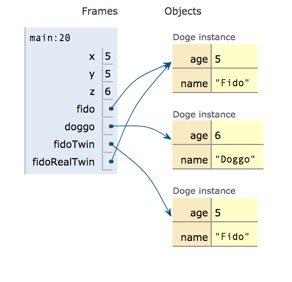
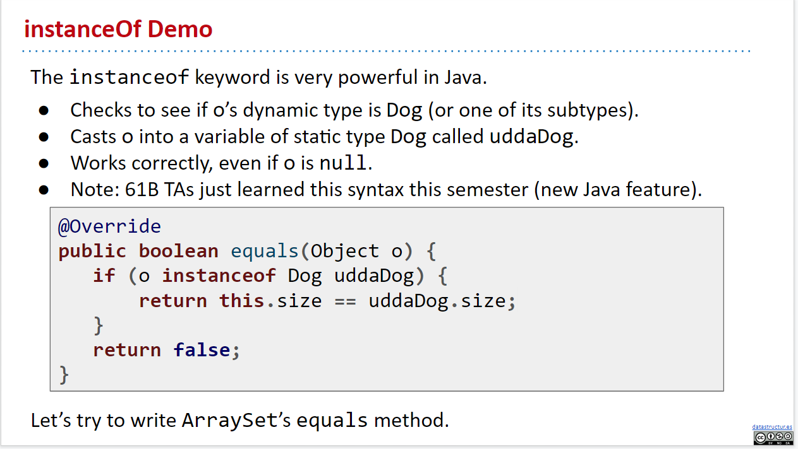
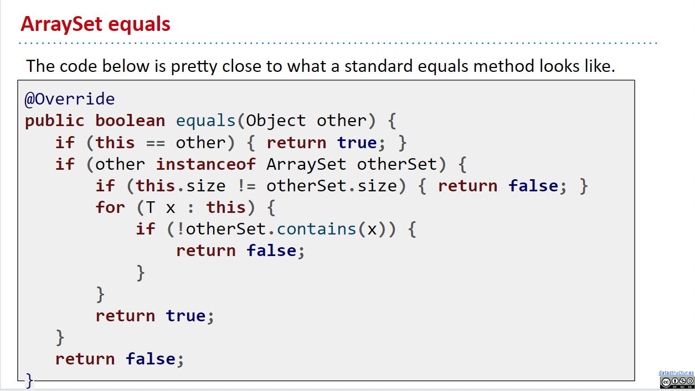
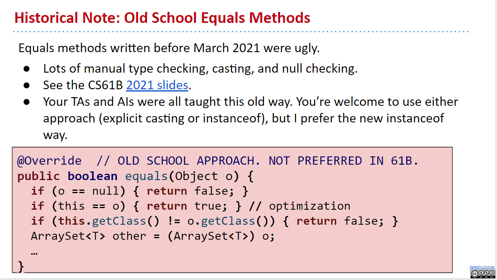
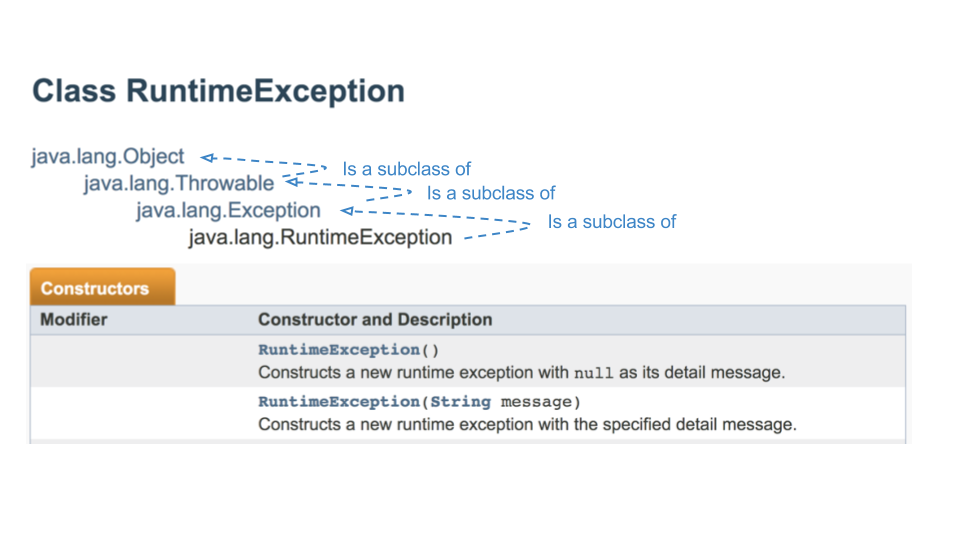
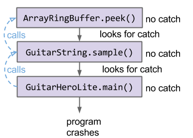
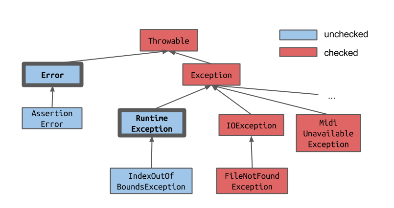

# Ch.5 Generics and Autoboxing

- [Ch.5 Generics and Autoboxing](#ch5-generics-and-autoboxing)
  - [5-1 Autoboxing](#5-1-autoboxing)
    - [Autoboxing and Unboxing](#autoboxing-and-unboxing)
    - [Caveats](#caveats)
    - [Widening](#widening)
  - [5-2 Immutability](#5-2-immutability)
  - [5-3 Generics](#5-3-generics)
    - [Creating Another Generic Class](#creating-another-generic-class)
    - [ArrayMap and Autoboxing Puzzle](#arraymap-and-autoboxing-puzzle)
    - [Generic Methods](#generic-methods)
      - [Implementing get(Map61B, key)](#implementing-getmap61b-key)
    - [Implementing maxKey(Map61B)](#implementing-maxkeymap61b)
    - [Type upper bounds](#type-upper-bounds)
      - [Notes on Bounded Type Parameters](#notes-on-bounded-type-parameters)
    - [Summary](#summary)
    - [More syntax on generics](#more-syntax-on-generics)
- [Ch.6 Exceptions, Iterators, Iterables, and Object methods](#ch6-exceptions-iterators-iterables-and-object-methods)
  - [6-1 Lists, Sets, and ArraySet](#6-1-lists-sets-and-arrayset)
    - [Lists in Real Java Code](#lists-in-real-java-code)
    - [Sets](#sets)
      - [Java](#java)
      - [Python](#python)
      - [JavaScript](#javascript)
    - [ArraySet](#arrayset)
  - [6-2 Throwing Exceptions](#6-2-throwing-exceptions)
  - [6-3 Iteration](#6-3-iteration)
    - [Enhanced For Loop](#enhanced-for-loop)
    - [Implementing Iterators](#implementing-iterators)
  - [6-4 Object Methods](#6-4-object-methods)
    - [toString()](#tostring)
    - [equals()](#equals)
    - [Sidenote on how Java is written](#sidenote-on-how-java-is-written)
    - [equals() with the new feature: instanceOf](#equals-with-the-new-feature-instanceof)
    - [Creating better `toString()` method and `ArraySet.of()`](#creating-better-tostring-method-and-arraysetof)
      - [Fancier `toString()`](#fancier-tostring)
      - [Make our own `.of()` method](#make-our-own-of-method)
- [Ch.6 Legacy](#ch6-legacy)
  - [(Legacy) 6-2 Throwing Exceptions](#legacy-6-2-throwing-exceptions)
    - [Catching Exceptions](#catching-exceptions)
    - [The Philosophy of Exceptions](#the-philosophy-of-exceptions)
    - [Uncaught Exceptions](#uncaught-exceptions)
  - [(Legacy) 6-3 Checked vs Unchecked Exceptions](#legacy-6-3-checked-vs-unchecked-exceptions)
  - [(Legacy) 6-4 Iteration of ArrayMap](#legacy-6-4-iteration-of-arraymap)

## 5-1 Autoboxing

In the previous parts of this book, we've talked about various data structures and the way that Java supports their implementation. In this chapter, we'll discuss a variety of supplementary topics that are used in industrial strength implementations of Java programs.

This is not meant to be a comprehensive guide to Java, but rather a highlight of features that are likely to be useful to you while working on this course.

### Autoboxing and Unboxing

As we saw in the previous chapter, we can define classes which have generic type variables using the `<>` syntax, e.g. `LinkedListDeque<Item>` and `ArrayDeque<Item>`. When we want to instantiate an object whose class uses generics, we have to substitute the generic with a concrete class, i.e. specify what type of items are going to go into that class.

Recall that Java has 8 primitive types -- all other types are reference types. One particular feature of Java is that we _can NOT provide a primitive type as an actual type argument for generics_, e.g. `ArrayDeque<int>` is a syntax error. Instead, we use `ArrayDeque<Integer>`.

For each primitive type, we use the corresponding reference type as shown in the table below. These reference types are called **"wrapper classes"**.


Naively, we'd assume that this would result in having to manually convert between primitive and reference types when using a generic data structure. For example, we might imagine having to do the following:

```java
public class BasicArrayList {
    public static void main (String[] args) {
      ArrayList<Integer> L = new ArrayList<>();
      L.add(new Integer(5)); // convert 5 to an Integer object
      L.add(new Integer(6)); // convert 6 to an Integer object

      /* Use the Integer.valueOf method to convert to int */
      int first = L.get(0).valueOf(); // convert Integer to int
    }
}
```

Writing code like above can be a bit annoying. Luckily, **Java can implicitly convert between primitive and wrapper types**, so the code below works just fine

```java
public class BasicArrayList {
    public static void main (String[] args) {
      ArrayList<Integer> L = new ArrayList<>();
      L.add(5);
      L.add(6);
      int first = L.get(0);
    }
}
```

The reason this works is that **Java will automatically "box" and "unbox" values between a primitive type and its corresponding reference type**. That is, if Java expects a wrapper type, like Integer, and you provide a primitive type, like int, it will "autobox" the integer. For example, if we have the function:

```java
public static void blah(Integer x) {
    System.out.println(x);
}
```

And we call it using:

```java
int x = 20;
blah(x);
```

Then Java implicitly creates a new `Integer` with value 20, resulting in a call to equivalent to calling `blah(new Integer(20))`. This process is known as autoboxing.

Likewise, if Java a function expected a primitive:

```java
public static void blahPrimitive(int x) {
    System.out.println(x);
}
```

but you give it a corresponding wrapper type:

```java
Integer x = new Integer(20);
blahPrimitive(x);
```

It will automatically unbox the integer, equivalent to calling the Integer class's valueOf method i.e. `blahPrimitive(x.valueOf())`.


Roughly speaking, all Java Objects uses 64 bits to store some extra informations about themselves, and some more bits to store its field variables.

### Caveats

There are a few things to keep in mind when it comes to autoboxing and unboxing:

- **Arrays are NEVER autoboxes or auto-unboxed**, e.g. if you have an array of integers `int[] x`, and try to put its address into a variable of type `Integer[]`, the compiler will NOT allow your program to compile.
- Autoboxing and unboxing also has a measurable performance impact. That is, **code that relies on autoboxing and unboxing will be slower** than code w/o such automatic conversions.
- **Wrapper types use much more memory than primitive types**. On most modern comptuers, not only must your code hold a 64 bit reference to the object, but every object also requires 64 bits of overhead used to store things like the dynamic type of the object.
  - More on memory usage, see [this link](http://blog.kiyanpro.com/2016/10/07/system_design/memory-usage-estimation-in-java/)

### Widening

Similar to the autoboxing/unboxing process, **Java will also automatically widen a primitive if needed**. Specifically, if a program expects a primitive of type T2 and is given a variable of type T1, and type T2 can take on a wider range of values than T1, the the variable will be implicitly cast to type T2.

For example, `double` in Java are wider than `int`. If we have the function shown below:

```java
public static void blahDouble(double x) {
    System.out.println("double: " + x);
}
```

We can call it with an int argument:

```java
int x = 20;
blahDouble(x);
```

The effect is the same as if we'd done `blahDouble((double) x)`. Thanks Java :)

If you want **to go from a wider type to a narrower type, you must explicitly do type cast**. For example, if you have the method below:

```java
public static void blahInt(int x) {
    System.out.println("int: " + x);
}
```

Then we'd need to explicitly cast if we want to call this method with a `double` value:

```java
double x =  20;
blahInt((int) x);
```

For more details on widening, including a full description of what types are wider than others, see the [official Java documentation](https://docs.oracle.com/javase/specs/jls/se8/html/jls-5.html).

---

## 5-2 Immutability

Definition: An immutable data type is a data type whose instances cannot change in any observable way after instantiation.

For example, `String` objects in Java are immutable. No matter what, if you have an instance of `String`, you can call any method on that `String`, but it will remain completely unchanged. This means that when `String` objects are concatenated, neither of the original `String`s are modified -- instead, a totally new `String` object is returned.

Mutable datatypes include objects like `ArrayDeque` and `Planet`. We can add or remove items from an `ArrayDeque`, which are observable changes. Similarly, the velocity and position of a `Planet` may change over time.

Any data type with non-private variables is mutable, unless those variables are declared `final` (this is not the only condition for mutability -- there are many other ways of defining a data type so that it is mutable). This is because an outside method can change the value of non-private variables, leading to observable change.

The `final` keyword is a keyword for variables that prevents the variable from being changed after its first assignment. For example, consider the `Date` class below:

```java
public class Date {
    public final int month;
    public final int day;
    public final int year;
    private boolean contrived = true;

    public Date (int m, int d, int y) {
        month = m; day = d; year = y;
    }
}
```

This class is **immutable**. After instantiating a Date, there is no way to change the value of any of its properties.

- Advantages of immutable data types:
  - Prevents bugs and makes debugging easier because properties cannot change ever
  - You can count on objects to have a certain behavior/trait
- Disadvantages:
  - Needs to create a new object in order to change a property
- Caveats:

  - Declaring a reference as `final` does NOT make the object that reference is pointing to immutable!!! For example, consider the following code snippet:

    ```java
    public final ArrayDeque<String>() deque = new ArrayDeque<String>();
    ```

    The `deque` variable is `final` and can never be reassigned, but the array deque object its pointing to can change! `ArrayDeque`s are always mutable!

  - Using the Reflection API, it is possible to make changes even to private variables! Our notion of immutability assumes that we're not using any of the special capabilities of this library.

---

## 5-3 Generics

### Creating Another Generic Class

Now that we've created generic lists, such as `DLList`s and `AList`s, lets move on to a different data type: maps. **Maps** let you **associate keys with values**, for example, the statement "Josh's score on the exam is 0" could be stored in a Map that associates students to their exam scores. A map is the Java equivalent of a Python dictionary or a JavaScript Map.

We're going to be creating the `ArrayMap` class, which implements the `Map61B` interface, a restricted version of Java's built-in `Map` interface. `ArrayMap` will have the following methods:

```
 put(key, value): Associate key with value.
 containsKey(key): Checks if map contains the key.
 get(key): Returns value, assuming key exists.
 keys(): Returns a list of all keys.
 size(): Returns number of keys.
```

For this exercise, we will ignore resizing. One thing to note about the `Map61B` interface (and the Java `Map` interface in general) is that **each key can only have one value at a time**. If Josh is mapped to 0, and then we say "Oh wait, there was a mistake! Josh actually got 100 on the exam," we erase the value 0 that Josh maps to and replace it with 100.

The implementation:

```java
package Map61B;

import java.util.List;
import java.util.ArrayList;

/***
 * An array-based implementation of Map61B.
 ***/
public class ArrayMap<K, V> implements Map61B<K, V> {

    private K[] keys;
    private V[] values;
    int size;

    public ArrayMap() {
        keys = (K[]) new Object[100];
        values = (V[]) new Object[100];
        size = 0;
    }

    /**
    * Returns the index of the key, if it exists. Otherwise returns -1.
    **/
    private int keyIndex(K key) {
        for (int i = 0; i < size; i++) {
            if (keys[i].equals(key)) {
            return i;
        }
        return -1;
    }

    public boolean containsKey(K key) {
        int index = keyIndex(key);
        return index > -1;
    }

    public void put(K key, V value) {
        int index = keyIndex(key);
        if (index == -1) {
            keys[size] = key;
            values[size] = value;
            size += 1;
        } else {
            values[index] = value;
        }
    }

    public V get(K key) {
        int index = keyIndex(key);
        return values[index];
    }

    public int size() {
        return size;
    }

    public List<K> keys() {
        List<K> keyList = new ArrayList<>();
        for (int i = 0; i < keys.length; i++) {
            // There's a bug here!!!
            keyList.add(keys[i]);
        }
        return keyList;
    }
}
```

> Note: the decision to name the generics K and V is arbitrary (but meant to be intuitive). It's quite common to see generics in Java represented as a single uppercase letter, in this course and elsewhere.

There were a few interesting things here; looking at the top of the code, we stated `package Map61B;`. We will go over this a bit later, but for now just know that it means we are putting our `ArrayMap` class within a folder called Map61B. Additionally, we import `List` and `ArrayList` from `java.utils`.

**Exercise 5.2.1**: In our current implementation of `ArrayMap`, there is a bug. Can you figure out what it is?

**Answer**: In the `keys` method, the for loop should be iterating until `i == size`, not `keys.length`. This is because the `keys` array have 100 elements and hence `keys.length` is `100`; however, some of them might just be `null`s, since we don't have that many keys yet. So, we only want to iterate to `size - 1`.

### ArrayMap and Autoboxing Puzzle

If we write a test as shown below:

```java
@Test
public void test() {
    ArrayMap<Integer, Integer> am = new ArrayMap<Integer, Integer>();
    am.put(2, 5);
    int expected = 5;
    assertEquals(expected, am.get(2));
}
```

You will find that we get a compile-time error!

```
$ javac ArrayMapTest.java
ArrayMapTest.java:11: error: reference to assertEquals is ambiguous
    assertEquals(expected, am.get(2));
    ^
    both method assertEquals(long, long) in Assert and method assertEquals(Object, Object) in Assert match
```

We get this error because JUnit's `assertEquals` method is **overloaded**, eg. `assertEquals(long expected, long actual)`, `assertEquals(Object expected, Object actual)`, etc (note that junit does NOT have a `assertEquals(int expected, int actual)` method). Thus, Java is unsure which method to call for `assertEquals(expected, am.get(2))`, which requires one argument to be autoboxed/unboxed.

- **Excercise 5.2.2** What would we need to do in order to call `assertEquals(long, long)`?
  A.) Widen `expected` to a `long`
  B.) Autobox `expected` to a `Long`
  C.) Unbox `am.get(2)`
  D.) Widen the unboxed `am.get(2)` to `long`

  **Answer**: We'll need all of A, C, and D to work.

  

- **Excercise 5.2.3** How would we make it work with `assertEquals(Object, Object)`?
  **Answer**: Autobox `expected` to an `Integer` because Integers are Objects.

  

- **Excercise 5.2.4** How do we make the code compile without having any runtime conversions? (Note: The answers in Exercise 5.2.2 and 5.2.3 both use runtime conversion)
  **Answer**: Cast `expected` to `Integer`. (Try to think about why not cast it to `Long`)

  

### Generic Methods

The goal for the next section is to create a class `MapHelper` which will have two methods:

- `get(Map61B, key)`: Returns the value corresponding to the given key in the map if it exists, otherwise null.
  - This is useful because `ArrayMap` currently has a bug where the get method throws an `ArrayIndexOutOfBoundsException` if we try to get a key that doesn't exist in the `ArrayMap`.
- `maxKey(Map61B)`: Returns the maximum of all keys in the given ArrayMap. Works only if keys can be compared.

Let's implement these methods inside the `MapHelper` class:

```java
package map61b;

public class MapHelper {
  // CODE HERE
}
```

#### Implementing get(Map61B, key)

`get` is a static method that takes in a Map61B instance and a key and returns the value that corresponds to the key if it exists, otherwise returns null.

**Excercise 5.2.5** Try writing this method yourself!

As you see, we could write a very limited method by declare the parameters as String and Integer like so:

```java
/**
  * Returns the value corresponding to the given key in the map
  * if it exists, otherwise null.
  */
public static Integer get(Map61B<String, Integer> map, String key) {
    if (map.containsKey(key)) {
        return map.get(key);
    }
    return null;
}
```

We are restricting this method to only take in `Map61B<String, Integer>`, which is not what we want! We want it to take any kind of `Map61B`, no matter what the actual types for the generics are. However, the following method header produces a compilation error:

```java
public static V get(Map61B<K, V> map, K key) {
  // ...
}
```

With generics defined in class headers, Java waits for the user to instantiate an object of the class in order to know what actual types each generic will be.

However, here we'd like a **generic specific to this method**. Moreover, we do not care what actual types `K` and `V` take on in our `Map61B` argument -- the important part is that whatever `V` is, an object of type `V` is returned.

Thus we see the need for **generic methods**. To declare a method as generic, the **formal type parameters must be specified before the return type**:

```java
public static <K, V> V get(Map61B<K, V> map, K key) {
  // ...
}
```

The complete syntax for invoking this method would be:

```java
ArrayMap<String, Integer> m = new ArrayMap<>();
String key = MapHelper.<String, Integer>get(m, "house");
```

The type has been explicitly provided.

Generally, you don't need any explicit declaration of what type you are inserting. Java can infer that isMap is an ArrayMap from Integers to Strings.

```java
ArrayMap<String, Integer> m = new ArrayMap<>();
String key = MapHelper.get(m, "house");
```

More on generic methods: [oracel docs](https://docs.oracle.com/javase/tutorial/java/generics/methods.html) and [Type Inference](https://docs.oracle.com/javase/tutorial/java/generics/genTypeInference.html)

### Implementing maxKey(Map61B)

**Exercise 5.2.6** Try writing this method yourself!

> Note: The enhanced for-loop `for (int item : items)` can be used on arrays and `Collection` objects (e.g. `List<T>`).

Here's something that looks OK, but isn't quite correct:

```java
public static <K, V> K maxKey(Map61B<K, V> map) {
    List<K> keylist = map.keys();
    K largest = keylist.get(0);
    for (K k: keylist) {
        if (k > largest) {
            largest = k;
        }
    }
    return largest;
}
```

**Exercise 5.2.7** Can you spot what's wrong with this method?

**Answer**: The `>` operator can't be used to compare `K` objects. This only works on primitives and `map` may not hold primitives

We will rewrite this method using the `compareTo` method:

```java
public static <K, V> K maxKey(Map61B<K, V> map) {
    List<K> keylist = map.keys();
    K largest = keylist.get(0);
    for (K k: keylist) {
        if (k.compareTo(largest) > 0) {
            largest = k;
        }
    }
    return largest;
}
```

**Exercise 5.2.8** This is still wrong, why?

**Answer** Not all Objects have a `compareTo` method. Thus this code won't compile!

To solve this problem, we need to somehow let the compiler know that **`K` is-a `Comparable`**, so that the compiler will know that `k` will always have a `compareTo` method.

To achive this, we'll use the following syntax for generic methods in the header of the function:

```java
public static <K extends Comparable<K>, V> K maxKey(Map61B<K, V> map) {
    List<K> keyList = map.keys();
    K largest = keyList.get(0);
    for (K k : keyList) {
        if (k.compareTo(largest) > 0) {
            largest = k;
        }
    }
    return largest;
}
```

The `K extends Comparable<K>` means keys must implement the `Comparable` interface and can be compared to other `K`'s. **We need to include the `<K>` after `Comparable` because `Comparable` itself is a generic interface!** Therefore, we must specify what kind of comparable we want. **In this case, we want to compare K's with K's**.

### Type upper bounds

You might be wondering, **why does it "extend" comparable and not "implement"?** `Comparable` is an interface after all.

Well, it turns out, `extends` in this context has a different meaning than in the polymorphism context.

When we say that the `Dog` class `extends` the `Animal` class, we are saying that Dogs can do anything that animals can do and more! We are giving Dog the abilities of an animal.

When we say that `K` `extends` `Comparable<K>`, we are simply stating a fact. We aren't giving K the abilities of a Comparable, we are just saying that **K must be Comparable**. This different use of `extends` is called **type upper bounding**. (This is just the word that designers of Java decides to use, which is very confusing, since it has NOTHING to do with the `extends` keyword used when defining a class)

Confusing? That's okay, it is confusing. Just remember, in the context of inheritance, the `extends` keyword is active in giving the subclass the abilities of the superclass. On the other hand, in the context of generics, `extends` simply states a fact: You must be a subclass of whatever you're extending. When used with generics (like in generic method headers), `extends` imposes a constraint rather than grants new abilities. It's akin to a fortune teller, who just tells you something without doing much about it.

#### Notes on Bounded Type Parameters

The [oracle doc](https://docs.oracle.com/javase/tutorial/java/generics/bounded.html) has a great documentation on bounded type parameters:

There may be times when you want to **restrict the types that can be used as type arguments in a parameterized type**. For example, a method that operates on numbers might only want to accept instances of `Number` or its subclasses. This is what **bounded type parameters** are for.

To declare a bounded type parameter, list the type parameter's name, followed by the `extends` keyword, followed by its upper bound, which in this example is `Number`. **Note that, in this context, `extends` is used in a general sense to mean either "extends" (as in classes) or "implements" (as in interfaces).**

```java
public class Box<T> {

    private T t;

    public void set(T t) {
        this.t = t;
    }

    public T get() {
        return t;
    }

    public <U extends Number> void inspect(U u){
        System.out.println("T: " + t.getClass().getName());
        System.out.println("U: " + u.getClass().getName());
    }

    public static void main(String[] args) {
        Box<Integer> integerBox = new Box<Integer>();
        integerBox.set(new Integer(10));
        integerBox.inspect("some text"); // compilation error: since it is-not-a Number
    }
}
```

We can even hava multiple bounds for a type paramter (this is supplementatry material, cs61b doesn't really need this):

```java
<T extends B1 & B2 & B3>
```

In this example, `T` must be a subtype of `B1`, `B2`, and `B3`. If one of the bounds is a class, it must be specified first, otherwise it's a compilation error.


### Summary

We’ve seen four new features of Java that make generics more powerful:

- Autoboxing and auto-unboxing of primitive wrapper types.
- Promotion/widening between primitive types.
- Specification of generic types for methods (before return type).
- Bounded type parameters in generic methods (e.g. `K extends Comparable<K>`).


### More syntax on generics

Yes, there's even more syntax that's not covered by CS61b, so here they are:

[Lower Bounded Wildcards](https://docs.oracle.com/javase/tutorial/java/generics/lowerBounded.html)
[Type Erasure](https://docs.oracle.com/javase/tutorial/java/generics/genTypes.html)

Or just study the whole oracle java tutorial on generics: [Generics](https://docs.oracle.com/javase/tutorial/java/generics/index.html)

---

# Ch.6 Exceptions, Iterators, Iterables, and Object methods

## 6-1 Lists, Sets, and ArraySet

In this section we will learn about how to use Java's built in `List` and `Set` data structures as well as build our own `ArraySet`.

So far, we've already built two kinds of lists: `AList` and `SLList`. We also built an interface `List61B` to enforce specific list methods `AList` and `SLList` had to implement. You can find the code at the following links:

- [List61B](https://github.com/Berkeley-CS61B/lectureCode-sp19/blob/master/inheritance2/List61B.java)
- [AList](https://github.com/Berkeley-CS61B/lectureCode-sp19/blob/master/inheritance1/AList.java)
- [SLList](https://github.com/Berkeley-CS61B/lectureCode-sp19/blob/master/inheritance2/SLList.java)

This is how we might use List61B type:

```java
List61B<Integer> L = new AList<>();
L.addLast(5);
L.addLast(10);
L.addLast(15);
L.print();
```

### Lists in Real Java Code

We built a list from scratch, but Java provides a built-in `List` interface and several implementations, e.g. `ArrayList`. Remember, since `List` is an `interface` we can't instatiate it! **We must instatiate one of its implementations**.

To access this, we can use the full name ('canonical name') of classes, interfaces:

```java
java.util.List<Integer> L = new java.util.ArrayList<>();
```

However this is a bit verbose. In a similar way to how we import `JUnit`, we can import java libraries:

```java
import java.util.List;
import java.util.ArrayList;

public class Example {
    public static void main(String[] args) {
        List<Integer> L = new ArrayList<>();
        L.add(5);
        L.add(10);
        System.out.println(L);
    }
}
```

### Sets

Sets are a collection of unique elements - you can only have one copy of each element. There is also no sense of order.

#### Java

Java has the `Set` interface along with implementations, e.g. `HashSet`. Remember to import them if you don't want to use the full name!

```java
import java.util.Set;
import java.util.HashSet;
```

Example use:

```java
Set<String> s = new HashSet<>();
s.add("Tokyo");
s.add("Lagos");
System.out.println(S.contains("Tokyo")); // true
```

#### Python

In python, we simply call `set()`. To check for contains we don't use a method but the keyword `in`.

```py
s = set()
s.add("Tokyo")
s.add("Lagos")
print("Tokyo" in s) # True
```

#### JavaScript

In JavaScript, it's pretty similar to Java, but we have a different name for `contains` method, we use `has` method. Also, in JavaScript, a set can contain different data types.

```js
const s = new Set();
s.add(1);
s.add(2);
console.log(s.has(2)); // true
```

### ArraySet

Our goal is to make our own set, `ArraySet`, with the following methods:

- `add(value)`: add the value to the set if not already present
- `contains(value)`: check to see if ArraySet contains the value
- `size()`: return number of values

Let's try to implement it, here's the [starter code](https://github.com/Berkeley-CS61B/lectureCode-sp19/blob/master/exercises/DIY/inheritance4/ArraySet.java)

Here's the code:

```java
/* Naive implementation of ArraySet, where resizing is not
* taken into account. */
public class ArraySet<T> {

    private T[] items;
    private int size;

    public ArraySet() {
        items = (T[]) new Object[100];
        size = 0;
    }

    /**
     * add the value to the set if not already present
     */
    public void add(T item) {
        if (contains(item)) {
            return;
        }
        items[size] = item;
        size++;
    }

    /**
     * check to see if ArraySet contains the value
     */
    public boolean contains(T item) {
        for (int i = 0; i < size; i++) {
            if (item.equals(items[i])) {
                return true;
            }
        }
        return false;
    }

    /**
     * return number of values
     */
    public int size() {
        return size;
    }

    public static void main(String[] args) {
        ArraySet<String> s = new ArraySet<>();
//        s.add(null);
        s.add("horse");
        s.add("fish");
        s.add("house");
        s.add("fish");
        System.out.println(s.contains("horse"));
        System.out.println(s.size);
    }

    /* Also to do:
    1. Make ArraySet implement the Iterable<T> interface.
    2. Implement a toString method.
    3. Implement an equals() method.
    */

}
```

Some terminologies:

- The `T` in `public class ArraySet<T>` is called a **generic type variable**.
- The `String` in `ArraySet<String> set = new ArraySet();` is called a **actual type argument**.

---

## 6-2 Throwing Exceptions

Our `ArraySet` implementation from the previous section has a small error. When we add `null` to our ArraySet, we get a `NullPointerException`.

The probelm lies in the `contains` method where we check `items[i].equals(x)`. If the value at `items[i]` is `null`, then we are calling `null.equals(x)` -> `NullPointerException`.

**Exceptions cause normal flow of control to stop**. We can in fact choose to throw our own exceptions. In JavaScript, we use the `throw` keyword and `throw new Error("text")`. In Java, Exceptions are objects and we throw exceptions using the following format:

`throw new ExceptionObject(parameter1, ...)`

Let's throw an exception when a user tries to add `null` to our `ArraySet`. We'll throw an `IllegalArgumentException` which takes in one parameter (a `String` message).

Our updated `add` method:

```java
/* Associates the specified value with the specified key in this map.
   Throws an IllegalArgumentException if the key is null. */
public void add(T x) {
    if (x == null) {
        throw new IllegalArgumentException("can't add null");
    }
    if (contains(x)) {
        return;
    }
    items[size] = x;
    size += 1;
}
```

> Note: We can actually use `try...catch` to catch the Exception, see the legacy part of the note.

We get an Exception either way - why is this better?

1. We have control of our code: we consciously **decide at what point to stop the flow** of our program
2. More **useful Exception type** and **helpful error message** for those using our code

However, it would be better if the program doesn't crash at all. There are different things we could do in this case. Here are some below:

- **Approach 1**: Don't add `null` to the array if it is passed into `add`

- **Approach 2**: Change the `contains` method to account for the case if `items[i] == null`.

Whatever you decide, it is important that users know what to expect. That is why documentation (such as comments about your methods) is very important.

---

## 6-3 Iteration

We can use a clean enhanced for loop with Java's HashSet

```java
Set<String> s = new HashSet<>();
s.add("Tokyo");
s.add("Lagos");
for (String city : s) {
    System.out.println(city);
}
```

However, if we try to do the same with our ArraySet, we get an error. How can we enable this functionality?

### Enhanced For Loop

Let's first understand what is happening when we use an enhanced for loop. We can "translate" an enhanced for loop into an ugly, manual approach.

```java
Set<String> s = new HashSet<>();
// ...
for (String city : s) {
    // ...
}
```

This translates to:

```java
Set<String> s = new HashSet<>();
// ...
Iterator<String> seer = s.iterator();
while (seer.hasNext()) {
    String city = seer.next();
    // ...
}
```

Let’s strip away the magic so we can build our own classes that support this.

The key here is an object called an **_iterator_**.

For our example, in List.java we might define an `iterator()` method that returns an `Iterator` object.

```java
public Iterator<E> iterator();
```

Now, we can use that object to loop through all the entries in our list:

```java
List<Integer> friends = new ArrayList<Integer>();
// ...
Iterator<Integer> seer = friends.iterator();

while (seer.hasNext()) {
  System.out.println(seer.next());
}
```

This code behaves identically to the foreach loop version above.

There are three key methods in our iterator approach:

First, we get a new `Iterator` object with `Iterator<Integer> seer = friends.iterator();`

Next, we loop through the list with our while loop. We check that there are still items left with `seer.hasNext()`, which will return `true` if there are unseen items remaining, and `false` if all items have been processed.

Last, `seer.next()` does two things at once. It **returns the next element of the list**, and here we print it out. It also **advances the iterator by one item**. In this way, the iterator will only inspect each item once.

### Implementing Iterators

In this section, we are going to talk about how to build a class to support iteration.

Let's start by thinking about what the compiler need to know in order to successfully compile the following iterator example:

```java
List<Integer> friends = new ArrayList<Integer>();
Iterator<Integer> seer = friends.iterator();

while(seer.hasNext()) {
    System.out.println(seer.next());
}
```

We can look at the **static types** of each object that calls a relevant method. `friends` is a List, on which `iterator()` is called, so we must ask:

- Does the `List` interface have an `iterator()` method?

`seer` is an `Iterator`, on which `hasNext()` and `next()` are called, so we must ask:

- Does the `Iterator` interface have `next()`/`hasNext()` methods?

So how do we implement these requirements?

The `List` interface `extends` the `Iterable` interface, inheriting the abstract `iterator()` method. (Actually, `List` `extends` `Collection` which `extends` `Iterable`, but it's easier to codethink of this way to start.)

```java
public interface Iterable<T> {
  Iterator<T> iterator();
}
```

```java
public interface List<T> extends Iterable<T>{
    // ...
}
```

Next, the compiler checks that Iterators have `hasNext()` and `next()`. The `Iterator` interface specifies these abstract methods explicitly:

```java
public interface Iterator<T> {
  boolean hasNext();
  T next();
}
```

> What if someone calls `next` when `hasNext` returns false?
>
> This behavior is undefined. However, a common convention is to throw a `NoSuchElementException`. See [Discussion 5](https://sp19.datastructur.es/materials/discussion/disc05sol.pdf) for examples.

> Will `hasNext` always be called before `next`?
>
> Not necessarily. This is sometimes the case when someone using the iterator knows exactly how many elements are in the sequence. Thus, we can't rely on the user calling `hasNext` before `next`. However, you can always call `hasNext` from within your `next` function.

Specific classes will implement their own iteration behaviors for the interface methods. Let's look at an example. (Note: if you want to build this up from the start, follow along with the live coding in the video.)

We are going to add iteration through keys to our ArraySet class. First, we write a new class called `ArraySetIterator`, nested inside of `ArraySet`:

```java
private class ArraySetIterator implements Iterator<T> {
    private int curIdx;

    public ArraySetIterator() {
        curIdx = 0;
    }

    @Override
    public boolean hasNext() {
        return curIdx < size;
    }

    @Override
    public T next() {
        T returnItem = items[curIdx];
        curIdx++;
        return returnItem;
    }
}
```

This ArraySetIterator implements a `hasNext()` method, and a `next()` method, using `curIdx` as an index to keep track of its position in the array. For a different data structure, we might implement these two methods differently.

**Thought Exercise**: How would you design `hasNext()` and `next()` for a linked list?

We still want to be able to support the enhanced for loop, though, to make our calls cleaner. So, we need to make `ArraySet` implement the `Iterable` interface. The essential method of the Iterable interface is `iterator()`, which returns an `Iterator` object for that class. All we have to do is return an instance of our `ArraySetIterator` that we just wrote!

Here we've seen **Iterable**, the interface that makes a class able to be iterated on, and requires the method `iterator()`, which returns an `Iterator` object. And we've seen **Iterator**, the interface that defines the object with methods to actually do that iteration. You can think of an `Iterator` as a machine that you put onto an `Iterable` that facilitates the iteration. Any `Iterable` is the object on which the `Iterator` is performing.

With these two components, you can make fancy for loops for your classes!

`ArraySet` code with iteration support is below:

```java
import java.util.HashSet;
import java.util.Iterator;
import java.util.Set;

/* Naive implementation of ArraySet, where resizing is not
* taken into account. */
public class ArraySet<T> implements Iterable<T> {

    private T[] items;
    private int size;

    public ArraySet() {
        items = (T[]) new Object[100];
        size = 0;
    }

    /**
     * Add the value to the set if not already present
     */
    public void add(T item) {
        if (item == null) {
            throw new IllegalArgumentException("Can't add null to an ArraySet");
        }
        if (contains(item)) {
            return;
        }
        items[size] = item;
        size++;
    }

    /**
     * check to see if ArraySet contains the value
     */
    public boolean contains(T item) {
        for (int i = 0; i < size; i++) {
            if (item.equals(items[i])) {
                return true;
            }
        }
        return false;
    }

    /**
     * return number of values
     */
    public int size() {
        return size;
    }

    /**
     * Returns an iterator (a.k.a. seer) over the elements in this set.
     */
    @Override
    public Iterator<T> iterator() {
        return new ArraySetIterator();
    }

    private class ArraySetIterator implements Iterator<T> {
        private int curIdx;

        public ArraySetIterator() {
            curIdx = 0;
        }

        @Override
        public boolean hasNext() {
            return curIdx < size;
        }

        @Override
        public T next() {
            T returnItem = items[curIdx];
            curIdx++;
            return returnItem;
        }
    }

    public static void main(String[] args) {
        /* Java Set example */
        Set<String> javaset = new HashSet<>();
        javaset.add("Tokyo");
        javaset.add("Taiwan");

//        for (String city : javaset) {
//            System.out.println(city);
//        }

        Iterator<String> seer = javaset.iterator();
        while (seer.hasNext()) {
            String city = seer.next();
            System.out.println(city);
        }

        /* ArraySet example */
        ArraySet<String> aset = new ArraySet<>();
//        s.add(null);
        aset.add("horse");
        aset.add("fish");
        aset.add("cow");

        for (String animal : aset) {
            System.out.println(animal);
        }
    }

}

```

See the Java library code: [openjdk github](https://github.com/openjdk/jdk/blob/master/src/java.base/share/classes/java/util/Collection.java)

---

## 6-4 Object Methods

All classes in Java inherit from the `Object` class. The methods that are inherited are as follows:

- `String toString()`
- `boolean equals(Object obj)`
- `Class <?> getClass()`
- `int hashCode()`
- `protected Objectclone()`
- `protected void finalize()`
- `void notify()`
- `void notifyAll()`
- `void wait()`
- `void wait(long timeout)`
- `void wait(long timeout, int nanos)`

See the `Object` class's original code here: [openjdk/Object.java](https://github.com/openjdk/jdk/blob/master/src/java.base/share/classes/java/lang/Object.java)

The documentation also suggests that all subclasses when needed, should override the `toString()` and `equals()` method. So, now we'll focus on these 2 methods.

### toString()

The `toString()` method provides a string representation of an object. The `System.out.println()` function implicitly calls this method on whatever object is passed to it and prints the string returned. When you run `System.out.println(dog)`, it's actually doing this:

```java
System.out.println(dog.toString());
```

> Actually, [println](https://github.com/AdoptOpenJDK/openjdk-jdk11/blob/999dbd4192d0f819cb5224f26e9e7fa75ca6f289/src/java.base/share/classes/java/io/PrintStream.java#L896) calls [String.valueOf](https://github.com/AdoptOpenJDK/openjdk-jdk11/blob/f0ef2826d2116f4e0c0ed21f8d54fe9d0706504e/src/java.base/share/classes/java/lang/String.java#L2950) which calls `toString`

The default `Object` class' `toString()` method prints the location of the object in memory. This is a hexidecimal string. Classes like `Arraylist` and java arrays have their own **overridden versions of `toString()`**. This is why, when you were working with and writing tests for Arraylist, errors would always return the list in a nice format like this (1, 2, 3, 4) instead of returning the memory location.

For classes that we've written by ourselves like `ArrayDeque`, `LinkedListDeque`, etc, we need to provide our own `toString()` method if we want to be able to see the objects printed in a readable format.

Let's try to write this method for an `ArraySet` class. Read the `ArraySet` class below and make sure you understand what the various methods do. Feel free to plug the code into java visualizer to get a better understanding!

**Exercise 6.4.1**: Write the toString() method so that when we print an ArraySet, it prints the elements separated by commas inside of curly braces. i.e {1, 2, 3, 4}. Remember, the toString() method should return a string.

**Naive Solution**

```java
@Override
public String toString() {
    String returnString = "{";
    for (int i = 0; i < size; i += 1) {
        returnString += keys[i];
        returnString += ", ";
    }
    returnString += "}";
    return returnString;
}
```

> Note: In Java, everytime we try to add an object to a string, `toString` gets calles. so `returnString += keys[i]` is implicitly `returnString += keys[i].toString()`.

> But what if `keys[i]` is a primitive?
>
> Then, the primitive is autoboxed to its wrapper type.

This solution, although seemingly simple and elegant, is actually very naive. This is because **_when you use string concatenation in Java, you're also creating an entirely new string_**. For example: `returnString += keys[i];` you are actually not just appending to `returnString`, you are creating an entirely new string. This is incredibly inefficient because creating a new string object takes time too! Specifically, linear in the length of the string.

**Bonus Question**: Let's say concatenating one character to a string takes 1 second. If we have an ArraySet of size 5: `{1, 2, 3, 4, 5}`, how long would it take to run the `toString()` method?

**Answer**: We set `returnString` to the left bracket which takes one second because this involves adding `{` to the empty string `""`. Adding the first element will involve creating an entirely new string, adding `}` and `1` which would take 2 seconds. Adding the second element takes `3` seconds because we need to add `{`, `1`, `2`. This process continues, so for the entire array set the total time is 1 + 2 + 3 + 4 + 5 + 6 + 7 (omit the time to add `, `).

> Question: Why would Java implement String to be immutable if it's so ineffective?
>
> Answer: We'll discuss more on immutable classes in the end of cs61b, basically it's a trade off between speed and simplicity.

To remedy this, Java has a special class called `StringBuilder`. It **creates a string object that is mutable**, so you can continue appending to the same string object instead of creating a new one each time.

**Exercise 6.4.2**: Rewrite the `toString()` method using `StringBuilder`.

> Note: the `append()` method of a StringBuilder object can be **chained**, this is because the `append()` method returns `this`. See its code: [openjdk-StringBuilder](https://github.com/openjdk/jdk/blob/master/src/java.base/share/classes/java/lang/StringBuilder.java)

**Solution**

```java
@Override
public String toString() {
    StringBuilder strB = new StringBuilder("{");
    for (int i = 0; i < size - 1; i++) {
        strB.append(items[i].toString()).append(", ");
    }
    strB.append(items[size - 1].toString()).append("}");
    return strB.toString();
}
```

Or even better (to account for empty set):

```java
@Override
public String toString() {
    StringBuilder strB = new StringBuilder("{");
    for (int i = 0; i < size - 1; i++) {
        strB.append(items[i].toString()).append(", ");
    }
    if (size != 0) {
        strB.append(items[size - 1].toString());
    }
    strB.append("}");
    return strB.toString();
}
```

### equals()

`equals()` and `==` have different behaviors in Java. `==` checks if two objects are actually the same object in memory. Remember, pass-by-value! `==` checks if two boxes hold the same thing. For primitives, this means checking if the values are equal. For objects, this means checking if the address/pointer is equal.

Say we have this `Doge` class:

```java
public class Doge {

   public int age;
   public String name;

   public Doge(int age, String name){
      this.age = age;
      this.name = name;
   }

   public static void main(String[] args) {
      int x = 5;
      int y = 5;
      int z = 6;
      Doge fido = new Doge(5, "Fido");
      Doge doggo = new Doge(6, "Doggo");
      Doge fidoTwin = new Doge(5, "Fido");
      Doge fidoRealTwin = fido;
   }

}
```

If we plug this code into the java visualizer, we will see the box in pointer diagram shown below.



**Exercise 6.4.2**: What would java return if we ran the following?

- `x == y`
- `x == z`
- `fido == doggo`
- `fido == fidoTwin`
- `fido == fidoRealTwin`

**Answers**

- `true`
- `false`
- `false`
- `false`
- `true`

You can see how == can cause some problems in Java testing. When we write tests for our `ArrayList` and want to check if expected is the same as what is returned by our function, we create expected as a new arraylist. If we used `==` in our test, it would always return false. This is what `equals(Object o)` is for.

`equals(Object o)` is a method in the `Object` that, by default, acts like `==` in that it checks if the memory address of the `this` is the same as `o`, i.e. `this == o`. However, **we can override it to define equality** in whichever way we wish! For example, for two Arraylists to be considered equal, they just need to have the same elements in the same order.

> Sidenote: Use `Arrays.equals()` or `Arrays.deepEquals()` for arrays.

**Exercise 6.4.3**: Let's write an `equals` method for the `ArraySet` class. Remember, **a set is an unordered collection of unique elements**. So, for two sets to be considered equal, you just need to check if they have the same elements.

**Solution**

```java
public boolean equals(Object other) {
        if (this == other) {
            return true;
        }
        if (other == null) {
            return false;
        }
        if (other.getClass() != this.getClass()) {
            return false;
        }
        ArraySet<T> o = (ArraySet<T>) other;
        if (o.size() != this.size()) {
            return false;
        }
        for (T item : this) {
            if (!o.contains(item)) {
                return false;
            }
        }
        return true;
    }
```

We added a few checks in the beginning of the method to make sure our `equals` can handle **nulls** and **objects of a different class**. We also optimized the function by **return true right away if the == methods returns true**. This way, we avoid the extra work of iterating through the set.

**Rules for Equals in Java**: When overriding a `.equals()` method, it may sometimes be trickier than it seems. A couple of rules to adhere to while implementing your `.equals()` method are as follows:

1. `equals` must be an equivalence relation:

   - **reflexive**: `x.equals(x)` is true
   - **symmetric**: `x.equals(y)` if and only if `y.equals(x)`
   - **transitive**: `x.equals(y)` and `y.equals(z)` implies `x.equals(z)`

2. It **must take an `Object` argument**, **in order to override the original `.equals()` method**.

3. It must be consistent if `x.equals(y)`, then as long as x and y remain unchanged: x must continue to equal y

4. It is never true for null, i.e., `x.equals(null)` must be false (except when `x == null`).

### Sidenote on how Java is written

See the [stackoverflow-question](https://stackoverflow.com/questions/1220914/in-which-language-are-the-java-compiler-and-jvm-written).

- The Java libraries (`java.lang`, `java.util` etc, often referred to as the Java API) are themselves written in Java, although methods marked as `native` will have been written in **C** or **C++**.

The very first Java compiler was developed by Sun Microsystems and was written in C using some libraries from C++. Today, the Java compiler is written in Java, while the JRE is written in C.

We can imagine how the Java compiler was written in Java like this:

The Java compiler is written as a Java program and then compiled with the Java compiler written in C(the first Java compiler). Thus we can use the newly compiled Java compiler(written in Java) to compile Java programs.

### equals() with the new feature: instanceOf



Basically, the line `o instanceOf Dog uddaDog` does two things:

1. Checks if `o`'s dynamic type if `Dog` (or its subclasses).
2. Casts `o` into a variable of static type `Dog` called `uddaDog`.

It kind of does the following lines (the old way) all in one line:

```java
if (o == null) {
    return false;
}
if (o.getClass() != this.getClass()) {
    return false;
}
Dog uddaDog = (Dog) o;
```



Note that intellij yells at us for using a raw use of parameterized ArraySet class in the line `o instanceof ArraySet otherAset`, but that's just how we're going to do in this class (other fixed are too complex generics topics).

Our code:

```java
@Override
public boolean equals(Object o) {
    if (o == this) {
        return true;
    }
    if (o instanceof ArraySet otherAset) {
        if (otherAset.size() != this.size()) {
            return false;
        }
        for (T item : this) {
            if (!otherAset.contains(item)) {
                return false;
            }
        }
        return true;
    }
    return false;
}
```



### Creating better `toString()` method and `ArraySet.of()`

#### Fancier `toString()`

We can use the `String.join()` method, which has the signature `join(CharSequence delimiter, Iterable<? extends CharSequence> elements)`.

Notice that `String.join()`'s second parameter needs to be an Iterable which has the type parameter String (which extends CharSequence), so we'll need to first put our items in the ArraySet into some Iterable with String type parameter, e.g. `List<String>`.

Code:

```java
@Override
public String toString() {
    List<String> listOfItems = new ArrayList<>();
    for (T item : this) {
        listOfItems.add(item.toString());
    }
    return "{" + String.join(", ", listOfItems) + "}";
}
```

Note that the line `"{" + String.join(", ", listOfItems) + "}"` actually copies the string twice, which might slow down the program. However, it's not that much a big difference from the other solution, plus this code is cleaner and more readable, so, a it's still an acceptable trade off.

#### Make our own `.of()` method

To create the `.of()` method, we'll use the **variable arguments (varargs)**.

Example: `public void fun(int... a)`

The `...` syntax tells the compiler that varargs have been used, and these arguments should be stored in the array referred to by `a`.

Let's define our `of` method: `public static ArraySet<T> of(T... )`. However, there's a problem when working with generic types in a `static` method, which is that **`static` methods do NOT know what the generic type parameter `T` is**.

So, instead we need to make **a generic method**, and change our method signature into:

```java
public static <E> ArraySet<E> of(E... elements)
```

The `<E>` before `ArraySet<E>` is the method's type parameter, and `ArraySet<E>` is the return type of this method.

> Note: we use `E` for the method's own type parameter to not confuse with `T`, the type parameter of `ArraySet`, since they're completely NOT related at all (remember, `static` methods NEVER have access to `T`, the type parameter of the class).

The entire code:

```java
public static <E> ArraySet<E> of(E... elements) {
    ArraySet<E> returnSet = new ArraySet<>();
    for (E el : elements) {
        returnSet.add(el);
    }
    return returnSet;
}
```

We can call it like this:

```java
ArraySet<Integer> asetOfInts = ArraySet.<Integer>of(1, 2, 3);
```

Or in this case we can simplify it to:

```java
ArraySet<Integer> asetOfInts = ArraySet.of(1, 2, 3);
```

---

# Ch.6 Legacy

## (Legacy) 6-2 Throwing Exceptions

Consider the following `main` method inside the `ArrayMap` class we implemented a few chapters before.

```java
public static void main (String[] args) {
    ArrayMap<String, Integer> am = new ArrayMap<String, Integer>();
    am.put("hello", 5);
    System.out.println(am.get("yolp"));
}
```

What happens when we run this? The program attempts to access a key which doesn’t exist, and crashes! This results in the following error message:

```
$ java ExceptionDemo
Exception in thread "main" java.lang.ArrayIndexOutOfBoundsException: -1
at ArrayMap.get(ArrayMap.java:38)
at ExceptionDemo.main(ExceptionDemo.java:6)
```

This is an **implicit** exception, an error thrown by Java itself. We can learn a little bit from this message: we see that the program crashed because of an `ArrayIndexOutOfBoundsException`; but it doesn’t tell us very much besides that. You may have encountered similarly unhelpful error messages during your own programming endeavors. So how can we be more helpful to the user of our program?

We can throw our own exceptions, using the `throw` keyword. This lets us provide our own error messages which may be more informative to the user. We can also provide information to error-handling code within our program. This is an **explicit** exception because we purposefully threw it as the programmer.

In the case above, we might implement get with a check for a missing key, that throws a more informative exception:

```java
public V get(K key) {
    int location = findKey(key);
    if(location < 0) {
        throw new IllegalArgumentException("Key " + key + " does not exist in map."\);
    }
    return values[location];
}
```

Now, instead of `java.lang.ArrayIndexOutOfBoundsException: -1`, we see:

```
$java ExceptionDemo
Exception in thread "main" java.lang.IllegalArgumentException: Key yolp does not exist in map.
at ArrayMap.get(ArrayMap.java:40)
at ExceptionDemo.main(ExceptionDemo.java:6)
```

### Catching Exceptions

So far, we've seen Java crash and print error messages with implicit exceptions:

```java
Object o = "mulchor";
Planet x = (Planet) o;
```

resulting in:

```
Exception in thread "main" java.lang.ClassCastException:
java.lang.String cannot be cast to Planet
```

And above, we saw how to provide more informative errors by using explicit exceptions:

```java
public static void main(String[] args) {
    System.out.println("ayyy lmao");
    throw new RuntimeException("For no reason.");
}
```

which produces the error:

```
$ java Alien
ayyy lmao
Exception in thread "main" java.lang.RuntimeException: For no reason.
at Alien.main(Alien.java:4)
```

Note a familiar construction: `new RuntimeException("For no reason.")`. This looks a lot like instantiating a class -- because that's exactly what it is. A `RuntimeException` is just a Java `Object`, like any other.



So far, thrown exceptions cause code to crash. But we can "catch" exceptions instead, preventing the program from crashing. The keywords `try` and `catch` break the normal flow of the program, protecting it from exceptions.

Consider the following example:

```java
Dog d = new Dog("Lucy", "Retriever", 80);
d.becomeAngry();

try {
    d.receivePat();
} catch (Exception e) {
    System.out.println("Tried to pat: " + e);
}
System.out.println(d);
```

The output might be:

```
$ java ExceptionDemo
Tried to pat: java.lang.RuntimeException: grrr... snarl snarl
Lucy is a displeased Retriever weighing 80.0 standard lb units.
```

Here we see that when we try and pat the dog when the dog is angry, it throws a `RuntimeException`, with the helpful error message "grrr...snarl snarl." But, it does continue on, and print out the state of the dog in the final line! This is because we caught the exception.

This might not seem particularly useful yet. But we can also use a `catch` statement to take corrective action.

```java
Dog d = new Dog("Lucy", "Retriever", 80);
d.becomeAngry();

try {
    d.receivePat();
} catch (Exception e) {
    System.out.println("Tried to pat: " + e);
    d.eatTreat("banana");
}
d.receivePat();
System.out.println(d);
```

In this version of our code, we soothe the dog with a treat. Now when we try and pat it again, the method executes without failing.

```
$ java ExceptionDemo
Tried to pat: java.lang.RuntimeException: grrr... snarl snarl
Lucy munches the banana

Lucy enjoys the pat.

Lucy is a happy Retriever weighing 80.0 standard lb units.
```

**In the real world**, this corrective action might be extending an antenna on a robot when an exception is thrown by an operation expecting a ready antenna. Or perhaps we simply want to write the error to a log file for later analysis.

### The Philosophy of Exceptions

Exceptions aren't the only way to do error handling. But they do have some advantages. Most importantly, they **keep error handling conceptually separate from the rest of the program**.

Let's consider some psuedocode for a program that reads from a file:

```
func readFile: {
    open the file;
    determine its size;
    allocate that much memory;
    read the file into memory;
    close the file;
}
```

A lot of things might go wrong here: maybe the file doesn't exist, maybe there isn't enough memory, or the reading fails.

Without exceptions, we might handle the errors like this:

```
func readFile: {
    open the file;
    if (theFileIsOpen) {
        determine its size;
        if (gotTheFileLength) {
            allocate that much memory;
        } else {
            return error("fileLengthError");
        }
            if (gotEnoughMemory) {
                read the file into memory;
            if (readFailed) {
                return error("readError");
            }
        ...
        } else {
            return error("memoryError");
        }
    } else {
        return error("fileOpenError")
    }
}
```

But this is super messy! And deeply frustrating to read.

With exceptions, we might rewrite this as:

```
func readFile: {
    try {
        open the file;
        determine its size;
        allocate that much memory;
        read the file into memory;
        close the file;
    } catch (fileOpenFailed) {
        doSomething;
    } catch (sizeDeterminationFailed) {
        doSomething;
    } catch (memoryAllocationFailed) {
        doSomething;
    } catch (readFailed) {
        doSomething;
    } catch (fileCloseFailed) {
        doSomething;
    }
}
```

Here, we first do all the things associated with reading our file, and wrap them in a try statement. Then, **if an error happens anywhere in that sequence of operations, it will get caught by the appropriate catch statement**. We can provide distinct behaviors for each type of exception.

The key benefit of the exceptions version, in contrast to the naive version above, is that the code flows in a clean narrative. **First, try to do the desired operations. Then, catch any errors**. Good code feels like a story; it has a certain beauty to its construction. That clarity makes it easier to both write and maintain over time.

### Uncaught Exceptions

When an exception is thrown, it descends the call stack.



If the `peek()` method does not explicitly `catch` the exception, the exception will propagate to the calling function, `sample()`. We can think of this as popping the current method off the stack, and moving to the next method below it. If `sample()` also fails to `catch` the exception, it moves to `main()`.

**If the exception reaches the bottom of the stack without being caught, the program crashes** and Java provides a message for the user, printing out the stack trace. Ideally the user is a programmer with the power to do something about it.

```
java.lang.RuntimeException in thread “main”:
at ArrayRingBuffer.peek:63
at GuitarString.sample:48
at GuitarHeroLite.java:110
```

We can see by looking at the stack trace where the error occurred: on line 63 of `ArrayRingBuffer.peek()`, after being called by line 48 of `GuitarString.sample()`, after being called by the `main` method of `GuitarHeroLite.java` on line 110. But this isn't super helpful unless the user also happens to be a programmer with the power to do something about the error.

---

## (Legacy) 6-3 Checked vs Unchecked Exceptions

The exceptions we've seen above have all occurred at runtime. Occasionally, you’ll find that your code won’t even compile, for the mysterious reason that an exception “must be caught or declared to be thrown”.

What's going on in that case? The basic idea is that some exceptions are considered so disgusting by the compiler that you MUST handle them somehow.

We call these **"checked" exceptions**. (You might think of that as shorthand for "must be checked" exceptions.)

Let's consider this example:

```java
public static void main(String[] args) {
    Eagle.gulgate();
}
```

It looks reasonable enough. But when we attempt to compile, we receive this error:

```
$ javac What.java
What.java:2: error: unreported exception IOException; must be caught or declared to be thrown
Eagle.gulgate();
^
```

We can't compile, because of an "unreported IOException." Let's look a little deeper into the Eagle class:

```java
public class Eagle {
    public static void gulgate() {
        if (today == “Thursday”) {
            throw new IOException("hi"); }
        }
    }
```

On Thursdays, the `gulgate()` method is programmed to throw an `IOException`. If we try and compile `Eagle.java`, we receive a similar error to the one we saw when compiling the calling class above:

```
$ javac Eagle
Eagle.java:4: error: unreported exception IOException; must be caught or declared to be thrown
throw new IOException("hi"); }
^
```

It's clear that Java isn't happy about this `IOException`. This is because `IOExceptions` are **"checked' exceptions** and **must be handled accordingly**. We will go over how this handling occurs a bit later in the chapter. But what if we threw a `RuntimeException` instead, like we did in previous sections?

```java
public class UncheckedExceptionDemo {
    public static void main(String[] args) {
        if (today == “Thursday”) {
            throw new RuntimeException("as a joke");
        }
    }
}
```

`RuntimeException`s are considered **"unchecked" exceptions**, and do not have the same requirements as the checked exceptions. The code above will compile just fine -- though it will crash at runtime on Thursdays:

```
$ javac UncheckedExceptionDemo.java
$ java UncheckedExceptionDemo
Exception in thread "main" java.lang.RuntimeException: as a joke.
at UncheckedExceptionDemo.main(UncheckedExceptionDemo.java:3)
```

How do we know which types of exceptions are checked, and which are unchecked?



**Errors and RuntimeExceptions, and all their children, are unchecked**. These are errors that **cannot be known until runtime**. They also tend to be **ones that can't be recovered from** -- what can you do to fix it if the code tries to get the -1 element from an array? Not much.

**Everything else is a checked exception**. Most of these have productive fixes. For instance, if we run into a `FileNotFound Exception`, perhaps we can ask the user to re-specify the file they want -- they might have mistyped it.

Since Java is on your side, and wants to do its best to make sure that every program runs without crashing, it will not let a program with a possible fixable error compile unless it is indeed handled in some way.

There are two ways to handle a checked error:

1. Catch
2. Specify

Using a `catch` block is what we have seen above. In our `gulgate()` method, it might look like this:

```java
public static void gulgate() {
    try {
        if (today == “Thursday”) {
            throw new IOException("hi");
        }
    } catch (Exception e) {
        System.out.println("psych!");
    }
}
```

If we don't want to handle the exception in the `gulgate()` method, we can instead "defer the responsibility to somewhere else". We mark, or **specify the method as dangerous** by modifying the method definition as follows:

```java
public static void gulgate() throws IOException {
... throw new IOException("hi"); ...
}
```

But specifying the exception does not yet handle it. When we call `gulgate()` from somewhere else, that new method now becomes dangerous as well!

Since `gulgate()` might throw an uncaught exception, now `main()` can also throw that exception, and the following code won't compile:

```java
public static void main(String[] args) {
    Eagle.gulgate();
}
```

We can solve this in one of two ways: catch, or specify in the calling method.

Catch:

```java
public static void main(String[] args) {
    try {
        gulgate();
    } catch (IOException e) {
        System.out.println("Averted");
    }
}
```

Specify:

```java
public static void main(String[] args) throws IOException {
    gulgate();
}
```

Basically, for "checked" exceptions, the compiler make sure that the exception must be "checked", i.e., the exception has NO way of delegeting to other methods, and is handled correctly inside where it is thrown. Thus, we must either "catch" or "specify" the exception.

- **Catch** the error when you can handle the problem there. Keep it from escaping!

- **Specify** the error when someone else should handle the error. Make sure the caller knows the method is dangerous!

> Sidenote: we can use the `.getMessage()` method of the Exception object to get the exception message:

```java
import java.io.IOException;

public class ExceptionsDemo {
    public static void main(String[] args) {
        try {
            int today = 4;
            if (today == 4) {
                throw new IOException("for no reason :)");
            }
        } catch (Exception e) {
            System.out.println("error: " + e.getMessage());
            // error: for no reason :)
        }
    }
}
```

Another sidenote:

Many I/O API methods specifies `throws SomeException` in their signature, so that we, as the user, knows that there might be an exception, and we always need to handle that exception by either catching it or specifiying it in our method.

---

## (Legacy) 6-4 Iteration of ArrayMap

Note: To instantiate a nested class that's NOT `static`, we'll need to use the weird syntax `ParentClass.new NestedClass();`

Final Code:

```java
package map61b;

import java.util.ArrayList;
import java.util.Iterator;
import java.util.List;

public class ArrayMap<K, V> implements Map61B<K, V>, Iterable<K> {

    private K[] keys;
    private V[] values;
    int size;

    public ArrayMap() {
        keys = (K[]) new Object[100];
        values = (V[]) new Object[100];
        size = 0;
    }

    @Override
    public Iterator<K> iterator() {
        return new KeyIterator();
    }

    private class KeyIterator implements Iterator<K> {
        private int curIndex;

        public KeyIterator() {
            curIndex = 0;
        }

        @Override
        public boolean hasNext() {
            return curIndex < size;
        }

        @Override
        public K next() {
            K returnKey = keys[curIndex];
            curIndex++;
            return returnKey;
        }
    }

    /**
     * Returns true if this map contains a mapping for the specified key.
     */
    @Override
    public boolean containsKey(K key) {
        return keyIndex(key) > -1;
    }

    /**
     * Returns the value to which the specified key is mapped.
     */
    @Override
    public V get(K key) {
        int index = keyIndex(key);
        if (index == -1) {
            return null;
        }
        return values[index];
    }

    /**
     * Returns the number of key-value mappings in this map.
     */
    @Override
    public int size() {
        return size;
    }

    /**
     * Associates the specified value with the specified key in this map.
     */
    @Override
    public void put(K key, V value) {
        int idx = keyIndex(key);
        if (idx == -1) {
            // new key-value pair
            keys[size] = key;
            values[size] = value;
            size++;
        } else {
            values[idx] = value;
        }
    }

    /**
     * Returns a list of the keys in this map.
     */
    @Override
    public List<K> keys() {
        List<K> keyList = new ArrayList<>();
        for (int i = 0; i < size; i++) {
            keyList.add(keys[i]);
        }
        return keyList;
    }

    /**
     * Returns the index of the key, if it exists. Otherwise returns -1.
     */
    private int keyIndex(K key) {
        for (int i = 0; i < size; i++) {
            if (keys[i].equals(key)) {
                return i;
            }
        }
        return -1;
    }

}
```

```java
import map61b.ArrayMap;
import java.util.Iterator;

public class IterationDemo {
    public static void main(String[] args) {
        ArrayMap<String, Integer> aMap = new ArrayMap<>();

        aMap.put("Breton", 105);
        aMap.put("Alex", 85);
        aMap.put("Eric", 70);

        // behind the scenes of enhanced for-loop
        Iterator<String> seer = aMap.iterator();
        while (seer.hasNext()) {
            System.out.println(seer.next());
        }

        // enhanced for-loop
        for (String s : aMap) {
            System.out.println(s);
        }
    }
}
```

```java
package map61b;

import java.util.List;

public interface Map61B<K, V> {
    /**
     * Returns true if this map contains a mapping for the specified key.
     */
    boolean containsKey(K key);

    /**
     * Returns the value to which the specified key is mapped. No defined
     * behavior if the key doesn't exist (ok to crash).
     */
    V get(K key);

    /**
     * Returns the number of key-value mappings in this map.
     */
    int size();

    /**
     * Associates the specified value with the specified key in this map.
     */
    void put(K key, V value);

    /**
     * Returns a list of the keys in this map.
     */
    List<K> keys();
}
```
