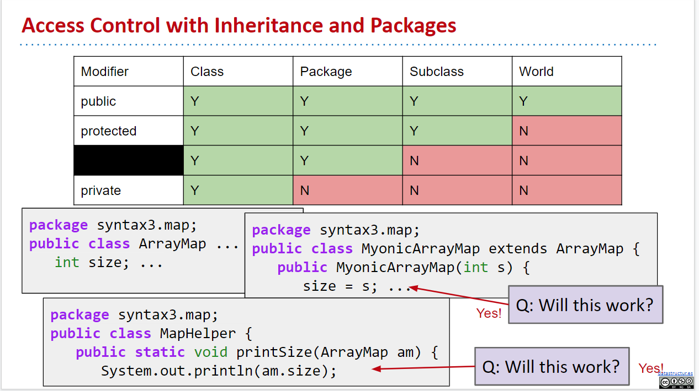

# Week 6

- [Week 6](#week-6)
  - [7-1 Packages](#7-1-packages)
    - [Why do we use reverse name for package names](#why-do-we-use-reverse-name-for-package-names)
    - [Intro](#intro)
    - [Using Packages](#using-packages)
    - [Creating a Package](#creating-a-package)
    - [Default Packages](#default-packages)
    - [JAR Files](#jar-files)
      - [Creating a JAR File (IntelliJ)](#creating-a-jar-file-intellij)
      - [Build Systems](#build-systems)
  - [7-2 Access Control](#7-2-access-control)
      - [Access Table](#access-table)
    - [Access Control Subtleties](#access-control-subtleties)
    - [Access Control at the Top Level](#access-control-at-the-top-level)
    - [Summary to access control](#summary-to-access-control)
  - [HW1](#hw1)
    - [When to use an Interface Versus an Abstract Class](#when-to-use-an-interface-versus-an-abstract-class)

## 7-1 Packages

### Why do we use reverse name for package names

You can see more [here](https://stackoverflow.com/questions/2475168/what-is-the-significance-of-the-reverse-domain-name-for-java-package-structure)

Imagine you have two important packages, an `accounting` package and a `graphics` package. If you specified these in 'straight' order:

```
accounting.mycompany.org
graphics.mycompany.org
```

Then it implies there is a major `accounting` package, a subsection of which is for `mycompany`, and a subsection of that package is called the `org` package which you actually use. However, you want this:

```
org.mycompany.accounting
org.mycompany.graphics
```

This makes more sense. Out of all packages from organizations (`org`), you look at `mycompany` in particular, and it has two sub-packages, the `accounting` and the `graphics` ones.

### Intro

It is very possible that with all the code in this world, you would create classes that share names with those from a different project. How can you then organize these classes, such that there is less ambiguity when you’re trying to access or use them? How will your program know that you mean to use your Dog.class, versus Josh Hug’s Dog.class?

Herein enters the **package** — **a namespace that organizes classes and interfaces**. In general, when creating packages you should follow the following naming convention: **package name starts with the website address, backwards**.

For example, if Josh Hug were trying to distribute his Animal package, which contains various different types of animal classes, he would name his package as following:

```
ug.joshh.animal;
// note: his website is joshh.ug
```

However, in CS61B you do not have to follow this convention, as your code isn’t intended for distribution.

### Using Packages

If accessing same class from within the same package, you can simply use its name:

```java
Dog d = new Dog();
```

If you're accessing the classes from outside the package, then use its entire canonical name:

```java
ug.joshh.animal.Dog d = new ug.joshh.animal.Dog();
```

To make things easier, you can import the package, and use their simple name instead:

```java
import ug.joshh.animal.Dog;

Dog d = new Dog();
```

### Creating a Package

Creating a package takes two steps:

1. Put the package name at the top of every file in this particular package.

   ```java
   package ug.joshh.animal;

   public class Dog {
    private String name;
    private String breed;
   }
   ```

2. Store the file in a folder that has the appropriate folder name. The folder should have a name that matches your package.

   e.g. `ug.joshh.animal` package is in `ug/joshh/anima`l folder

### Default Packages

Any Java class _without an explicit package name_ at the top of the file is automatically considered to be part of the **“default” package**. However, when writing real programs, you should **avoid leaving your files in the default package** (unless it’s a very small example program). This is because code from the default package cannot be imported, and it is possible to accidentally create classes with the same name under the default package.

For example, if I were to create a “DogLauncher.java” class in the default package, I would be unable to access this DogLauncher class anywhere else outside of the default package.

Therefore, your **Java files should generally start with an explicit package declaration**.

### JAR Files

Oftentimes, programs will contain multiple .class files. If you wanted to share this program, rather than sharing all the .class files in special directories, you can “zip” all the files together by creating a JAR file. This single .jar file will contain all your .class files, along with some other additional information.

That `.jar` file is then just like a library for other users to import and use.

It is important to note that JAR files are just like zip files. It is entirely possible to unzip and transform the files back into .java files. JAR files do not keep your code safe, and thus you should not share your .jar files of your projects with other people.

> Note: Our `javalib` folder contains multiple `.jar` files which in turn contains the bundled version of .class codes.

#### Creating a JAR File (IntelliJ)

1. Go to File → Project Structure → Artifacts → JAR → “From modules with dependencies”

2. Click OK a couple of times

3. Click Build → Build Artifacts (this will create a JAR file in a folder called “Artifacts”)

4. Distribute this JAR file to other Java programmers, who can now import it into IntelliJ (or otherwise)

#### Build Systems

Rather than importing a list of libraries or whatnot each time we wanted to create a project, we can simply put the files into the appropriate place, and use “Build Systems” to automate the process of setting up your project. The advantages of Build Systems are especially seen in bigger teams and projects, where it’s largely beneficial to automate the process of setting up the project structure. Though the advantages of Build Systems are rather minimal in 61B, we did use Maven in Project 3 (BearMaps, Spring 2017), which is one of many popular build systems (including Ant and Gradle).

---

## 7-2 Access Control

We now run into the question of how public and private members behave in packages and subclasses. Think to yourself right now: when inheriting from a parent class, can we access the private members in that parent class? Or, can two classes in the same package access the other’s private members?

If you don’t know the answers right away, you can read on to find out!

- **Private**: _Only code from the given class can access private members_. It is truly private from everything else, as subclasses, packages, and other external classes cannot access private members.

  _TL;DR_: only the class needs this piece of code

- **Package Private**: This is the _default access given to Java members_ if there is no explicit modifier written. Package private entails that classes that belong in the _same package can access_, but not subclasses!

  Why is this useful? Usually, packages are handled and modified by the same (group of) people. It is also common for people to extend classes that they didn’t initially write. The original owners of the class that’s being extended may not want certain features or members to be tampered with, if people choose to extend it — hence, _package-private allows those who are familiar with the inner workings of the program to access and modify certain members_, whereas it _blocks those who are subclassing from doing the same_.

  _TL;DR_: only classes that live in the same package can access

- **Protected**: Protected members are _protected from the “outside” world_, so classes within the **same package** and **subclasses** can access these members, but the rest of the world (e.g. classes external to the package or non-subclasses) cannot!

  _TL;DR_: subtypes might need it, but subtype clients will not

- **Public**: This keyword opens up the access to everyone! This is generally what clients of the package can rely on to use, and once deployed, the public members’ signatures should not change. It’s like a promise and contract to people using this public code that it will always be accessible to them.

  Usually if developers want to “get rid of” something that’s public, rather than removing it, they would call it _“deprecated”_ instead.

  _TL;DR_: open and promised to the world

#### Access Table

Let's try to draw the access table.

Have the following be the column titles: Modifier, Class, Package, Subclass, World, with the following as the Rows: public, protected, package-private, private.

Indicate whether or not each row/access type has access to that particular column’s “type”.

**Exercise**:

**Answer**:

| Modifier        | Class | Package | Subclass | World |
| --------------- | ----- | ------- | -------- | ----- |
| public          | Yes   | Yes     | Yes      | Yse   |
| protected       | Yse   | **Yes** | Yes      | No    |
| package-private | Yes   | Yes     | **No**   | No    |
| private         | Yes   | No      | No       | No    |

Graph of the access table:


> Note: although default (package-private) members are NOT accessible by its subclasses, but if that subclass is in the same package, then package-private members are still accessble.

> Note: The `private` members are actually still inherited from a subclass' superclass, since otherwise the inheritance does not work at all (for example, another inherited `protected` method might use a private instance variable). However, we do NOT have access to inherited `private` members.
>
> So basically, the `private` members are there but just not accessible by the subclass.

Exercises:

- 

  Ans: Both are yes because they're in the same package (so package-private variables are accssble).

- 
  

  Ans: No, it will NOT compile. The compiler first checks whether the `ChattyMap` class has a field called `size`, and yes it does (inherit from `ArrayMap`). Then, it checks whether `size` is accessble to `ChattyMap`, so it looks at `size`'s access modifier, which is package-private. But since `ChattyMap` class is neither the same class nor in the same package as the `ArrayMap` class, so it is NOT accessble. Thus, the compilation will fail.

  - 
    

    Basically, it's due to how Java programmers usually work, so it's often the case where programmers from the same team would work on the same packages, so they know exactly how the code inside the package works. However, people outside that team, who might be writing a subclass of a class from that package might NOT know how it's implemented.

    Consider the people who write the `java.util` library, they probably want some members to be only accessble within the `java.util` package, where other users like us, who are trying to `extends` or `implements` some class or interface in that package, should not be able to access).

    Thus, packages are overall more "secret" than subclasses from an industrial point of view.

### Access Control Subtleties

- **Default Package**: Code that does not have a package declaration is automatically part of the _default package_. If these classes have members that don’t have access modifiers (i.e. are _package-private_), then because everything is part of the same (unnamed) default package, these members are still accessible between these “default”-package classes.

  For example, consider the following classes in different folders:

  ```java
  public class CeccoBeppe {
    void fun() { /* ... */ };
  }
  ```

  ```java
  public class Tane {
    public static void main(String[] args) {
      CeccoBeppe cb = new CeccoBeppe();
      cp.fun();
    }
  }
  ```

  The code actually compiles. This is because although `fun` is a "package-private" method, which is only accessble if classes are the same class or in the same package. However, in this case since we did NOT specify the package of these classes, so they're **both in the default package**.

- **Access is Based Only on Static Types**: It is important to note that for `interface`s, the _default access for its methods is actually public_, and not package-private. Additionally, like this subtitle indicates, the access depends only on the static types.

**Exercise 7.1.2** Given the following code, which lines in the demoAccess method, if any, will error during compile time?

```java
package universe;
public interface BlackHole {
    void add(Object x); // this method is public, not package-private!
}

/* --- */

package universe;
public class CreationUtils {
    public static BlackHole hirsute() {
         return new HasHair();
    }
}

/* --- */

package universe;
class HasHair implements BlackHole {
    Object[] items;
    public void add(Object o) { ... }
    public Object get(int k) { ... }
}

/* --- */

import static CreationUtils.hirsute;
class Client {
   void demoAccess() {
      BlackHole b = hirsute();
      b.add("horse");
      b.get(0);
      HasHair hb = (HasHair) b;
   }
}
```

**Answer**

- `b.get(0);` This line errors because `b` is of static type `BlackHole`, but the `BlackHole` interface does not define a `get` method! Even though you and I both know that `b` is dynamically a `HasHair`, and thus has the `get` method, the compiler bases its checks off the static type.
- `HasHair hb = (HasHair) b;` This one is tricky, but notice that the `HasHair` class is not a public class - _it's package-private_. This means that `Client`, a class outside of the universe package, can't see that the `HasHair` class exists.


### Access Control at the Top Level

So far we've dicussed how to control access to members. It's also possible to control access at the top level (i.e. an entire interface or class).

We can only control two levels:

- public
- no modifier: package-private

Determines who can see the existence of the class: the entire world or just members of the same package.


### Summary to access control


---

## HW1

### When to use an Interface Versus an Abstract Class

In practice, in can be a little unclear when to use an interface and when to use an abstract class. One mostly accurate metaphor that might help is that you can think of an `interface` as defining a “can-do” or an **“is-a”** relationship, whereas an `abstract class` should be a **stricter “is-a”** relationship. The difference can be subtle, and you can often use one instead of the other.

In practice, large Java libraries often have a hierarchy of interfaces, which are extended by abstract classes that provided default implementations for some methods, and which are in turn ultimately implemented by concrete classes. A good example is the `Collection` interface: It extends `Iterable` (which is its superinterface), and is implemented by many subinterfaces (i.e. `List`, `Set`, `Map`), which in turn have their own abstract implementations (`AbstractList`, `AbstractSet` `AbstractMap`).

However, for smaller programs, the hierarchy is often stubbier, sometimes starting with an abstract class. For example, we could have just started with `AbstractBoundedQueue` at the top of the hierarchy and skipped having a `BoundedQueue` interface altogether.

---
