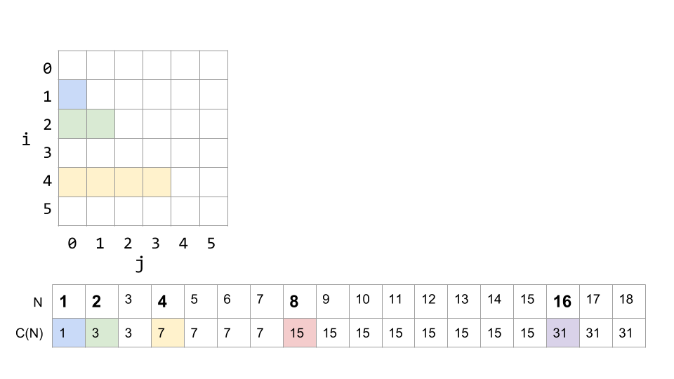
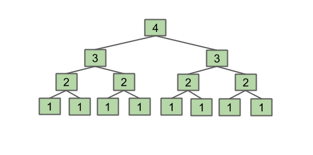

- [Ch.8 Efficient Programming](#ch8-efficient-programming)
  - [8-1 Encapsulation](#8-1-encapsulation)
    - [Encapsulation](#encapsulation)
    - [ADT's](#adts)
    - [API's](#apis)
    - [Delegation vs Extension](#delegation-vs-extension)
    - [Views](#views)
    - [Takeaway](#takeaway)
  - [8-2 Asymptotics I: An Introduction to Asymptotic Analysis](#8-2-asymptotics-i-an-introduction-to-asymptotic-analysis)
    - [Example of Algorithm Cost](#example-of-algorithm-cost)
    - [Runtime Characterization](#runtime-characterization)
    - [Techniques for Measuring Computational Cost](#techniques-for-measuring-computational-cost)
    - [Checkpoint](#checkpoint)
    - [Why scaling matters](#why-scaling-matters)
    - [Asymptotic Behavior](#asymptotic-behavior)
      - [Parabolas vs. Lines](#parabolas-vs-lines)
    - [Returning to Duplicate Finding](#returning-to-duplicate-finding)
    - [Intuitive Simplification 1: Consider only the Worst Case](#intuitive-simplification-1-consider-only-the-worst-case)
    - [Intuitive Simplification 2: Restrict Attention to One Operation](#intuitive-simplification-2-restrict-attention-to-one-operation)
    - [Intuitive Simplification 3: Eliminate Low Order Terms](#intuitive-simplification-3-eliminate-low-order-terms)
    - [Intuitive Simplification 4: Eliminate Multiplicative Constants](#intuitive-simplification-4-eliminate-multiplicative-constants)
    - [Simplification Summary](#simplification-summary)
    - [Summary of our (Painful) Analysis Process](#summary-of-our-painful-analysis-process)
    - [Simplified Analysis Process](#simplified-analysis-process)
      - [Analysis of Nested For Loops: Exact Count](#analysis-of-nested-for-loops-exact-count)
      - [Analysis of Nested For Loops: Geometric Argument](#analysis-of-nested-for-loops-geometric-argument)
    - [Formalizing Order of Growth](#formalizing-order-of-growth)
  - [Definitions](#definitions)
    - [Big-Theta](#big-theta)
      - [Summary](#summary)
    - [Big-O](#big-o)
  - [8-3 Asymptotics II](#8-3-asymptotics-ii)
    - [Loop Example 1](#loop-example-1)
    - [Loop Example 2](#loop-example-2)
    - [There is no magic shortcut :(](#there-is-no-magic-shortcut-)
    - [Recursion](#recursion)

# Ch.8 Efficient Programming

## 8-1 Encapsulation

Efficiency comes in two flavors:

1. Programming cost.

- How long does it take to develop your programs?
- How easy is it to read, modify, and maintain your code?

2. Execution cost.

- How much time does your program take to execute?
- How much memory does your program require?

Today, we will be focusing on how to reduce programming cost. Some helpful Java features discussed in 61B:

- Packages.
  - Good: Keeps code organized (in folders), and makes things package-private.
  - Bad: Too specific (more work to be done, e.g. import)
- Static type checking.
  - Good: Checks for errors early, and speeds up runtime (no need for runtime type checking)
  - Bad: Not too flexible (might need casting), and more verbose code.
- Inheritance (Implementation and interface inheritance).
  - Good: Reuse of code, and allows subtype polymorphism.
  - Bad: “Is-a”, the path of debugging gets annoying, can’t instantiate interfaces, have to implement every method of an interface, and makes code harder to read/understand.

We will explore some new ways in this chapter!

### Encapsulation

We will first define a few terms:

- **Module**: A set of methods that work together as a whole to perform some task or set of related tasks.

- **Encapsulated**: A module is said to be encapsulated if its implementation is completely hidden, and it can be accessed only through a documented interface.

### ADT's

- ADT's (Abstract Data Types) are high-level types that are defined by their **behaviors**, not their implementations.

  e.g., Deque in Proj1 was an ADT that had certain behaviors (addFirst, addLast, etc.). But, the data structures we actually used to implement that ADT was ArrayDeque and LinkedListDeque.

- Some ADT's are actually special cases of other ADT's.

  e.g., Stacks and Queues are just Lists that have even more specific behavior.

### API's

An API(Application Programming Interface) of an ADT is the list of constructors and methods and a short description of each.

API consists of syntactic and semantic specification.

- Compiler verifies that **syntax** is met.
  - AKA, everything specified in the API is present.
- Tests help verify that **semantics** are correct.
  - AKA everything actually works the way it should.
  - Semantic specification usually written out in English (possibly including usage examples). Mathematically precise formal specifications are somewhat possible but not widespread.

**Exercise 8.1.1**:

Write a Stack class using a Linked List as its underlying data structure. You only need to implement a single function: `push(Item x)`. Make sure to make the class generic with "Item" being the generic type!

My ans:

```java
public class MyStack<Item> {
  private LinkedList<Item> list = = new LinkedList<>();

  public void push(Item x) {
    list.add(x);
  }
}
```

Three polular solutions:

1. This solution uses extension. it simply borrow the methods from `LinkedList<Item>` and uses them as its own.

   ```java
    public class ExtensionStack<Item> extends LinkedList<Item> {
      public void push(Item x) {
        add(x);
      }
    }
   ```

2. This approach uses **Delegation**. It creates a Linked List object and calls its methods to accomplish its goal.

   ```java
   public class DelegationStack<Item> {
      private LinkedList<Item> L = new LinkedList<Item>();
      public void push(Item x) {
          L.add(x);
      }
   }
   ```

3. This approach is similar to the previous one, except it can use any class that implements the `List` interface (`LinkedList`, `ArrayList`, etc).

   ```java
   public class StackAdapter<Item> {
      private List L;
      public StackAdapter(List<Item> worker) {
          L = worker;
      }

      public void push(Item x) {
          L.add(x);
      }
   }
   ```

**Warning**: be mindful of the difference between "is-a" and "has-a" relationships.

### Delegation vs Extension

Earlier in the section define that **delegation** is accomplished by passing in a class while **extension** is defined as inheriting (just because it may be hard to notice at first glance).

**Delegation vs Extension**: Right now it may seem that Delegation and Extension are pretty much interchangeable; however, there are some important differences that must be remembered when using them.

**Extension** tends to be used when you know what is going on in the parent class. In other words, you know how the methods are implemented. Additionally, with extension, you are basically saying that the class you are extending from acts similarly to the one that is doing the extending.

**Delegation** is when you do not want to consider your current class to be a version of the class that you are pulling the method from.

### Views

**Views** are an alternative representation of an existed object. Views essentially limit the access that the user has to the underlying object. However, changes done through the views will affect the actual object.

For example, say, you only want a list from index 1 and 4. Then you can use a method `sublist` like this:

```java
List<String> L = new ArrayList<>();
L.add("at"); L.add("ax"); L.add("ban"); ...

List<String> subList = L.sublist(1, 4);
subList.set(0, "jug");
```

Now why is this useful? Well say we want to reverse only part of the list. For example in the below image, we would want to reverse `ax ban bat` in the above list.


The most intuitive way is to create a method that takes in a list object and the indices which should be reversed. However, this can be a bit painful because we add some extraneous logic.

To get around doing this, we can just create a general reverse function that takes in a list and reverses that list. Because views mutates the underlying object that it represents, we can create a sublist like earlier and reverse the sublist. The end result would actually mutate the actual list and not the copy.


### Takeaway

- **API**s are hard to design; however, having a coherent design philosophy can make your code much cleaner and easier to deal with.

- **Inheritance** is tempting to use frequently, but it has problems and should be use sparingly, only when you are certain about attributes of your classes (both those being extended and doing the extending).

---

## 8-2 Asymptotics I: An Introduction to Asymptotic Analysis

We can consider the process of writing efficient programs from two different perspectives:

1. Programming Cost (_everything before this section_)
   - How long does it take for you to develop your programs?
   - How easy is it to read or modify your code?
   - How maintainable is your code? (very important — much of the cost comes from maintenance and scalability, not development!)
2. Execution Cost (_everything after this section_)
   - Time complexity: How much time does it take for your program to execute?
   - Space complexity: How much memory does your program require?

### Example of Algorithm Cost

Objective: Determine if a _sorted_ array contains any duplicates.

**Silly Algorithm**: Consider **every** pair, returning true if any match!

**Better Algorithm**: Take advantage of the **sorted** nature of our array.

- We know that if there are duplicates, they must be next to each other.
- Compare neighbors: return true first time you see a match! If no more items, return false.

We can see that the Silly algorithm seems like it’s doing a lot more unnecessary, redundant work than the Better algorithm. But how much more work? How do we actually quantify or determine how efficient a program is? This chapter will provide you the formal techniques and tools to compare the efficiency of various algorithms!

### Runtime Characterization

To investigate these techniques, we will be characterizing the runtime of the following two functions, dup1 and dup2. These are the two different ways of finding duplicates we discussed above.

Things to keep in mind about our characterizations:

- They should be simple and mathematically rigorous.
- They should also clearly demonstrate the superiority of dup2 over dup1.

```java
//Silly Duplicate: compare everything
public static boolean dup1(int[] A) {
  for (int i = 0; i < A.length; i++) {
    for (int j = i + 1; j < A.length; j++) {
      if (A[i] == A[j]) {
        return true;
      }
    }
  }
  return false;
}

//Better Duplicate: compare only neighbors
public static boolean dup2(int[] A) {
  for (int i = 0; i < A.length - 1; i++) {
    if (A[i] == A[i + 1]) {
      return true;
    }
  }
  return false;
}
```

### Techniques for Measuring Computational Cost

**Technique 1**: Measure execution time in seconds using a client program (i.e. actually seeing how quick our program runs in physical seconds)

_Procedure_:

- Use a physical stopwatch
- Or, Unix has a built in `time` command that measures execution time.
- Or, Princeton Standard library has a `stopwatch` class

_Observations_:

- As our input size increases, we can see that `dup1` takes a longer time to complete, whereas `dup2` completes at relatively around the same rate.

_Pros vs. Cons_:

- Pros: Very easy to measure (just run a stopwatch). Meaning is clear (look at the actual length of time it takes to complete).
- Cons: May take a lot of time to test. Results may also differ based on what kind of machine, compiler, input data, etc. you’re running your program with.

So how does this method match our goals? It's simple, so that's good, but not mathematically rigorous. Moreover, the differences based on machine, compiler, input, etc. mean that the results may not clearly demonstrate the relationship between dup1 and dup2.


**Technique 2A**: Count possible operations for an array of size N = 10,000.

_Procedure_:

- Look at your code and the various operations that it uses (i.e. assignments, incrementations, etc.)
- Count the number of times each operation is performed.

_Observations_:

- Some counts get tricky to count.
- How did we get some of these numbers? It can be complicated and tedious.

_Pros vs. Cons_

- Pros: Machine independent (for the most part). Input dependence captured in model.
- Cons: Tedious to compute. Array size was arbitrary (we counted for N = 10,000 — but what about for larger N? For a smaller N? How many counts for those?). Number of operations doesn’t tell you the actual time it takes for a certain operation to execute (some might be quicker to execute than others).

So maybe this one has solved some of our cons from the timing simulation above, but it has problems of its own.


**Technique 2B**: Count possible operations in terms of input array size N (symbolic counts)

_Pros vs. Cons_:

- Pros: Still machine independent (just counting the number of operations still). Input dependence still captured in model. But now, it tells us how our algorithm scales as a function of the size of our input.
- Cons: Even more tedious to compute. Still doesn’t tell us the actual time it takes!


### Checkpoint

**Exercise**: Apply techniques 2A and 2B to `dup2`

- Come up with counts for each operation, for the following code, with respect to N.
- Predict the rough magnitudes of each one.

```java
for (int i = 0; i < A.length - 1; i += 1){
  if (A[i] == A[i + 1]) {
    return true;
  }
}
return false;
```

| operation        | symbolic count | count, N = 10000 |
| ---------------- | -------------- | ---------------- |
| i = 0            | 1              | 1                |
| less than (<)    | 1 to N         | 1 to 10000       |
| increment (+= 1) | 0 to N - 1     | 0 to 9999        |
| equals (==)      | 1 to N - 1     | 1 to 9999        |
| array accesses   | 2 to 2N - 2    | 2 to 19998       |

### Why scaling matters

**Exercise**: Which algorithm is better, and why?


### Asymptotic Behavior

In most cases, we only care about what happens for very large N (asymptotic behavior). We want to consider what types of algorithms would best handle big amounts of data, such as in the examples listed below:

- Simulation of billions of interacting particles
- Social network with billions of users
- Encoding billions of bytes of video data

Algorithms that scale well (i.e. look like lines) have better asymptotic runtime behavior than algorithms that scale relatively poorly (i.e. looks like parabolas).

#### Parabolas vs. Lines


What about constants? If we had functions that took \(2N^2\) operations vs. \(500N\) operations, wouldn’t the one that only takes \(2N^2\) operations be faster in certain cases, like if N = 4 (32 vs. 20,000 operations).

- Yes! For some small \(N\), \(2N^2\) may be smaller than \(500N\).
- However, as \(N\) grows, the \(2N^2\) will dominate.
- i.e. N = 10,000 → 2*100000000 vs. 5 * 1000000

The important thing is the “shape” of our graph (i.e. parabolic vs. linear) Let us (for now) informally refer to the shape of our graph as the “orders of growth”.

### Returning to Duplicate Finding

Returning to our original goals of characterizing the runtimes of `dup1` vs. `dup2`

- They should be simple and mathematically rigorous.
- They should also clearly demonstrate the superiority of dup2 over dup1.

We’ve accomplished the second task! We were able to clearly see that `dup2` performed better than `dup1`. However, we did NOT do it in a very simple or mathematically rigorous way.

We did however talk about how `dup1` performed “like” a parabola, and `dup2` performed “like” a line. Now, we’ll be more formal about what we meant by those statements by applying the four simplifications.

### Intuitive Simplification 1: Consider only the Worst Case

When comparing algorithms, we often only care about the worst case (though we'll see some exceptions later in this course).

**Checkpoint**: Order of Growth Identification

Consider the counts for the algorithm below. What do you expect will be the order of growth of the runtime for the algorithm?

- \(N\) [linear]
- \(N^2\) [quadratic]
- \(N^3\) [cubic]
- \(N^6\) [sextic]

| operation        | count           |
| ---------------- | --------------- |
| less than (<)    | \(100N^2 + 3N\) |
| greater than (>) | \(N^3 + 1\)     |
| and (&&)         | \(5000\)        |

**Answer**: \(N^3\) cubic

idea:

- Suppose the \(<\) operator takes \(\alpha\) nanoseconds, the \(>\) operator takes \(\beta\) nanoseconds, and && takes \(\gamma\) nanoseconds.
- Total time is \(\alpha(100N^2 + 3N) + \beta(2N^3 + 1) + 5000\gamma\)
- For large N, the \(2{\beta}N^3\) term is much larger than the others. (we can think of it in terms of calculus, i.e., $\lim_{N \to \infty} \frac{\alpha(100N^2 + 3N) + \beta(2N^3 + 1) + 5000\gamma}{N^3} = 2\beta$).

### Intuitive Simplification 2: Restrict Attention to One Operation

Pick some **representative operation** to act as a proxy for overall runtime.

- Good choice: **increment**, or **less than** or **equals** or **array accesses**
- Bad choice: **assignment** of `j = i + 1`, or `i = 0`

The operation we choose can be called the “**cost model**”.

### Intuitive Simplification 3: Eliminate Low Order Terms

Ignore lower order terms!

**Sanity check**: Why does this make sense? (Related to the checkpoint above!)
My ans: since when the number of input data becomes large, the lower terms are much less dominant than the higher order terms. (Think of this in terms of taking the limit)

### Intuitive Simplification 4: Eliminate Multiplicative Constants

Ignore multiplicative constants.

- Why? No real meaning!
- Remember that by choosing a single representative operation, we already “threw away” some information
- Some operations had counts of \(3N^2\), \(N^2/2\) etc. In general, they are all in the family/shape of \(N^2\) !

### Simplification Summary

- Only consider the worst case.
- Pick a representative operation (aka: cost model)
- Ignore lower order terms
- Ignore multiplicative constants.

**checkpoint**: Apply these four steps to `dup2`, given the following tables.

| operation        | symbolic count |
| ---------------- | -------------- |
| i = 0            | 1              |
| less than (<)    | 1 to N         |
| increment (+= 1) | 0 to N - 1     |
| equals (==)      | 1 to N - 1     |
| array accesses   | 2 to 2N - 2    |

**Ans**:

| operation    | worst case order of growth |
| ------------ | -------------------------- |
| array access | N                          |

or `less than` or `increment` or `equals` are all ok.

### Summary of our (Painful) Analysis Process

- Construct a table of exact counts of all possible operations (takes lots of effort!)
- Convert table into worst case order of growth using 4 simplifications.

### Simplified Analysis Process

Rather than building the entire table, we can instead:

- Choose the cost model (representative operation, we'd like to count).
- Figure out the order of growth for the count of our cost model by either:
  - Making an exact count, and discarding unnecessary pieces.
  - Or, using intuition/inspection to determine order of growth (comes with practice).

#### Analysis of Nested For Loops: Exact Count

Find order of growth of worst case runtime of `dup1`.

```java
int N = A.length;
for (int i = 0; i < N; i += 1)
   for (int j = i + 1; j < N; j += 1)
      if (A[i] == A[j])
         return true;
return false;
```

**Cost model**: number of `==` operations.

- Worst case number of `==` operations:

  - consider the below chart
    

  - Cost $C = 1 + 2 + 3 + ... + (N-2) + (N-1)$

- To sum it up, we can either:

  - Use the old formula to get $C = \frac{N(N-1)}{2}$

  - Or write $C = (N-1) + (N-2) + ... + 3 + 2 + 1$, and then sum these 2 equations and get $2C = N + N + ... + N = N(N-1)$, and thus $C = \frac{N(N-1)}{2}$

- If we do our simplification (throwing away lower order terms, getting rid of multiplicative constants), we get worst case order of growth = $N^2$
  ​​

#### Analysis of Nested For Loops: Geometric Argument

- We can see that the number of == can be given by the area of a right triangle, which has a side length of N - 1

- Therefore, the order of growth of $Area(triangle)$ is \(N^2\)
  ​​
- Takes time and practice to be able to do this!

### Formalizing Order of Growth

Given some function $Q(N)$, we can apply our last two simplifications, i.e., **dropping lower order terms** and **dropping multiplicative constants**, to get the order of growth of \(Q(N)\).

For example, consider the function \(Q(N) = 3N^2 + N^2\), after applying the simplifications for order of growth, we get: \(N^3\)

Next, we’ll use the formal notation of “Big-Theta" to represent how we’ve been analyzing our code.

Checkpoint:


---

## Definitions

### Big-Theta

Let R(N) be a function with order of growth f(N). In "**Big-Theta**" notation, we write this as

$$R(N) \in \Theta(f(N))$$

meaning that there exists positive constants $k_1$, $k_2$ such that:

$$ k_1 \cdot f(N) \le R(N) \le k_2 \cdot f(N) $$

for all $N > N_0$, where $N_0$ is some positive number.

We say that "$R(N)$ belongs to Big-Theta of $f(N)$"

**Remark**: This notation is the formal way of representing the "families" we've been finding above.

**Examples**:

- $N^3 + 3N^4 \in \Theta(N^4)$
- $\frac{1}{N} + 10N^3 \in \Theta(N^3)$
- $\frac{1}{N} + 5 \in \Theta(1)$
- $Ne^N + N \in \Theta(Ne^N)$
- $40 \sin(N) + 4N^2 \in \Theta(N^2)$

**Big-Theta and Runtime Analysis**:

- Using this notation doesn’t change anything about how we analyze runtime (no need to find the constants $k_1$, $k_2$)

- The only difference is that we use the $\Theta$ symbol in the place of “order of growth” (e.g. worst case runtime: $\Theta(N^2)$

**Exercise**: Find a simple f(N) and the corresponding $k_1$ and $k_2$ for the following functions:

- Suppose $R(N) = 40 \sin(N) + 4N^2$
  $f(N) = N^2$, $k_1 = 3$, $k_2 = 5$

<br>

- Suppose $R(N) = \frac{4N^2 + 3N \ln(N)}{2}$
  $f(N) = n^2$, $k_1 = 1$, $k_2 = 3$

#### Summary

- Given a piece of code, we can express its **runtime** as a function R(N)

  - where N is some **property** of the input.
  - i.e. oftentimes, N represents the **size** of the input

- Rather than finding R(N) explicitly, we instead usually only care about the **order of growth** of R(N).

- One approach to find the order of growth (not an universal way though):
  - Choose a representative operation
  - Let $C(N)$ = count of how many times that operation occurs, as a function of N.
  - Determine order of growth $f(N)$ for \(C(N)\), i.e. find \(f(N)\) such that \(C(N) \in \Theta(f(N))\)
  - Often (but not always) we consider the worst case count.
  - If operation takes constant time, then $R(N) \in \Theta(f(N))$

### Big-O

---

## 8-3 Asymptotics II

### Loop Example 1

Determine the order of growth of the overall runtime in the worst case of the following code:

```java
int N = A.length;
for (int i = 0; i < N; i += 1)
   for (int j = i + 1; j < N; j += 1)
      if (A[i] == A[j])
         return true;
return false;
```

**Method 1**

Since the main repeating operation is the comparator, we will count the number of `==` operations that must occur. The first time through the outer loop, the inner loop will run N-1 times. The second time, it will run N-2 times. Then N-3... In the worst case, we have to go through every entry (the outer loop runs N times).

Therefore, the number of comparisons is: $C = 1 + 2 + ... + (N - 2) + (N - 1) = \frac{N(N-1)}{2}$

$\frac{N(N-1)}{2}$ is of the family \(N^2\). Since `==` is a constant time operation, the overall runtime in the worst case is \(\Theta(N^2)\)

**Method 2**

We can also approach this from a geometric view. Let's draw out when we use == operations in the grid of i,j combinations:


We see that the number of `==` operations is the same as the area of a right triangle with a side length of \(N-1\). Since area is in the \(N^2\) family, we see again that the overall runtime is \(\Theta(N^2)\).

### Loop Example 2

Consider the following function, with similar nested for loops:

```java
public static void printParty(int N) {
   for (int i = 1; i <= N; i = i * 2) {
      for (int j = 0; j < i; j += 1) {
         System.out.println("hello");
         int ZUG = 1 + 1;
      }
   }
}
```

**Method 1**

The first loop advances by multiplying `i` by 2 each time. The inner loop runs from 0 to the current value of i. The two operations inside the loop are both constant time, so let's approach this by asking "how many times does this print out "hello" for a given value of N?"

If N is 1, then `i` only reaches 1, `j` is 0. So only 1 print statement.


If N is 2, the total number of print statements will be 3. 1 for the first iteration of the outer loop, and 2 for the second iteration.


If N is 3, after the second loop, $i = 2 ∗ 2 = 4$, which is greater than N, so the outer loop does not continue, and ends after i = 2, just like N = 2 did. N = 3 will have the same number of print statements as N = 2.

If N is 4, there will be 4 prints when i = 4, 3 prints when i = 2, and 1 print when i = 1 (remember i never equals 3). So a total of 7.


We can keep filling out our diagram to get a fuller picture. Here it is up to N = 18:



We see that, the number of print statements is: $C(N) = 1 + 2 + 4 + ... + N$, if N is a power of 2.

After some math, we have $C(N) = 1 + 2 + 4 + ... + N = 2N - 1$ if N is a power of 2. Thus, the runtime in the worst case is of order $N$, which is linear.

NOTE: Graphical example


### There is no magic shortcut :(

It would be super convenient if all nested for loops were $N^2$, but in reality, they're NOT.

In the end, there is no shortcut to doing runtime analysis. It requires careful thought. But there are a few useful techniques and things to know.

**Techniques**:

- Find exact sum
- Write out examples
- Draw pictures

**Common sum formulas**

- $1 + 2 + 3 + ... + N = \frac{N(N+1)}{2} \in \Theta(N^2)$
- $1 + 2 + 4 + 8 + ... + N = 2N - 1 \in \Theta(N)$

We already proved the first formula, the second formula can be proved by writing: $1 + 2 + 4 + 8 + ... + N = \sum_{k=1}^{\log_2 {N+1}} 2^{k-1} = \frac{1 \cdot (1-2^{\log_2{N+1}})}{1-2} = 2N - 1$

### Recursion

Consider the function `f3`:

```java
public static int f3(int n) {
   if (n <= 1)
      return 1;
   return f3(n-1) + f3(n-1);
}
```

Let's think of an example. If we call `f3(4)`, it will return `f3(4-1)` + `f3(4-1)` which are each `f3(3-1) + f3(3-1)`, which are each `f3(2-1) + f3(2-1)`, which each return 1. So we see that in the end we have `f3(2-1)` summed 8 times, which equals 8.

We can visualize this as a **tree**, where each level is the argument to the function:



We see that the function returns the value $2^{N-1}$

**The Intuitive Method**

Now, let's think about the runtime. We can notice that every time we add one to N, we double the amount of work that has to be done:


This intuitive argument shows that the runtime is
